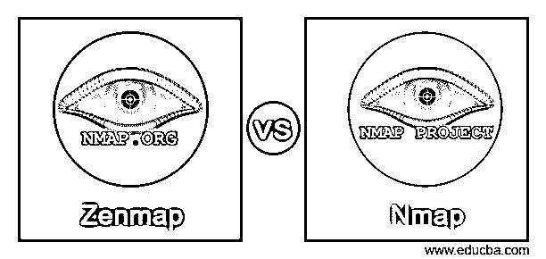
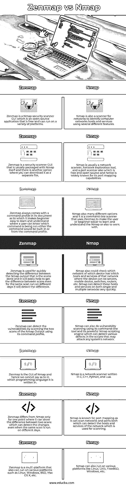

# Zenmap vs Nmap

> 原文：<https://www.educba.com/zenmap-vs-nmap/>

## Zenmap 与 nmap 的区别

Zenmap 被定义为一个免费和开源的官方 nmap 安全扫描器 GUI，具有多平台，可在不同的操作系统上使用，使 Nmap 更容易为初学者开发，并具有升级的功能，用于显示 Nmap 的输出，可以显示两次扫描之间的差异，这些扫描运行多次命令。Nmap 被定义为网络扫描器，通常用于识别主机和服务，其中该 Nmap 利用 Nmap 自身提供的许多功能来探测计算机网络，该网络还提供网络来进行主机发现和服务。在这个主题中，我们将学习 Zenmap 和 nmap 的区别。

### Zenmap 与 nmap 的面对面比较(信息图)

以下是 Zenmap 和 nmap 之间的主要区别:

<small>网页开发、编程语言、软件测试&其他</small>

### Zenmap 和 nmap 的主要区别

以下是下面提到的主要区别。

#### 1.扫描仪的类型

Zenmap 是用于 nmap 的网络扫描工具的 windows 的图形前端，或者 Zenmap 是 nmap 安全扫描器 GUI，其包括各种特征并用于显示 Nmap 的输出，该输出通常显示图形输出，其中它可以清楚地显示两次扫描之间的差异，该输出显示诸如关于新主机或网络上可用的当前服务等细节。而 Nmap 被用作网络扫描器和端口扫描器，用于扫描网络的主机或服务，因此主要以其端口映射特征而闻名。但是这个 Zenmap 并不是为了取代 nmap 而开发的，而是让它更有用。

#### 2.扫描仪的使用

Nmap 是一个网络扫描器，也由一些命令组成，因此被称为命令行工具，用于扫描网络端口，这将快速找到哪些设备在哪些网络上运行，而无需使用任何复杂的命令。而 Zenmap 也提供了一个命令配置文件，其中它提供了 Zenmap 可以使用的各种命令，以使 nmap 对用户来说更容易理解和学习。因此，Nmap 命令行工具用于了解哪个网络在哪个设备上运行，Zenmap 用于确定在查找网络主机或服务时运行哪个命令。

#### 3.能力

Zenmap 是一个用于 nmap 的 GUI，它能够通过扫描两次扫描轻松显示 Nmap 输出的视觉输出，这两次扫描提供了图形显示，它可以检测这两次扫描之间的差异，并且即使在使用命令配置文件中的命令在不同的日期运行这些相同的扫描之后，它也可以找出它们之间的差异。因此，nmap 使用 Zenmap 来使 Nmap 用户易于学习和检测差异，其中 Nmap 可以使用其 Nmap 脚本引擎来检测在可能攻击系统的现有脚本中完成的扫描中的漏洞，从而容易和快速地检测在任何设备的网络上运行的主机或服务。

### Zenmap 与 nmap 对比表

| **序列号** | **Zenmap** | **Nmap** |
| One | Zenmap 是一个 nmap 安全扫描器 GUI，它是一个免费的开源应用程序，可以在各种平台上运行。 | Nmap 也是一个网络扫描器，使用几种不同的功能来识别计算机网络主机和服务。 |
| Two | Zenmap 是一个安全扫描器 GUI，通常与 nmap 本身打包在一起，还有另一个选项，您可以将它作为一个单独的文件下载。 | Nmap 通常是一个网络扫描器、网络探测工具和端口扫描器，也是免费和开源的，因此因其端口映射功能而广为人知。 |
| Three | Zenmap 的文档中总是带有一个命令配置文件，这使得初学者很容易学习和理解，用户可以知道哪个命令正在运行，该命令是内置的，或者来自命令配置文件。 | nmap 也有许多不同的选项，它是一个命令行扫描器，使用 Zenmap 使用户或初学者更容易学习和理解 Nmap 或使用它。 |
| Four | Zenmap 用于快速检测 nmap 输出(即已完成的扫描)之间的差异，它将很容易帮助获得扫描之间的差异，即使是在不同日期运行的相同扫描，它也会检测到差异。 | Nmap 还可以检查哪个设备哪个网络具有该网络的哪些主机和服务，其中该设备可以是服务器、移动设备、交换机、路由器等。Nmap 可以非常快速地检测单个或多个网络上的这些主机和服务。 |
| Five | Zenmap 可以通过使用其命令配置文件扫描 nmap 输出的两次扫描来检测漏洞。 | Nmap 还可以使用其命令行工具和强大的 Nmap 脚本引擎进行漏洞扫描，该引擎可以检测脚本中可能攻击任何系统网络的各种缺陷。 |
| Six | Zenmap 是 nmap 的 GUI，因此我们不能说它是用哪种编程语言编写的。 | Nmap 是一个用 C、C++、Python 和 Lua 编写的网络扫描器。 |
| Seven | Zenmap 与 nmap 的区别仅在于它可以显示两次扫描之间的差异，这两次扫描即使在不同的日期运行相同的扫描也可以检测到变化。 | Nmap 因端口映射而闻名，因为它可以扫描网络和端口，这两者都可以检测用于扫描的网络的主机和服务。 |
| Eight | Zenmap 是一个多平台平台，也可以运行在各种平台上，如 Linux，Windows，BSD，Mac OS X 等。 | Nmap 还可以在各种平台上运行，如 Linux、Unix、FreeBSD、Windows 等。 |

### 结论

在本文中，我们得出结论，Zenmap 和 nmap 之间没有太大的区别，因为 Zenmap 被用作显示 Nmap 输出的图形界面。这两者之间的主要区别在于，只有它才能够区分所进行的扫描，这反过来将帮助 Nmap 检测或跟踪服务或托管正在使用的设备的当前网络，并使 Nmap 用户容易地检测任何特定设备的网络的现有服务。因此，如果开发者想要更好的 nmap 视觉输出，那么他们可以使用 Zenmap，但是我们应该注意 Zenmap 不是用来代替 Nmap 的。

### 推荐文章

这是 Zenmap vs Nmap 的指南。在这里，我们讨论 Zenmap 与 nmap 的关键区别，并提供信息图表和比较表。您也可以看看以下文章，了解更多信息–

1.  [Arduino Nano vs Mini](https://www.educba.com/arduino-nano-vs-mini/)
2.  [Zendesk vs Salesforce](https://www.educba.com/zendesk-vs-salesforce/)
3.  [Shopify vs Squarespace](https://www.educba.com/shopify-vs-squarespace/)
4.  [鲍尔 vs npm](https://www.educba.com/bower-vs-npm/)

