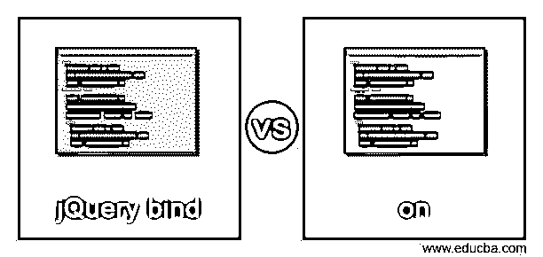
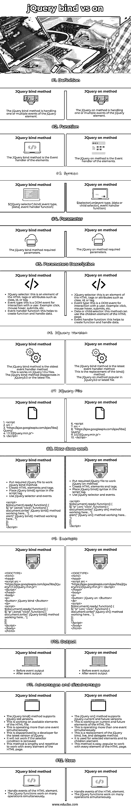

# jQuery 绑定与打开

> 原文：<https://www.educba.com/jquery-bind-vs-on/>

## jQuery 绑定与 on 的区别

**jQuery 绑定方法:**

*   jQuery bind 是一个内置的方法，用于处理元素的一个或多个事件。
*   当给定元素发生事件时，jQuery bind 方法正在工作。
*   jQuery bind 是一个作用于 HTML 页面的几个当前元素的函数。
*   jQuery bind 方法是 click 和 alert 等当前元素的事件处理程序。

**方法上的 jQuery:**

<small>网页开发、编程语言、软件测试&其他</small>

*   jQuery on 方法取代了 bind 方法来处理多个事件。
*   当给定元素中发生事件时，jQuery on 方法正在工作。
*   jQuery 是一个作用于 HTML 页面的几个当前和未来元素的函数。
*   jQuery on 方法是 click 和 alert 等元素的事件处理程序。

### jQuery bind 与 on 的直接比较(信息图表)

以下是 jQuery bind 与 on 的主要区别:

### 主要差异

jQuery bind()和 jQuery on()方法有许多相似之处和不同之处。jQuery bind()和 jQuery on()方法的区别如下。

*   jQuery bind()方法是 HTML 文件中当前元素的句柄事件。jQuery on()方法处理 HTML 页面中的事件当前和未来元素。
*   jQuery bind()方法支持旧版本的 jQuery。jQuery on()方法支持 jQuery 的当前和最新版本。
*   jQuery on()方法很受欢迎，是 bind()方法的替代品。
*   对于最新版本的 jQuery，开发人员不赞成使用 jQuery bind()方法。
*   jQuery bind()方法只对选定的元素起作用。jQuery on()方法作用于选定的元素及其子元素。
*   jQuery on()方法取代了 bind()、live()和 delegate 方法()。jQuery bind()只有多个事件处理程序方法。

### JQuery 绑定方法与 JQuery 方法的比较表

下表显示了 jQuery bind 方法和 jQuery on 方法的简要说明。

| **特性** | **JQuery 绑定方法** | **方法上的 JQuery** |
| **定义** | jQuery bind 方法正在处理 jQuery 元素的一个或多个事件。 | jQuery on 方法正在处理 jQuery 元素的一个或多个事件。 |
| **功能** | JQuery bind 方法是元素的事件处理程序。 | jQuery on 方法是元素的事件处理程序。 |
| **语法** | $('jQuery 选择器')。绑定(事件类型，[数据]，事件处理函数) | $(选择器)。on(事件类型，[数据或子选择器]，事件处理函数) |
| **参数** | jQuery bind 方法需要参数。 | 方法上的 jQuery 需要参数。 |
| **参数描述** | ·         JQuery selector:  this is an element of the HTML tags or attributes such as class, id, or tag.事件类型:这是一个与用户交互的 DOM 事件。例如:点击、鼠标悬停、提交等。事件处理函数:这有助于创建函数和处理数据。 | ·         JQuery selector:  this is an element of the HTML tags or attributes such as class, id, or tag.事件类型:这是一个与用户交互的 DOM 事件。例如:点击、鼠标悬停、提交等。数据或子选择器:这个方法可以使用 HTML 页面的子元素。事件处理函数:这有助于创建函数和处理数据。 |
| **JQuery 版本** | The jQuery bind method is the oldest event handler method.这适用于 jQuery 1.0.x 文件。jQuery3.0 或最新文件不支持 jQuery bind 方法。 | The jQuery bind method is the latest event handler method.

这是 bind()方法的替代。

jQuery3.0 或最新文件中流行的 jQuery on 方法。

 |
| **JQuery 文件** | 1.       **<**script2.src =3." https://Ajax . Google APIs . com/Ajax/libs/jQuery/4.1 . 11 . 2/jquery . min . js "**>T1】**5. | 6.       **<**script7.src =8." https://Ajax . Google APIs . com/Ajax/libs/jQuery/9.3 . 5 . 1/jquery . min . js "**>**10. **< /** 剧本 **>** |
| **如何工作** | ·         Put required jQuery file to work jQuery bind method.创建 HTML 元素和标签。将 jQuery bind()语法放在脚本标记中。使用 jQuery 选择器和事件。<button>jQuery on</button> |