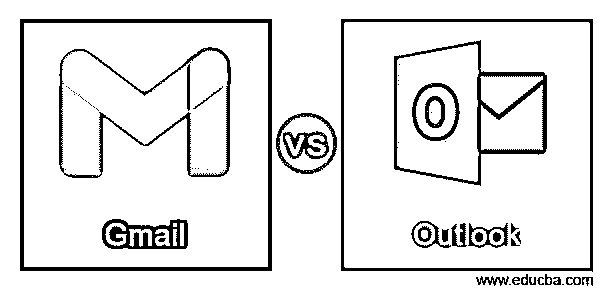
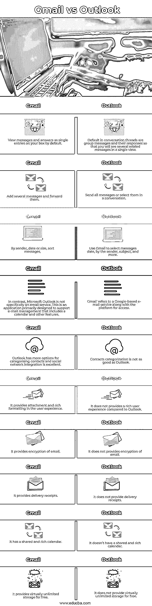

# Gmail 与 Outlook

> 原文：<https://www.educba.com/gmail-vs-outlook/>

## Gmail 和 Outlook 的区别

在商务电子邮件和日历服务领域，有许多竞争者，但还有两个:微软 Outlook 和谷歌 Gmail。企业沟通的标准是由 Outlook 和 Gmail 设定的，它们都是在 1997 年和 2004 年推出的，现在垄断了劳动力市场。鉴于这两个部门都受到高度赞扬，您如何选择适合您业务的部门？打开 Microsoft Outlook，一个标准的三面板设置就能满足你:文件夹、收件箱和选定的邮件，都在三面板工具栏下从左到右排列。用户可以调整每个白板的尺寸，并在单独的窗口中打开他们选择的邮件，但 Outlook 的自定义选项也相对有限。

### Gmail 是什么？

存储在计算机上的信息在两个用户之间通过电信交换，存储为电子邮件、电子邮件或电子邮件。更简单地说，电子邮件是一种可以包含某个人或一组人的文本、图像文件或其他通过网络发送的附件的消息。1971 年，雷·汤姆林森发出了第一封电子邮件。作为测试消息，他发送了带有“类似 QWERTYUIOP 的内容”的电子邮件。汤姆林森发给自己的。然而，尽管电子邮件是发送给自己的，但电子邮件仍然通过 ARPANET 传输。

<small>网页开发、编程语言、软件测试&其他</small>

### 什么是 Outlook？

Outlook.com 是微软基于网络的免费电子邮件服务。这有点像谷歌的 Gmail 服务，但有所改变——链接到你的 Outlook 数据桌面。除了支持你的联系人(包括脸书、Twitter 和 LinkedIn)，微软还将 Hotmail 和 Windows Live 合并为一个邮件服务。通过访问该网站并点击页面末尾的立即注册链接，您可以获得一个 Outlook.com 帐户。必须输入适当的个人信息，创建电子邮件地址和密码，然后就大功告成了。如果您已经在 Hotmail 或 Windows Live、SkyDrive、Messenger、Xbox LIVE 或 Windows phone 中拥有帐户，则可以间接签名。

### Gmail 与 Outlook 的直接对比(信息图表)

以下是 Gmail 和 Outlook 的 10 大区别:

### Gmail 与 Outlook 的主要区别

Gmail 和 Outlook 的一些主要区别如下:

*   Gmail 只能在你的浏览器中作为网络邮件使用，但可以通过桌面上的 Shift 等第三方应用程序访问。iOS 和 Android 移动 Gmail 应用程序都可用。整理收件箱的主要方式是通过 Gmail 过滤器和标签。Outlook 在顶栏中有所有不同的选项，即功能区。然后，对于所有不同的视图，包括电子邮件、日历、任务、联系人和笔记，将有不同的丝带。
*   Gmail 和 Outlook 都为谷歌和微软提供直接支持，并支持他们的社区电子邮件服务。除了社区支持之外，谷歌还可以轻松浏览 Gmail 的“帮助中心”, Gmail 用户可以在这里自助解决问题和疑难解答。为 G Suite 用户提供全天候的实时客户服务。
*   这一转变使得管理多个 Gmail 或 Outlook 账户比以往任何时候都更容易。Gmail 和 Outlook 的主要电子邮件帐户都可以添加到 Shift。添加主电子邮件帐户后，您可以添加其他电子邮件帐户。
*   Outlook 免费提供几乎无限的存储空间，而 Gmail 免费提供几乎无限的存储空间。Outlook 有更多的联系人分类选项，社交网络集成非常出色，而联系人分类不如 Outlook。
*   Outlook 提供电子邮件加密，而 Gmail 不提供电子邮件加密。
*   它在用户体验中提供了附件和丰富的格式。另一方面，与 Outlook 相比，Gmail 不能提供丰富的用户体验。

### Gmail 与 Outlook 的对比表

Gmail 和 Outlook 的比较如下:

| **展望** | **Gmail** |
| 默认情况下，在您的邮箱中以单个条目的形式查看消息和答案。 | 对话线程中的默认设置是对消息及其响应进行分组，这样您就可以在一个视图中看到几条相关的消息 |
| 添加几条消息并转发它们 | 发送所有邮件或在对话中选择它们 |
| 按发件人、日期或大小对邮件进行排序。 | 使用 Gmail 选择邮件日期、发件人、主题等 |
| 相比之下，微软 Outlook 并不是专门的电子邮件服务。这是一个应用程序，主要用于支持电子邮件管理，包括日历和其他功能。 | “Gmail”指的是基于谷歌的电子邮件服务以及访问平台。 |
| Outlook 有更多的联系人分类选项，社交网络集成非常出色。 | 联系人分类不如 Outlook 好。 |
| 它在用户体验中提供了附件和丰富的格式。 | 与 Outlook 相比，它不能提供丰富的用户体验。 |
| 它提供电子邮件加密。 | 它不提供电子邮件加密。 |
| 它提供送货收据。 | 它不提供送货收据。 |
| 它有一个共享和丰富的日历。 | 它没有共享和丰富的日历。 |
| 它免费提供几乎无限的存储空间。 | 它并不免费提供几乎无限的存储空间。 |

### 推荐文章

这是 Gmail 与 Outlook 的对比指南。在这里，我们还将讨论 Gmail 和 Outlook 的主要区别，包括信息图表和比较表。您也可以看看以下文章，了解更多信息–

1.  [Trello vs Todoist](https://www.educba.com/trello-vs-todoist/)
2.  [操作系统替代品](https://www.educba.com/os-alternatives/)
3.  [SQLite sum](https://www.educba.com/sqlite-sum/)
4.  [飞镖 vs 围棋](https://www.educba.com/dart-vs-go/)

