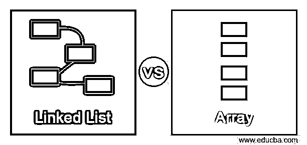
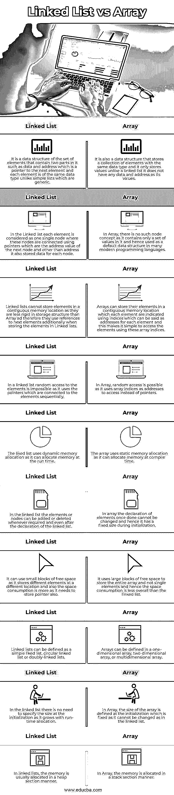

# 链表与数组

> 原文：<https://www.educba.com/linked-list-vs-array/>

## 链表和数组的区别

数组被定义为一列值或一组元素，其中每个元素的数据类型都相同。数组是一种存储在连续内存分配中的数据结构，固定大小数组的初始化是在声明时定义的。链表也是一种数据结构，其被定义为具有相同数据类型的元素的集合，该集合是不在任何连续存储器位置中的元素的有序集合，并且每个元素被认为是一个节点，在该节点中它存储数据和到下一个节点的地址，该地址被称为指向下一个节点的指针，因此使用这些指针来连接这些元素。

### 链表与数组的直接比较(信息图)

下面是链表和数组之间的 10 大区别:

<small>网页开发、编程语言、软件测试&其他</small>

### 链表和数组的主要区别

下面给出了链表和数组之间的一些主要区别:

#### 元素的插入

在数组中，元素的插入非常简单，因为它使用从 0 开始索引的数组索引，因此它允许随机访问元素，例如，如果在数组中我们想在第 3 个位置插入一个元素，索引将是“2”，所以我们只需要在插入新元素后从索引为“2”的第 3 个元素移动元素，并成为索引“3”。而在链表中，如果我们知道指向每个元素的指针或地址，插入也是简单和容易的，例如，如果我们在第 3 个位置插入一个元素，那么我们需要改变第 2 个位置的元素的地址，该地址现在应该包含新元素的地址，并且新元素地址应该包含先前在第 3 个位置的第 4 个位置的元素的地址。

#### 时间和空间消耗

在 Array 中，插入和删除元素所花费的时间更多，因为它使用连续的内存位置，该位置在初始化时大小总是固定的，以后不能更改，因此使用的空间是存储整个数组，而不是存储需要较少空间的单个元素。然而，链表插入和删除元素所用的时间比数组快，因为它将任何新元素存储在内存中可用的第一个空闲空间中，并使用单独的内存来存储其指针，因此与数组相比，空间利用率更高。

#### 访问和执行时间

数组使用数组索引作为存储元素的地址和连续内存位置，它可以被随机访问，因此修改某些元素可以更快，这使得执行时间更快。然而，链表使用指针或存储对下一个元素的引用，它需要遍历所有 before 元素来访问任何使用顺序访问的元素，因为它不能存储在连续的存储位置中，因此有时在执行链表时可能会有延迟。但是，这仍然取决于我们应用于哪种数据结构的操作，因为有些在数组中更快，有些在链表中更快。

### 链表与数组对照表

链表和数组的比较如下:

| **序列号** | **链表** | **数组** |
| One | 它是元素集合的数据结构，其中包含两个部分，例如数据和地址，地址是指向下一个元素的指针，每个元素都是相同的数据类型，这不同于通用的简单列表。 | 它也是一种数据结构，存储具有相同数据类型的元素的集合，它只存储值，不像链表，它没有任何数据和地址作为它的值。 |
| Two | 在链表中，每个元素被认为是一个单个节点，其中这些节点使用指针连接，这些指针是下一个节点的地址值，并且除了地址之外，它还存储每个节点的数据。 | 在 Array 中，没有这样的节点概念，因为它只包含一组值，因此在许多现代编程语言中被用作默认的数据结构。 |
| Three | 链表不能在连续的内存位置存储元素，因为它们在存储结构上不如数组严格，因此在链表中存储元素时，它们还使用对下一个元素的引用。 | 数组可以将它们的元素存储在连续的存储位置中，其中每个元素使用索引来指示，索引可以说是每个元素的地址，这使得使用这些数组索引来访问元素变得简单。 |
| Four | 在链表中，对元素的随机访问是不可能的，因为它使用的是顺序连接到元素的指针。 | 在数组中，随机访问是可能的，因为它使用数组索引作为访问地址，而不是指针。 |
| Five | 喜欢列表使用动态内存分配，因为它可以在运行时分配内存。 | 该数组使用静态内存分配，因为它可以在编译时分配内存。 |
| Six | 在链表中，只要需要，甚至在链表声明之后，就可以添加或删除元素或节点。 | 在 array 中，元素的声明一旦完成就不能更改，因此在初始化时它的大小是固定的。 |
| Seven | 它可以使用小块的空闲空间，因为它在不同的位置存储不同的元素，而且空间消耗更多，因为它还需要存储指针。 | 它使用大块空闲空间来存储整个数组，而不是单个元素，因此总的空间消耗比链表少。 |
| Eight | 链表可以定义为一个简单的喜欢的列表，循环链表，s 或双向链表。 | 数组可以定义为一维数组、二维数组或多维数组。 |
| Nine | 在链表中，不需要在初始化时指定大小，因为它随着运行时分配而增长。 | 在 Array 中，数组的大小是在初始化时定义的，它是固定的，因为它不能像在链表中那样改变。 |
| Ten | 在链表中，内存通常以堆段的方式分配。 | 在 Array 中，内存是以堆栈分段的方式分配的。 |

### 结论

在本文中，我们得出结论，数组和喜欢的列表都是数据结构的类型，都是线性数据结构。不能说链表比数组更好，反之亦然，因为每一个都有不同的方法和操作，而它们的类型更好。因此，这完全取决于开发人员检查每个概念实现的优点和缺点，并查看每个概念中使用的内存利用率和要求。

### 推荐文章

这是一个关于链表和数组的指南。在这里，我们还通过信息图和比较表讨论了链表和数组键的区别。您也可以看看以下文章，了解更多信息–

1.  [数组 vs 数组列表](https://www.educba.com/array-vs-arraylist/)
2.  [jQuery 数组长度](https://www.educba.com/jquery-array-length/)
3.  [Java Vector vs ArrayList](https://www.educba.com/java-vector-vs-arraylist/)
4.  [C#数组 vs 列表](https://www.educba.com/c-sharp-array-vs-list/)

