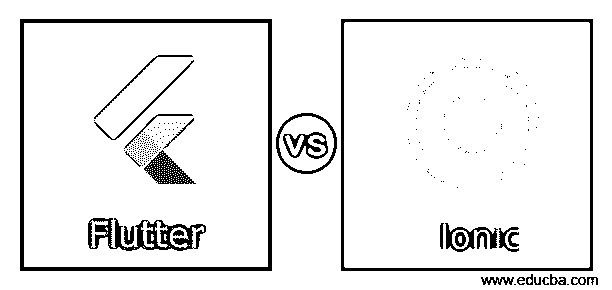
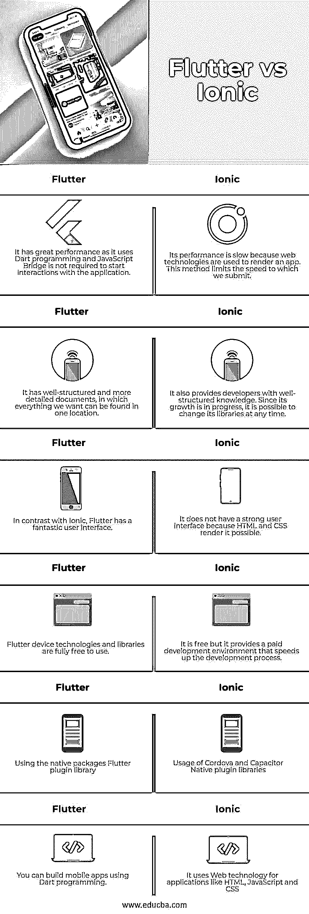

# 颤动 vs 离子

> 原文：<https://www.educba.com/flutter-vs-ionic/>

## 颤动与离子的区别

在 iOS 和 Android 平台上开发移动应用的两项领先技术是 Flutter 和 ionic。它使开发人员能够使用一种编程语言和一个用于智能手机、互联网和桌面应用程序的单一代码库轻松构建和发布编译的应用程序。这两种系统的好处取决于公司的特定标准和目标。在本节中，将根据不同的参数对比颤振和离子框架之间的差异。在进行比较之前，我们将简要介绍这些发展。

### 什么是爱奥尼亚？

Ionic platform 是一个开源 UI 工具包，用于使用 CSS、HTML 和 JavaScript 技术开发高质量的 web、桌面和渐进式 Web 应用程序。它有一个特点，可以一次性构建并运行。2013 年，它由 Max Lynch、Drifty Co .、Ben Sperry 和 Adam Bradley 成立。2014 年 3 月，Ionic 平台的第一个测试版发布。它主要关注前端用户体验或用户之间的交互，管理我们应用程序的外观和感觉。它很容易学习，可以集成到其他书籍或框架中，如 Angular，Cordova 等。它也可以作为一个单独的工具使用一个简单的脚本，没有前端应用程序。

<small>网页开发、编程语言、软件测试&其他</small>

### 什么是颤振？

Flutter 是一个界面接口工具包，它允许我们用 Dart 语言构建快速、漂亮、本机编译的移动、web 和桌面应用程序。这用单一的编程语言和代码库来构建软件。它是开源和免费的。谷歌在 2017 年 5 月首次开发了它，现在根据 ECMA 标准管理它。这是一项越来越受欢迎的技术，可以提供出色的本地体验。谷歌推出 SDK 来开发高级 iOS 和 Android 移动应用程序。如果你用的是 Android Studio，内置 Java 和 Objective C，iOS 上集成了 Swift。

### Flutter 与 Ionic 的直接对比(信息图)

以下是 Flutter 与 Ionic 之间的 6 大区别:

### 颤动与离子的主要区别

以下是颤振与离子之间的主要区别:

*   Ionic 提供了一个相当简单的 web 技术学习曲线，而 flooding 允许开发人员学习 Dart 来构建应用程序。在最好的 Google 开发者和社区的支持下，Flutter 正在逐渐成长。Ionic 还被图形应用或游戏开发的包装插件所利用。
*   使用在线平台和拥抱开放标准是 Ionic 的核心理念。当你使用 Ionic 进行开发时，你将会接受 web 工具和语言，以及为移动、桌面、尤其是互联网提供高性能的 web 架构。Flutter 选择在更全面的增长世界中前进，创建一个自包含的生态系统，它与通用语言、资源和标准进行斗争。
*   为了适应应用程序的外观，Flutter 和 Ionic 更新了 UI 元素模板，包括 Android 材料和 iOS Cupertino。他们还可以使用带有一组工具的预建插件库来构建定制插件，以访问平台资源和本地 API。
*   Ionic 和 Flutter 有一个共同的梦想，那就是创建美观、高性能的应用程序，这些应用程序可以在任何地方工作。然而，这两者在内部是截然不同的。这里给出了离子振动和颤振的快速比较。与 Ionic 移动应用程序开发公司或 Flutter 公司合作至关重要。

### 颤振与离子的对比表

让我们来看一下 Flutter 与 Ionic 的对比表。

| **颤动** | 离子的 |
| 它具有很好的性能，因为它使用 Dart 编程，并且不需要 JavaScript Bridge 来启动与应用程序的交互。 | 它的性能很慢，因为网络技术被用来渲染一个应用程序。这种方法限制了我们提交的速度。 |
| 它有结构良好和更详细的文件，其中我们想要的一切都可以在一个位置找到。 | 它还为开发人员提供了结构良好的知识。由于其正在增长，因此可以随时更改其库。 |
| 与 Ionic 相比，Flutter 有一个奇妙的用户界面。 | 它没有强大的用户界面，因为 HTML 和 CSS 使它成为可能。 |
| Flutter 设备技术和库可以完全免费使用。 | 它是免费的，但是它提供了一个付费的开发环境来加速开发过程。 |
| 使用本机包 Flutter 插件库 | 使用 Cordova 和 Capacitor 本地插件库 |
| 您可以使用 Dart 编程构建移动应用程序。 | 它将 Web 技术用于 HTML、JavaScript 和 CSS 等应用程序 |

### 推荐文章

这是一个颤振与离子的指南。在这里，我们也讨论了颤振与离子关键差异的信息图表和比较表。您也可以看看以下文章，了解更多信息–

1.  [什么是颤振？](https://www.educba.com/what-is-flutter/)
2.  [反应自然 vs 颤动](https://www.educba.com/react-native-vs-flutter/)
3.  [React Native vs React](https://www.educba.com/react-native-vs-react/)
4.  [视图。JS vs React .js〔t1〕](https://www.educba.com/vue-js-vs-react-js/)

