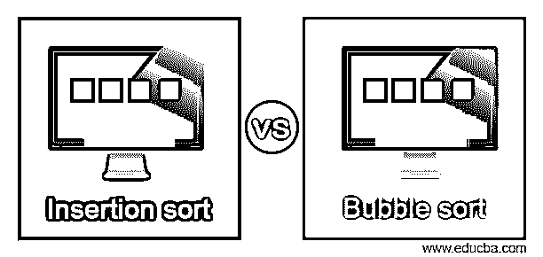
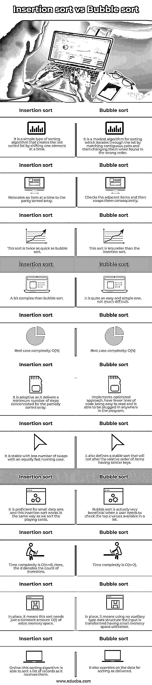

# 插入排序与冒泡排序

> 原文：<https://www.educba.com/insertion-sort-vs-bubble-sort/>

## 插入排序和冒泡排序的区别

*   计算机科学包括各种数据结构和算法，用户可以执行这些数据结构和算法来完成特定任务或解决任何问题。有些经典算法是大家最熟悉的，比如冒泡排序、插入排序和归并排序等等。
*   说到插入排序，它是一种简单的排序算法，其功能与我们对手中的扑克牌进行排序的方式相同。这里，数组实际上将被分为排序部分和未排序部分。此后，未排序部分中的可用值将被挑选出来，然后正确地放置在排序部分中。
*   此外，另一方面，冒泡排序(也称为比较排序)是最简单但效率很低的排序算法，它遍历列表，比较相邻项，如果顺序不正确，还会进行必要的交换。据说有必要了解冒泡排序，因为它代表了排序的基础。

### 插入排序和冒泡排序的比较(信息图)

以下是插入排序和冒泡排序的主要区别

<small>网页开发、编程语言、软件测试&其他</small>

### 插入排序与冒泡排序的主要区别

插入排序与冒泡排序之间的一些主要区别如下:

*   基本上，排序可以定义为以降序或升序组合元素。这种技术大致分为内部排序和外部排序。在内部排序中，所有要排序的元素都存在于主存中。类似地，在外部排序中，当少数排序不能在主存中执行时，就在磁带或磁盘上执行。
*   在排序算法中，冒泡排序被认为是最低级的一种。在这里，该方法访问整个数组，然后关联每个相邻的数字，在这里交换数字，直到列表以升序排列。
*   插入排序算法在数组的每次迭代中将未排序的项放在合适的位置。假设我们需要对大小为 v 的数组进行升序排序，这个 InsertionSort()函数对数组重复执行，并使用以下算法指令一次计算两个元素:
*   对数组从 arr[1]到最后一个 arr[v]重复上述操作。
*   将当前项或键与其前一项匹配。
*   如果前置项大于关键元素，则将与之前的项目进行比较。
*   将较大的项目上移一个位置，以便为交换的项目创造空间
*   此外，当我们合并 InsertionSort()和 BubbleSort()函数中使用的排序算法技术的概念时，将创建一个新的排序方法，称为 Merge Sort 或 MergeAndSort()函数，它在拆分数组以分别进行比较和排序时处理两个数组。这个过程可能需要一些时间。
*   对于排序算法，主要实现数字顺序和字典顺序。此外，这些排序算法介绍了各种核心算法思想，包括大 O 符号、数据结构、分治算法、最佳、平均和最差情况分析、下界和时空权衡。
*   对于经典的排序算法，不好的行为用 O(n2)表示，好的行为用 O(n log n)表示。很少有算法是递归的或非递归的。
*   冒泡排序也称为下沉排序，它遍历数据列表，并使用交换技术对相邻项进行排序，以避免顺序错误。
*   以插图为例:

(82531) -> (28531)

在这里，冒泡排序算法用于比较前两个项目 8 和 2，然后在 8 大于 2 时交换 8>2。同样，该过程在列表中重复，直到列表在初始传递中以正确的顺序排序，如下所示:

(25831)->(25381)->(25318)，结束。

在此之后，第二遍和所需的第三遍将继续，除非我们得到排序后的列表。因此，冒泡排序通过比较相邻元素遍历整个元素数组。

*   以前面的列表为例说明插入排序，然后它将通过一个堆栈工作，首先获取一个元素并与主项目匹配，如果找到更大的交换，然后再次获取两个元素并排序，从排序的位置开始，直到所有元素都无效为止。顺序如下:

(82531) -> (28531) -> (25831) -> (25381) -> (23581) -> (23518) -> (23158)

-> (21358) -> (12358).

此后，当列表显示升序时，算法或插入排序停止进一步迭代并生成输出(12358)。

### 插入排序与冒泡排序的比较表

请查找以下插入排序和冒泡排序的比较表，其中包含几个要点:

| **插入排序** | **冒泡排序** |
| 这是一种简单的排序算法，通过一次移动一个元素来创建最后一个排序列表。 | 这是一种适度的排序算法，它通过匹配相邻对来遍历列表，然后在发现顺序错误时改变它们。 |
| 一次将一个项目重定位到部分排序的数组中。 | 检查相邻的项目，然后交换它们。 |
| 这种排序比冒泡排序快一倍。 | 这种排序比插入排序更轻松。 |
| 比冒泡排序稍微复杂一点。 | 这是一个相当容易和简单的，没有太多的困难。 |
| 最佳情况复杂度:O(N) | 最佳情况复杂度:O(N) |
| 它是自适应的，因为它为部分排序的数组提供了最少数量的集中步骤。 | 实现优化的方法，具有更少的易于阅读的代码行，并且能够插入到程序中的任何位置。 |
| 它稳定，交换次数少，运行速度也同样快。 | 它还定义了一个稳定的排序，不会改变具有相似键的项目的相对顺序。 |
| 它对小数据集很精通，这种插入排序的工作方式与我们对扑克牌进行排序的方式相同。 | 当用户需要检查列表中可用的前 x 个值时，冒泡排序实际上非常有用。 |
| 时间复杂度为 O(n+d)。这里，d 表示反转的次数。 | 时间复杂性是 O(n^2). |
| 这意味着这种排序只需要恒定的 O(1)额外内存空间。 | 就地，意味着不使用辅助类型数据结构；输入被转换，具有小的存储空间利用。 |
| 在线:这种排序算法能够在收到记录时对记录列表进行排序。 | 它还对交付的数据进行排序。 |

### 结论

*   插入和冒泡排序是正确排序数据记录所需的有用的标准算法。如果可以灵活地对记录进行排序，那么排序算法就更有价值了。
*   如果排序算法有效工作，那么给定问题的时间复杂度可以最小化。但无论如何，在这两种排序中，冒泡排序比插入排序慢，也是最简单易行的排序。

### 推荐文章

这是插入排序和冒泡排序的指南。在这里，我们用信息图和比较表讨论插入排序和冒泡排序的关键区别。您也可以看看以下文章，了解更多信息–

1.  [VueScan vs Silverfast](https://www.educba.com/vuescan-vs-silverfast/)
2.  [点击与概念](https://www.educba.com/clickup-vs-notion/)
3.  [Pro tools vs Cubase](https://www.educba.com/pro-tools-vs-cubase/)
4.  [Snapseed vs Lightroom](https://www.educba.com/snapseed-vs-lightroom/)

