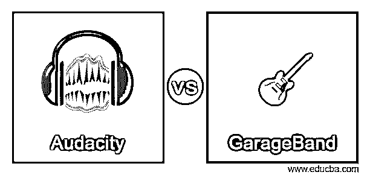
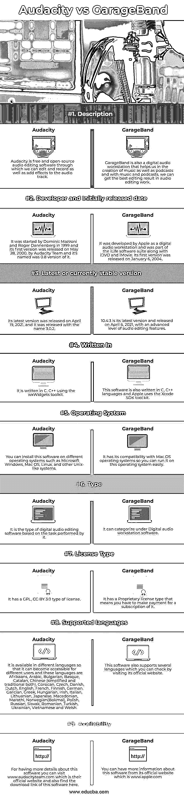

# Audacity vs GarageBand

> 原文：<https://www.educba.com/audacity-vs-garageband/>

## Audacity 与 GarageBand 的区别

Audacity 是数字音频编辑器和记录器，它是这一类的免费开源软件，可以访问多种操作系统。它可用于所有类型音频的后期处理，我们可以在其中添加不同类型的效果，如修剪、正常化、淡入或淡出等。另一方面，GarageBand 是一个数码音频工作站，允许您制作音乐和播客。通过其音乐和播客创作，用户可以使用预先制作的循环、预先制作的 MIDI 键盘、各种乐器效果的阵列来创建多个轨道，并且还可以在其中进行语音录制。现在让我们开始讨论 Audacity 与 GarageBand 软件的不同事实和方面，以便我们能够对它们有一个很好的理解。

### Audacity 与 GarageBand 的面对面比较(信息图)

以下是 Audacity 与 GarageBand 的顶级对比:

<small>网页开发、编程语言、软件测试&其他</small>

### Audacity 与 GarageBand 的主要区别

这两个软件都很擅长以自己的方式进行音频编辑和操作。那么让我们来看看这两个软件的这些特定术语。

*   我们可以在 Audacity 软件中导入和导出几种音频文件格式，这些文件是 WAV、AIFF、MP3、Ogg Vorbis 和 libsndfile 库支持的所有文件的格式。GarageBand 还支持许多音乐文件格式，这使它与多种音频支持格式兼容:AIFF、WAV 和 MIDI。此外，它可以将歌曲导出为 MP3、AAC、MP4 或 AIFF 文件格式，这使得它易于使用。
*   在 Audacity 中，有一些现代的多声道音频功能，如导航控制、单声道和缩放声道编辑，这有助于优化音轨的编辑、带有 XY 项目导航的项目窗格、非破坏性和破坏性效果处理、使用不同命令(剪切、复制、粘贴)对音频文件的操作。此外，GarageBand 还是一个音乐序列器，可以回放和录制具有不同类型效果的多个音频轨道。此外，GarageBand 中有一个内建的音频过滤器 AU (audio unit ),它允许用户通过添加各种效果、混响、回声和失真来提高音频轨道的质量。
*   在 Audacity 中，我们可以在保持音高的同时精确调整音频速度，以便与视频或其他目的同步。GarageBand 能够以 16 位和 24 位音频分辨率进行录制，以获得最佳的工作效果，但其采样速率固定为 44.1 kHz。还有一个调谐系统，有助于音高修正，并增加了自动调谐效果，在调谐到最高水平，这是一个非常好的功能。

### Audacity 与 GarageBand 的比较:

通过阅读本文的这一部分，您将了解这两个软件的基本要求，如操作系统、支持的语言、最新版本等。让我们来看看这些特征。

|  | **胆大妄为** | **GarageBand** |
| **定义** | Audacity 是一款免费的开源音频编辑软件，通过它我们可以编辑和录制音频，并为音频添加效果。 | GarageBand 也是一个数字音频工作站，可以帮助我们创作音乐和播客，通过音乐和播客，我们可以在音频编辑工作中获得最佳的编辑效果。 |
| **开发者和最初发布日期** | 它由 Dominic Mazzoni 和 Roger Dannenberg 于 1999 年开始，其第一个版本于 2000 年 5 月 28 日由 AudacIty Team 发布，其名称为 0.8 版本的 it。 | 它是由 Apple 开发的数码音频工作站，与 iDVD 和 iMovie 一起是 iLife 软件套件的一部分。它的第一个版本于 2004 年 1 月 6 日发布。 |
| **最新或当前稳定的版本** | 它的最新版本发布于 2021 年 4 月 19 日，发布时的名字是 3.0.2。 | 10.4.3 是其最新版本，于 2021 年 4 月 6 日发布，具有高级别的音频编辑功能。 |
| **写于** | 它是使用 wxWidgets 工具包用 C，C++编写的。 | 这个软件也是用 C，C++语言写的，苹果用的是 Xcode SDK 工具包。 |
| **操作系统** | 您可以在不同的操作系统上安装该软件，例如 Microsoft Windows、Mac OS、Linux 和其他类似 Unix 的系统。 | 它与 Mac OS 操作系统兼容，因此您可以在这个操作系统上轻松运行它。 |
| **类型** | 它是一种基于其执行的任务的数字音频编辑软件。 | 它可以归类在数字音频工作站软件下。 |
| **许可证类型** | 它有一个 GPL，CC BY 3.0 类型的许可证。 | 它有一个专有的许可类型，这意味着你必须为它的订阅付费。 |
| **支持的语言** | It is available in different languages so that it can become accessible for different users and these languages are Afrikaans, Arabic, Bulgarian, Basque, Catalan, Chinese (simplified and traditional both), Corsican, Czech, Danish, Dutch, English, French, Finnish, German, Galician, Greek, Hungarian, Irish, Italian, Lithuanian, Japanese, Macedonian, Marathi, Norwegian(Bokmal), Polish, Russian, Slovak, Romanian, Turkish, Ukrainian, Vietnamese and Welsh. | 这个软件还支持几种语言，你可以通过访问它的官网来查看。 |
| **可用性** | 想了解更多关于这个软件的细节，你可以访问 www.audacityteam.com，这是他们的官方网站，也可以在这里找到这个软件的下载链接。 | 你可以从它的官方网站，也就是 www.apple.com，获得更多关于这个软件的信息。 |

有了这些要点，您就可以很好地分析这两个软件的基本需求和特征。现在让我们转到本文的另一部分，在这一部分，我将告诉您 Audacity 和 GarageBand 的特性和事实。

### 结论

现在你对 Audacity 和 GarageBand 软件有了很好的了解，你清楚的知道使用这个软件的目的是什么？你可以用这个软件添加不同类型的效果和其他所需的附件来进行音频编辑，这个软件以自己的方式工作，所以你会发现使用这两个软件中的任何一个都感觉很好。

### 推荐文章

这是 Audacity vs GarageBand 的指南。在这里，我们用信息图和比较表来讨论 Audacity 和 GarageBand 的主要区别。您也可以看看以下文章，了解更多信息–

1.  [Safari vs Chrome](https://www.educba.com/safari-vs-chrome/)
2.  [程序 vs 进程](https://www.educba.com/program-vs-process/)
3.  [Clojure vs Common Lisp](https://www.educba.com/clojure-vs-common-lisp/)
4.  [Lisp vs Haskell](https://www.educba.com/lisp-vs-haskell/)

