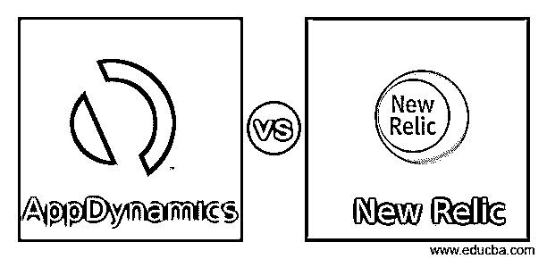
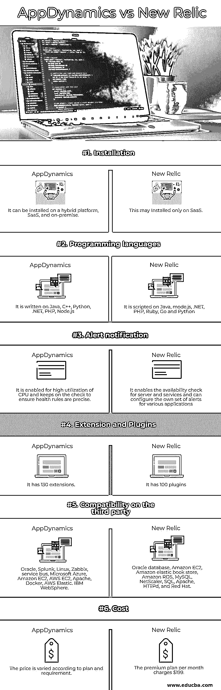

# AppDynamics vs 新遗迹

> 原文：<https://www.educba.com/appdynamics-vs-new-relic/>

## AppDynamics 与 New Relic 的区别

基础设施监控用于网络管理，这可以通过 AppDynamics 和 New Relic 实现。对应用程序的性能管理已经在实践中，这对于开发者来说是不舒服的。因此，他们实施了一些现代工具来监控和分析服务器和基础设施的性能。它可以在不同的领域用代码实现，并用于进行整个交易。这可以通过监视日志和指定可以包含在硬件指标或网络中的代码来实现。在传统的应用程序性能管理工具中，存在某些限制，如吞吐量和 CPU 指标，这些限制在 New Relic 和 AppDynamics 等现代工具中得以克服。下面解释 AppDynamics 和 New Relic 的区别和比较。

### AppDynamics 与 New Relic 的正面比较(信息图)

以下是 AppDynamics 与 New Relic 的 6 大区别:

<small>网页开发、编程语言、软件测试&其他</small>

### AppDynamics 与 New Relic 的主要区别

AppDynamics 与 New Relic 之间的重要区别可能是它们的仪表板、功能、服务和警报管理，这里将进行讨论。

#### 1.历史

AppDynamics 是由 Jyoti 实现的，在网络监控中变得太流行了。它提供应用程序监控，以支持 monitor 中运行的应用程序堆栈，并管理用户端到端网络基础架构。它利用了出色的性能引擎，如基线智商、微服务智商、诊断智商、信号智商和应用智商。这是针对跨国公司的完美解决方案。它吸引了像 Nasdaq、Cisco、Expedia 和 DirecTV 这样的客户，他们是使用该产品多年的可靠客户。New relic 于 2006 年实施，用于基础设施监控，以 SaaS 为基础。它使用户能够监控整个网络设备的预检查。它还可以监控基于云的内部部署，以了解整个网络基础架构。它用于构建监控环境，如 New Relic APM、基础设施、浏览器、移动设备、Insights 和合成设备。

#### 2.特征

New Relic 已经执行了长度名称，但没有与 AppDynamics 这样的大型企业进行相同的交易。New Relic 被 Zendesk、Office Depot、Trulia 和 Hearst 等企业使用。与 New Relic 相比，AppDynamics 在自动发现方面处于领先地位。AppDynamics 中的 APM 解决方案通过应用程序自动查找定制旅程。该路径被映射在视觉显示的彩色代码中。自动发现功能中的寄存器可以添加到购物车中，并显示格式以查看引擎罩中发生的事情。这种特殊的自动发现功能用于获得用户旅程的透明度。

#### 3.服务监控

AppDynamics 在 New Relic 上有着坚定的优势。它提供了查找性能问题和应用程序故障的根本原因的编码级别。对于排除整个网络的故障是无效的。New Relic 给人一种巨大的应用体验。它还可以显示应用程序的响应率、错误率、应用程序直方图、吞吐量、服务地图和事务度量。显示许多应用程序直方图，并允许查看链接应用程序的运行时间。它可以比较各种应用程序，以查看任何性能问题。用户可以通过显示图表和显示依赖于响应时间的最上面的五个外部服务来监视外部服务。JVM 的性能使我们能够显示 HTTP 会话、线程活动、类负载计数、连接池度量和卸载会话计数等信息。它会在触发任何警报之前向用户发送通知

#### 4.数据库监控

新的 Relic 使用户能够查看所有简单的操作，如吞吐量、SQL 上的查询分析、响应时间和数据库调用花费的时间、数据库的缓存操作以及慢速 SQL 报告。新遗迹的进步使得对用户来说过滤特定的数据库并使其对用户友好变得更有吸引力。而 AppDynamics 可以查看资源消耗、等待状态、执行计划、SQL 过程、保存的过程、数据库上的对象、事件中的更改、用户会话、统计和执行模式。AppDynamics 提供了广泛的支持，如 Amazon RDS、SQL Server、MySQL、Scalatra、Sybase、Scala、Sybase IQ、Mongo DB、DB2、Cassandra、Postgre。而 New Relic 提供了对 Mongo DB、Microsoft Azure SQL 数据库、Microsoft SQL Server 和 Postgre SQL 的广泛支持。

#### 5.装置

AppDynamics 可以安装在各种类型中，如 SaaS 平台、混合平台和内部部署。但是《新遗迹》只在 SaaS 有售。根据用户的要求，他可以选择自己的平台。

#### 5.仪表盘

New Relic 允许用户在仪表板上查看不同的性能指标。为了定制仪表板，用户可以选择将性能块拖放到仪表板中。有一些默认的性能指标，用户也可以创建一个新的。AppDynamics 的仪表板更加可定制，并显示应用服务器的所有指标以及服务器和数据库的性能。与 New Relic 类似，用户也可以选择或构建自己定制的仪表板模板。它创建了一个用户友好的面板，使其易于访问。

### AppDynamics 与新遗迹对比表

让我们讨论一下 AppDynamics 与 New Relic 之间的顶级对比:

| **属性** | **AppDynamics** | **新遗迹** |
| 装置 | 它可以安装在混合平台、SaaS 和内部部署上。 | 这可能只安装在 SaaS 上 |
| 编程语言 | 它是用 Java、C++、Python、.NET，PHP，Node.js | 它是用 Java，mode.js 编写的。NET、PHP、Ruby、Go 和 Python |
| 警报通知 | 它支持高 CPU 利用率，并持续检查以确保运行状况规则准确无误。 | 它支持服务器和服务的可用性检查，并可以为各种应用程序配置自己的警报集 |
| 扩展和插件 | 它有 130 个分机 | 它有 100 个插件 |
| 第三方兼容性 | Oracle，Splunk，Linux，Zabbix，service bus，微软 Azure，亚马逊 EC2，AWS EC2，Apache，Docker，AWS Elastic。IBM WebSphere | Oracle 数据库、亚马逊 EC2、亚马逊弹性书店、亚马逊 RDS、MySQL、NetScaler、SQL、Apache、HTTPd 和 Red Hat。 |
| 费用 | 价格根据计划和要求而变化。 | 每月保费计划收费 199 美元。 |

### 推荐文章

这是一个关于 AppDynamics 和 New Relic 的主要区别的指南。在这里，我们还将讨论信息图和比较表的主要区别。您也可以看看以下文章，了解更多信息–

1.  [JMeter vs LoadRunner](https://www.educba.com/jmeter-vs-loadrunner/)
2.  [手机应用 vs 网站](https://www.educba.com/mobile-apps-vs-website/)
3.  [钋 vs 硒](https://www.educba.com/appium-vs-selenium/)
4.  [移动应用与网络应用](https://www.educba.com/mobile-apps-vs-web-apps/)

