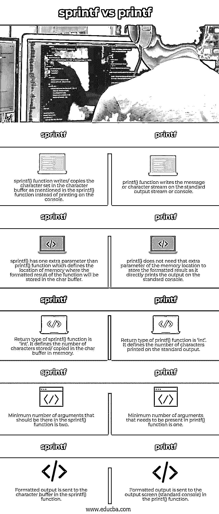
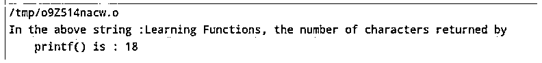
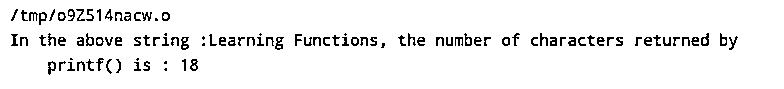

# sprintf vs printf

> 原文：<https://www.educba.com/sprintf-vs-printf/>

## sprintf 与 printf 的区别

下面的文章提供了 sprintf 和 printf 的概要。sprintf()代表“字符串打印格式化”，这是一个用于将字符流复制或写入计算机内存的字符串缓冲区而不是打印在控制台上的功能。它至少有两个参数，第一个是字符数组的名称或指向字符缓冲存储器的指针。它的返回类型是' int '，返回复制到缓冲区的字符数。

printf()函数在 C 程序中用于在标准控制台上打印输出(通常是输出屏幕，尽管我们可以通过编程更改标准输出)。它至少接受一个参数:消息和需要打印的字符串的格式。printf()函数的返回类型是“int ”,它返回打印在标准输出上的字符数。

<small>网页开发、编程语言、软件测试&其他</small>

### sprintf 与 printf 的面对面比较(信息图表)

以下是 sprintf 与 printf 之间的 5 大区别:

### sprintf 与 printf 的主要区别

让我们讨论一下 sprintf 和 printf 之间的一些主要区别:

*   首先，函数 printf()用于在 stdout 控制台上打印包含所有值和变量的消息的数据字符流，而 sprintf()函数不在控制台上打印消息；相反，它将字符流存储在 char buffer 上，如 sprintf()函数中所述。
*   在代码中使用 printf()函数的基本语法是:

`int printf (const char *format, . . . )`

在哪里，

*   **format:** 借助格式说明符如%f、%s、%d 等，指定需要在控制台上打印的字符串格式。
*   **。..:**定义参数列表。它可以是任何长度，取决于代码要求。
*   **返回类型:**printf()函数的返回类型是‘int’，它指定了控制台上打印的字符数。如果输出错误，它将返回负值。

而在程序中使用 sprintf()函数的基本语法是:

`int sprintf (char *str, const char *format, . . .)`

在哪里，

*   **char *str:** 是一个字符数组，格式化后的字符流将被复制到这个数组中。
*   **format:** 借助格式说明符如%f、%s、%d 等，指定需要在控制台上打印的字符串格式。
*   **。..:**定义参数列表。它可以是任何长度，取决于代码要求。
*   **返回类型:**sprintf 的返回类型是‘int ’,因为它指定了字符缓冲区中存储/复制的字符数，不包括所有空字符。

如果出现错误，sprintf()函数返回-1。

*   printf()函数代表“print formatted”，它在标准控制台上打印输出，而 sprintf()代表“string print formatted”，它实际上不打印任何东西，而是用字符流加载缓冲区。
*   与 printf()函数相比，sprintf()函数在语法中多了一个参数。这个额外的参数是指向内存位置的第一个参数，它将接收缓冲区中的结果。这个内存位置有足够的空间来存储整个格式化的结果。这个额外的参数或者是动态分配字符缓冲区的指针的名称，或者是创建来指向已经存在的 char 数组的指针的名称，而 printf()函数没有这个额外的参数，因为默认情况下，它将输出存储在标准控制台上，而不是指针所指向的内存中的任何特定位置。
*   根据程序需求，两个函数中的参数可以一样多，但是 printf()函数中至少需要 1 个参数，而 sprintf()函数中至少需要 2 个参数。
*   sprintf()和 printf()函数都执行打印格式化字符串的相同任务，但是位置不同。对于 printf()函数，位置是标准控制台，而在 sprintf()函数中，位置是内存中的字符缓冲区。

借助一个例子，让我们看看 printf()和 sprintf()函数如何在程序中实现它们以及它们的输出。

#### 示例 1: printf()函数

**代码:**

`#include <stdio.h>
int main()
{
char topic[] = "Learning Functions";
printf("In the above string :");
printf(", the number of characters returned by printf() is : %d",
printf("%s", topic));
return 0;
}`

**输出:**

#### 示例 2: sprintf()函数

**代码:**

`#include<stdio.h>
int main() {
char str[90];
float num1 = 78.90, num2 = 28.89, result;
result = num1 - num2;
sprintf(str, "Result of substraction of values %f and %f is %f" , num1, num2, result);
printf("%s", str);
return 0;
}`

**输出:**

### sprintf 与 printf 对比表

我们来讨论一下 sprintf 和 printf 的顶级对比:

| **Sr 号** | **sprintf()函数** | **printf()函数** |
| One | sprintf()函数在字符缓冲区中写入/复制字符集，如 sprintf()函数中所述，而不是在控制台上打印。 | printf()函数将消息或字符流写入标准输出流或控制台。 |
| Two | sprintf()比 printf()函数多了一个参数，它定义了函数的格式化结果在 char 缓冲区中的存储位置。 | printf()不需要内存位置的额外参数来存储格式化的结果，因为它直接在标准控制台上打印输出。 |
| Three | sprintf()函数的返回类型是“int”。它定义了在内存的字符缓冲区中存储/复制的字符数。 | printf()函数的返回类型是“int”。它定义了打印在标准输出上的字符数。 |
| Four | sprintf()函数中最少应该有两个参数。 | printf()函数中需要的最小参数数量是 1。 |
| Five | 格式化的输出被发送到 sprintf()函数中的字符缓冲区。 | 格式化的输出被发送到 printf()函数中的输出屏幕(标准控制台)。 |

### 结论

上面的描述清楚地解释了什么是 sprintf 和 printf，以及两者之间的主要区别。两个函数，即 printf()和 sprintf()，执行相同的任务，格式化字符集并将结果发送到某个地方，唯一的区别是发送结果的位置。和在 printf()中一样，结果被发送到标准控制台，通常是控制台屏幕，而在 sprintf()函数中，是函数中定义的字符缓冲区。

### 推荐文章

这是 sprintf vs printf 的指南。这里我们分别用信息图和比较表来讨论 sprintf 和 printf 的主要区别。您也可以看看以下文章，了解更多信息–

1.  [C 与 C++](https://www.educba.com/c-vs-c-plus-plus/)
2.  [C++ vs Java](https://www.educba.com/c-plus-plus-vs-java/)
3.  [jQuery children vs find](https://www.educba.com/jquery-children-vs-find/)
4.  [JavaScript vs JQuery](https://www.educba.com/javascript-vs-jquery/)

