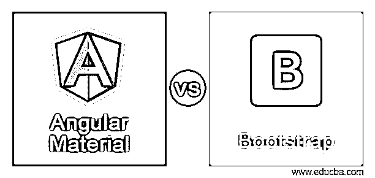
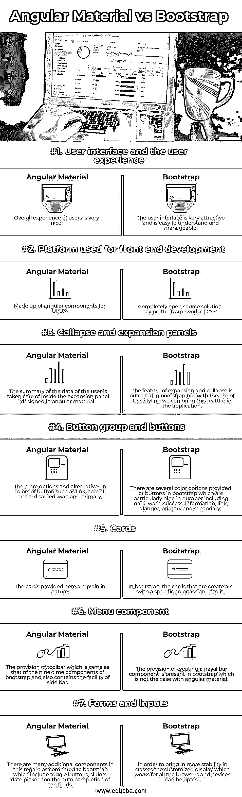

# 角材料与自举

> 原文：<https://www.educba.com/angular-material-vs-bootstrap/>

## 角材料与自举的区别

下面的文章提供了角材料与自举的概述。Angular material 和 bootstrap 是你可以用来使你的用户界面实用、高效和令人印象深刻的 UI 框架。毫无疑问，您的应用程序中良好的用户界面是一个良好的开端，也是您业务成功的一个重要原因。许多 UI 框架已经证实了在市场上的响应性和功能性。angular material 和 bootstrap 都可以用于设计 web 应用程序，并提供令人满意的用户体验。这些平台已经使用了很多年，是一个经过充分验证的设计解决方案。

#### 什么是有角的物质？

angular platform 是一个由 HTML 和 typescript 组成的开源框架，有利于创建单页面应用程序的 web 应用程序，并被市场上的许多应用程序使用，如网飞、paypal 和 Upwork。Angular 使用引用 angular 组件的 ng 模块。

<small>网页开发、编程语言、软件测试&其他</small>

Angular material 是 2016 年推出的 angular material，它用 JavaScript 编写，由多个 UI 组件组成，如下所示:

*   **布局组件:**列表、网格、标签、卡片。
*   **表单控件组件:**复选框、选择、滑块、输入。
*   **导航模式:**菜单、侧边海军和工具栏
*   **带有数据存储标题的表格:**弹出窗口、模型、指示器，如进度条和微调器

**特性:**

更重要的是，角状材料具有下列多种特性:

*   CSS 中自定义的最小内存占用和副作用。
*   根据设备尺寸做出响应的设计是可用的。
*   平台很平坦。
*   可以创建可重用和跨浏览器的 Web 组件。
*   当使用 angular 设计时，这些网站可以在任何设备上运行，如平板电脑、android 手机和 PC。
*   侧海军，工具栏，快速拨号等功能。，是有棱角的，这使它与众不同。
*   设计是内在的，易于接受的。
*   Angular 组件可以与较新版本的其他组件一起编译，这些组件是通过使用内容设计假设的遵从性来设计的。
*   使用 angular 设计的内容是完全响应的，这意味着如果任何屏幕大小发生变化，它都会进行自我调整。
*   阴影和许多颜色都是由有角度的材质框架支持的。
*   即使您更改了运行使用 angular material 创建的应用程序的平台或设备，颜色和阴影仍保持不变。

#### 什么是自举？

当 Jacob Thornton 和 mark otto 创建 bootstrap 时，它的原名是 Twitter Blueprint，因为它是为 Twitter 平台而创建的。Bootstrap 主要用于前端开发，用于移动友好的设计，是一个完全开源的 CSS 框架。Bootstrap 使用 HTML、CSS、JavaScript，有时也使用 jQuery 的插件。在各种在线资源和编码文档中有大量可用的资源，这使得用户更容易理解 bootstrap。

Bootstrap 的主要目的是优化和简化设计应用程序和网页时使用的组件数量。因此，bootstrap 框架包含许多由 HTML、CSS、Saas 版本 4、Less 版本 3 和预样式组件构成的设计模板，包括进度条、导航、按钮、徽章警告，甚至下拉菜单。

**特性:**

*   定制不同的组件和设计变得非常容易，尤其是在使用网格系统、反应式列布局和 bootstrap 中的其他组件时。
*   这个平台和框架非常容易理解，这是它大受欢迎的最重要的特点。
*   当您创建需要移动友好的 web 应用程序时，接受性实用程序类的特性证明对引导非常有帮助。
*   组件菜单下拉菜单响应迅速，可以在 java 等许多平台上作为插件使用，只需很少的时间。
*   bootstrap 所需的代码非常少，因此只需要少量的文件。一个更有利的特性是，它还可以在应用程序中使用旧的 CSS 文件。

### 角形材料与 Bootstrap 之间的直接比较(信息图)

以下是角形材料与自举材料之间的 7 大区别:

### 角形材料与自举之间的主要区别

让我们讨论一下有角材料与自举材料之间的一些主要区别:

*   每种技术的使用取决于场景。例如，当你创建一个有角度的 web 应用程序时，你应该使用有角度的材料，或者当你创建一个通用的网站和应用程序时，应该使用 bootstrap 进行设计。
*   当你想创建移动友好的响应应用时，Angular material 是个不错的选择。但是，如果需要可以定制和标准化的现成主题，你应该使用 bootstrap。
*   Angular material 包含定制工具和灵活性，而 bootstrap 是创建跨平台和桌面应用程序的好选择。

### 角度材料与自举比较表

让我们来讨论一下有棱角的材料与自举之间的主要对比:

| **功能** | **角状物质** | **自举** |
| **用户界面和用户体验** | 用户的整体体验非常好。 | 用户界面非常吸引人，易于理解和管理。 |
| **用于前端开发的平台** | 由 UI/UX 的角度组件组成。 | 一个拥有 CSS 框架的完全开源的解决方案。 |
| **折叠和展开面板** | 用户数据的汇总在用角形材料设计的扩展面板内进行。 | 展开和折叠的特性在 bootstrap 中已经过时了，但是通过使用 CSS 样式，我们可以在应用程序中引入这个特性。 |
| **按钮组和按钮** | 按钮的颜色有多种选择，如链接、强调、基本、禁用、wan 和主要。 | bootstrap 中提供了几个颜色选项或按钮，特别是 9 个，包括黑暗、警告、成功、信息、链接、危险、主要和次要。 |
| **卡片** | 这里提供的卡片本质上很简单。 | 在 bootstrap 中，创建的卡具有分配给它们的特定颜色。 |
| **菜单组件** | 提供一个工具栏，该工具栏与 bootstrap 的九次组件的工具栏相同，并且还包含侧栏功能。 | bootstrap 中提供了创建海军杆组件的功能，而角形材料则不是这种情况。 |
| **表格和输入** | 与 bootstrap 相比，在这方面有许多附加组件，包括切换按钮、滑块、日期选择器和字段的自动完成。 | 为了提高类的稳定性，可以选择适用于所有浏览器和设备的定制显示。 |

### 结论

根据您的需求以及应用程序的组件和结构的内容，您可以选择 bootstrap 框架的任何一种有角度的材料用于 web 应用程序的前端开发。

### 推荐文章

这是一个有角度的材料与自举指南。这里我们分别讨论信息图和比较表的主要区别。您也可以看看以下文章，了解更多信息–

1.  [棱角 vs 脊柱](https://www.educba.com/angular-vs-backbone/)
2.  [角度与自举](https://www.educba.com/angular-vs-bootstrap/)
3.  [角度 vs 敲除](https://www.educba.com/angular-vs-knockout/)
4.  [Angular vs JQuery](https://www.educba.com/angular-vs-jquery/)

