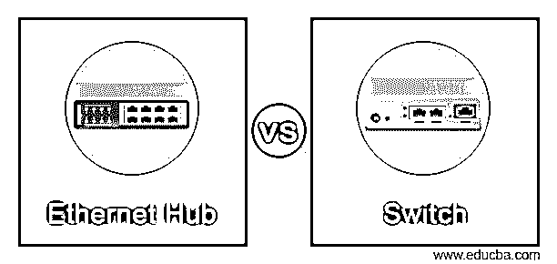
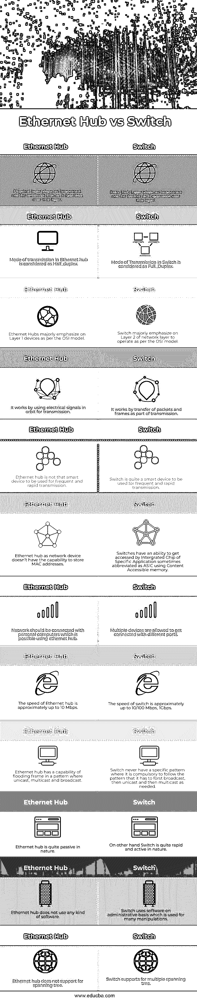

# 以太网集线器与交换机

> 原文：<https://www.educba.com/ethernet-hub-vs-switch/>

## 以太网集线器与交换机的区别

以下文章概述了以太网集线器与交换机。以太网集线器是一种设备，它充当多个系统的公共点，通过单一网络路由连接到该公共点网络。另一方面，交换机是一种专门的网络设备，它有助于通过一个计算机网络将各种系统连接在一起。以太网集线器用于将局域网的各个部分或网段连接在一起，它也充当存储端口的公共点，然后使数据包通过该路由中的公共点到达同一端口。

### 以太网集线器与交换机的直接比较(信息图表)

以下是以太网集线器与交换机之间的 12 大区别:

<small>网页开发、编程语言、软件测试&其他</small>

### 以太网集线器与交换机的主要区别

与交换机相比，以太网集线器有一些主要区别:

*   以太网集线器能够在端口之间共享带宽。而具有专用带宽的交换机与其他端口集共享。
*   以太网集线器中使用的传输模式是半双工，而交换机则以全双工方式传输数据。
*   以太网集线器根本不支持生成树实现，而在交换机的情况下，多生成树支持生成树实现。
*   交换机只支持对帧进行过滤，因此它们只存在于特定的专用设备中，尤其是在传输数据包和比特时对转发的帧进行过滤。另一方面，当到达以太集线器进行转发时，没有过滤的概念，而是将一个帧唯一地转发到每个端口。
*   以太网集线器利用域中的单个冲突，而交换机支持不同端口和不同域的冲突，因为哪个以太网集线器经历更多不同的域冲突。
*   在以太网集线器中，与交换机相比，用于连接的端口数量非常少，与以太网集线器相比，交换机可以支持许多端口，因此非常有用。
*   以太网集线器之间最重要的关键区别是，它运行在物理层，而交换机运行在 OSI 的数据链路层。
*   以太网集线器仍然能够处理端口转发，但是它不支持交换协议，而在交换机的情况下则完全相反，在交换机的情况下，交换机使用交换环路，这在部署和检查生成树协议时很有用，有助于使周围无环路。
*   以太网集线器被认为是一种非常被动的集线器，它可以增强信号，并利用信号的产生与其他设备建立连接。
*   相比之下，交换机充当主动集线器，为建立任何成功的连接提供大量的信号生成和放大。
*   有一些局域网电缆连接到集线器的帮助下，一些连接器，如 RJ45，它作为一个中介，并有一个大约 100 米长的电线范围的连接。为了与其他节点形成网络并添加节点以扩展连接，需要以分层格式增加节点，其中集线器作为半双工模式的链接设备，用于传输并进一步接收数据。就数据过滤而言，使用数据包过滤无需任何准备或额外操作就能轻松实现。
*   在交换机的情况下，数据传输通过提供配置来进行，但不需要额外的过滤。
*   以太网集线器的传输类型是广播类型，而交换机的传输类型首先是单播，接着是多播，然后是广播类型。
*   使用在以太网集线器中更健全和稳定的许多其他协议，发送器和接收器之间的通信变得流畅，但是在根据要求的类型和需要进行切换的情况下不稳定。因此，以太网集线器和交换机各有不同。

### 以太网集线器与交换机对照表

让我们讨论一下以太网集线器与交换机之间的主要比较:

| **以太网集线器** | **开关** |
| 物理层对以太网集线器起着重要的作用，因为它在这一层上运行。 | 数据链路层对交换机起着重要的作用，因为它在这一层上运行。 |
| 以太网集线器中的传输模式被视为半双工。 | 交换机中的传输模式被视为全双工。 |
| 按照 OSI 模型，以太网集线器主要强调第 1 层设备。 | 交换机主要侧重于网络层的第 2 层，按照 OSI 模型运行。 |
| 它的工作原理是利用轨道上的电信号进行传输。 | 它的工作原理是将数据包和帧的传输作为传输的一部分。 |
| 以太网集线器不是用于频繁和快速传输的智能设备。 | 交换机是一个非常智能的设备，用于频繁和快速的传输。 |
| 作为网络设备的以太网集线器不具备存储 MAC 地址的能力。 | 交换机能够被特定应用的集成芯片访问，有时缩写为使用内容可访问存储器的 ASIC。 |
| 网络应该与个人电脑连接，这可以使用以太网集线器。 | 允许多个设备通过不同的端口连接。 |
| 以太网集线器的速度大约高达 10 Mbps。 | 交换机的速度大约高达 10/100 Mbps，1Gbps。 |
| 以太网集线器能够以单播、多播和广播模式泛洪帧。 | 交换机从来没有一个特定的模式，在这种模式下，它必须强制遵循这样的模式:先广播，然后单播，然后按需组播。 |
| 以太网集线器本质上是相当被动的。 | 另一方面，转换在本质上是相当迅速和活跃的。 |
| 以太网集线器不使用任何软件。 | 交换机在管理基础上使用软件，用于许多操作。 |
| 以太网集线器不支持生成树。 | 交换机支持多生成树 |

### 结论

以太网集线器和交换机是网络及其连接的两个组件，用于以某种方式建立通信。因此，在使用比较和关键差异中提到的协议集实施时，以太网集线器和交换机在用途和要求方面都有各自的重要性。

### 推荐文章

这是以太网集线器与交换机的指南。在这里，我们通过信息图和比较表来讨论以太网集线器与交换机的主要区别。您也可以看看以下文章，了解更多信息–

1.  [交换机 vs 路由器 vs 集线器](https://www.educba.com/switch-vs-router-vs-hub/)
2.  [桥 vs 开关](https://www.educba.com/bridge-vs-switch/)
3.  [vs 兰](https://www.educba.com/vlan-vs-lan/)
4.  [中继端口对接入端口](https://www.educba.com/trunk-port-vs-access-port/)

