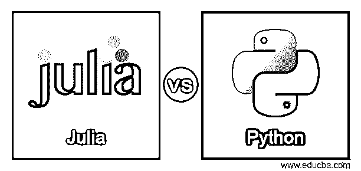
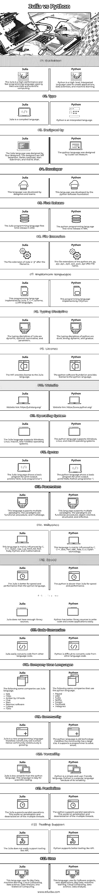

# Julia vs Python

> 原文：<https://www.educba.com/julia-vs-python/>

## Julia 与 Python 的区别

*   Julia and python 是一种为数据分析师和大数据工作的编程语言。
*   Julia 和 python 是一种用于统计计算和机器学习的高级语言。
*   Python 和 Julia 是通用的，easy 编程语言适用于云计算。
*   Julia 是一种高性能快速编程语言，用于创建应用程序和科学计算。
*   Julia 是开源的高级技术，支持并行、并发和分布式计算。
*   Python 是一种流行、简单、通用的编程语言，适用于小型和大型软件项目。
*   Python 是一种用于数据计算和机器学习的高级解释语言。
*   Julia 和 python 是一种用于软件开发和数据管理系统的开源函数式编程技术。

### Julia 与 Python 的面对面比较(信息图)

以下是 Julia 和 Python 之间的主要区别

<small>网页开发、编程语言、软件测试&其他</small>

### Julia 与 Python 的主要区别

下面给出了 Julia 和 Python 之间的一些区别:

*   Julia 是一种编译型编程语言，而 python 是一种解释型语言。
*   Julia 语言比 python 编程语言更快。但是，另一方面，python 比 Julia 语言更加用户友好。
*   Python 是一种面向对象的函数式编程语言。因此，Julia 是一种函数式编程语言。
*   python 有成熟的库支持，而 Julia 支持主动开发库。
*   朱莉娅很容易将代码转换成其他语言。不幸的是，python 具有将代码转换成另一种语言的困难过程。
*   python 数组从 0 到 N-1 开始。Julia 数组从 1 到 n 开始。
*   Julia 是比 python 编程语言更简单的数值计算语法。因此，Julia 是比 python 语言更容易和简单的代码。
*   人们更喜欢 Julia 的编程语言用于数据科学编程。而 python 语言更喜欢干净的代码成为小型和大型的应用程序。
*   茱莉亚是在大数据、机器学习、云计算、数据科学、数据分析、统计计算方面表现比较好的。

### Julia 与 Python 的比较表

*   Julia 和 python 是用于数据分析的开源函数式编程作品。
*   Julia 和 python 是现代技术中简单、干净、强大的打字语言。
*   Julia 和 python 语言在不同的应用程序中有各自的特性、功能和可用性。
*   下表有助于理解 Julia 和 python 语言在开发和其他方面的功能。

| **特性** | 朱莉娅 | **Python** |
| **定义** | The Julia is a high-performance and fast programming language used by data scientists and scientific computing. | Python is a high-level, interpreted language used to create applications, data scientists, and machine learning. |
| **类型** | Julia 是一种编译语言。 | Python 是一种解释型语言。 |
| **由**设计 | 朱莉娅语言是由四位设计师设计的。设计师是杰夫·贝赞森、斯特凡·卡尔平斯基、艾伦·埃德尔曼和维尔拉·b·沙阿。 | python 语言是由吉多·范·罗苏姆设计的。 |
| **开发者** | 这种语言是由设计师和团队开发的。 | 这种语言由 python 软件基金会开发。 |
| **首次发布** | Julia 编程语言于 2012 年首次发布。 | python 编程语言于 1991 年首次发布。 |
| **文件扩展名** | 茱莉亚的文件扩展名是”。jl"。 | python 的文件扩展名是。py，。pyi，。pyc，。pyd，。pyo。pyw，。文件名后的 pyz。 |
| **实现语言** | 这种编程语言由 Julia，C，C++，scheme，LLVM 语言实现。 | 这种编程语言由 CPython 实现。 |
| **打字专业** | Julia 的打字规则是动态的、可选的、主格的和参数化的。 | python 的类型原则是鸭、强壮、动态和渐进。 |
| **执照** | 麻省理工学院为朱莉娅语言提供许可。 | python 软件基金会为 python 语言提供许可。 |
| **网站** | 网站链接:https://julialang.org/ | 网站链接:https://www.python.org/ |
| **操作系统** | Julia 语言支持 Windows、Linux、macOS 和 FreeBSD 操作系统。 | python 语言支持 Windows、Linux 和 macOS 操作系统。 |
| **语法** | The Julia language shows a basic program for print output.println(“你好朱莉娅程序员”) | The python language shows a basic program for print output.打印(“你好 Python 程序员”) |
| **参数** | 这种语言支持多种范例。范例是功能性的、程序性的和多阶段的。 | 这种语言支持多种范例。范例是功能性的、过程性的、面向对象的、结构化的和反思性的。 |
| **影响** | 这种语言主要受 C，C++，Dylan，Lisp，Lua，MATLAB，Perl，Ruby，Python，mathematical 的影响。 | 这种语言主要受 C、C++、Java、Perl、ABC、Ada、CLU、迪伦技术的影响。 |
| **速度** | Julia 在速度和性能上比 python 语言更好。 | 就速度和性能而言，python 比 Julia 慢。 |
| **图书馆** | 朱莉娅没有足够的图书馆资源。 | Python 有更好的库资源，可以轻松地编写代码和创建应用程序。 |
| **代码转换** | Julia 很容易将代码从其他语言代码转换过来。 | Python 很难将代码从其他语言代码转换过来。 |
| **公司使用的语言** | 下面一些公司使用 Julia 语言。

*   N26
*   飞向
*   琥珀由因费埃多
*   firewood
*   Stan
*   realmec 软件
*   cymera
*   福里奥

 | 以下是一些使用 python 语言的公司。

*   贝宝
*   Uber
*   Twilio
*   Net fly
*   Google
*   Facebook
*   Instagram

 |
| **社区** | Julia 是一种新的编程语言；所以社区规模小。因此，社区在不断发展。 | python 语言是旧技术；所以社区规模很大。它支持程序员解决错误。 |
| **多功能性** | Julia 的通用性不如 python 语言。这种语言便于科学编码。 | Python 是一种简单且用户友好的语言。Python 是一种流行的语言，因为它的多功能性。 |
| **并行度** | Julia 支持并行操作。这适用于多线程的序列化和反序列化。 | python 支持并行操作。这适用于多线程的序列化和反序列化。 |
| **工具支架** | Julia 不容易支持像 API 这样的工具。 | Python 支持更好的工具，比如 API。 |
| **用途** | 这种语言用于大数据、机器学习、云计算、数据科学、数据分析和统计计算。 | 这种语言用于软件项目、网络应用、大数据、机器学习、云计算、数据科学、数据分析。 |

### 结论

*   Julia 和 python 对于数据科学家开发者来说是最有用最有帮助的。
*   朱莉娅是因为速度而被要求的。因此，Python 因其多功能性而广受欢迎。
*   Julia 和 python 是用户友好、简单、干净的编程语言。

### 推荐文章

这是 Julia vs Python 的指南。在这里，我们用信息图和比较表来讨论 Julia 和 Python 的主要区别。您也可以看看以下文章，了解更多信息–

1.  [Asana vs Todoist](https://www.educba.com/asana-vs-todoist/)
2.  Arduino Leonardo vs Uno
3.  [内联网 vs 外联网](https://www.educba.com/intranet-vs-extranet/)
4.  [Alexa vs 谷歌](https://www.educba.com/alexa-vs-google/)

