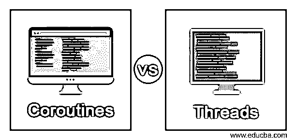
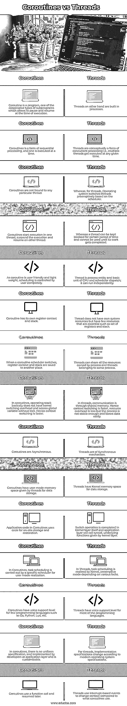

# 协程与线程

> 原文：<https://www.educba.com/coroutines-vs-threads/>

## 协程与线程的区别

协程 vs 线程将通过比较它们来展示关键的不同和相似之处。仔细看一下每一个的定义，协程是一种顺序处理的形式，也就是说，一个协程可以在任何给定的时间执行，类似于子程序。而线程是并发处理的一种形式，即在任何给定时间执行多个线程。在线程中，操作系统将根据调度程序抢先切换线程的运行。与线程不同，协程会有一个程序员，编程语言决定何时切换到协程。协程和线程之间的区别相对更大。

### 协程与线程的直接比较(信息图)

以下是协程与线程之间的 15 大区别:

<small>网页开发、编程语言、软件测试&其他</small>

### 协程与线程的主要区别

让我们讨论一下协程与线程之间的一些主要区别:

*   协程需要一步一步或一行一行地读取文件并将其解析成一些有意义的信息，或者将整个内容加载到内存中。
*   线程是在不复制整个进程的情况下创建的；它们是在用户空间而不是内核空间创建的。
*   协程在程序中的特定点重新调度，避免并发执行。这被认为是有利的，因为它是事件驱动的。
*   线程不是相互独立的；它们共享代码和数据部分以及操作系统资源。
*   协同程序在异步编程和函数式编程中实现。
*   相对而言，协程保持了较高的系统利用率。
*   协同程序可以实现抢占式调度，并且比线程需要更少的资源。
*   线程最大限度地减少了上下文切换时间，并在流程中提供了并发性。
*   线程具有高效的通信，并且在线程的创建和上下文切换中更经济。
*   线程允许以更大的规模和效率使用多处理器架构。
*   由于线程可以共享公共数据，它们不需要进程间通信，因此线程比多处理器有优势。
*   用户级线程是在用户级库中实现的，而不是在系统调用中实现的，因此不需要调用操作系统来导致内核中断。
*   内核级线程知道并管理线程，不需要运行时系统。内核有一个线程表来跟踪系统中的所有线程。
*   由于内核线程知道所有的线程，调度程序决定给拥有大量线程的进程比拥有少量线程的进程更多的时间。

### 协程与线程对照表

让我们讨论一下协程与线程之间的主要比较:

| **协程** | **线程** |
| 协程是一种程序，是子程序的协作类型之一，允许在执行时暂停和恢复。 | 另一方面，线程是内置的进程。 |
| 协程是顺序处理的一种形式，一次执行一个。 | 线程在概念上是并发处理的一种形式，即多个线程在任何给定的时间被执行。 |
| 协程不绑定到任何特定的线程。 | 而对于线程，操作系统根据调度器优先切换线程。 |
| 协程在一个线程中开始执行，暂停执行并在另一个线程上继续。 | 而线程可以被阻塞一段时间，直到它的工作完成后才能使用。 |
| 由于协程是用户友好的和轻量级的，调度完全由用户控制。 | 线程是一个进程实体，是 CPU 和调度程序调度的基本单位；它可以独立运行。 |
| 协程有自己的寄存器上下文和堆栈。 | 线程没有自己的系统资源，但有一些重要的资源，如一组寄存器和堆栈。 |
| 当协程调度程序切换时，寄存器上下文和堆栈被保存到另一个地方。 | 线程可以共享进程和属于同一进程的线程所拥有的所有资源。 |
| 在协同程序中，操作栈基本上没有内核切换开销，并且在没有锁的情况下访问全局变量。因此，上下文切换更快。 | 在线程中，通信是通过共享内存进行的。因此，上下文切换更快，资源开销更少，但是该过程不够稳定，并且容易丢失数据。 |
| 协程是异步的。 | 线程具有同步机制。 |
| 协程拥有由线程提供的用户模式内存空间，用于数据存储。 | 线程拥有用于数据存储的内核内存空间。 |
| 协同例程中的应用程序代码使用代码进行现场存储和恢复。 | 切换操作是在内核层本身完成的，应用层会调用内核层给出的底层函数 syscall。 |
| 在协同程序中，任务调度是由用户模式实现的特定调度器来执行的。 | 在线程中，任务调度由内核实现，抢占模式依赖于各种锁。 |
| 协程对少数编程语言(如 Go、Python、Lua 等)有语音支持级别。 | 线程对大多数编程语言都有语音支持级别。 |
| 在协程中，没有统一的规范，由开发者在应用层实现，并且是可定制的。 | 对于线程，实现规范根据现代操作系统规范而变化。 |
| 协同程序使用一个函数调用，稍后再继续。 | 与协同程序相比，线程使用基于中断的事件来改变上下文。 |

### 结论

至此，我们将结束主题“协程与线程”。我们已经看到了协程与线程的定义以及它们各自的含义。接下来，我们看到了一个比较表，列出了协程和线程的相同点和不同点，并列出了两者之间的一些关键差异。

### 推荐文章

这是协程与线程的指南。这里我们分别讨论信息图和比较表的主要区别。您也可以看看以下文章，了解更多信息–

1.  [多线程 vs 多重处理](https://www.educba.com/multithreading-vs-multiprocessing/)
2.  [Python vs Groovy](https://www.educba.com/python-vs-groovy/)
3.  [Python vs Ruby](https://www.educba.com/python-vs-ruby/)
4.  [Python vs Scala](https://www.educba.com/python-vs-scala/)

