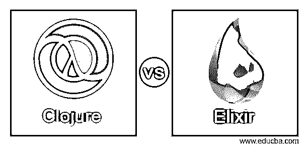
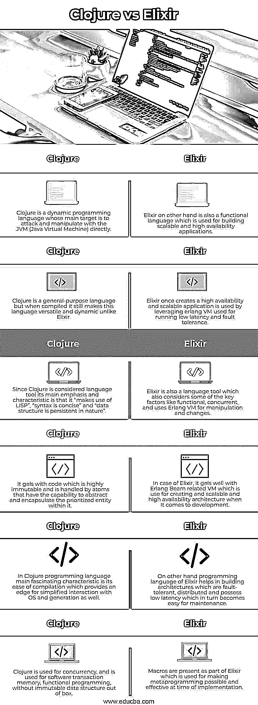

# Clojure vs 酏剂

> 原文：<https://www.educba.com/clojure-vs-elixir/>

## Clojure 与酏剂的区别

下面的文章提供了 Clojure vs Elixir 的概要。Clojure 是一种动态编程语言，用于与目标软件如 JVM (Java 虚拟机)进行转换和倾斜。它通常被认为是一种通用语言，用于将方法和脚本语言结合起来，具有灵活性和健壮性，特别是在多线程编程方面。另一方面，Clojure 是一种编译语言，主要用于直接用 JVM 编译字节码；尽管如此，它仍然充满活力。与 Clojure 相比，Elixir 也是一种用于构建可伸缩和可维护的应用程序的语言。

### Clojure 与 Elixir 的面对面比较(信息图表)

以下是 Clojure 与 Elixir 之间的 6 大区别:

<small>网页开发、编程语言、软件测试&其他</small>

### Clojure 与酏剂的主要区别

让我们讨论一下 Clojure 和 Elixir 之间的一些主要区别:

*   由于 Clojure 是一种面向 Lisp 的语言，所以它通过简化整个语言来操作和简化函数。但是，从另一方面来说，它的语法更简单、更高尚，这使它成为最容易接近的函数式语言。
*   Clojure 旨在维护生态系统，并使应用程序倾向于软件事务，以使内存和函数式编程成为开箱即用的不可变数据结构，从而为开发团队提供仅使用功能而非并发处理的优势。
*   作为一种编程语言，Clojure 的不变性在嵌入式系统中是默认的，因为它通过用函数和原子处理实体标识的转换来改变状态。
*   Clojure 是一个跨平台的域，因为它有助于编译成 JVM 字节码，并有助于在 JVM 内部运行它。它进一步使整个应用程序变得健壮和通用。
*   Clojure 语言本质上是动态的，具有高超的处理语言，尽管系统之间存在一些丰富而严格的规范，这些规范是可选的。
*   这是一个具有宏系统的工具，可以帮助插件考虑除球拍以外的特定语言的附加参数。
*   它是一个工具，用于自动化，集成，以及关于环境文件和其他实用程序的良好配置。
*   magrice 有一些缺点，比如它会产生很多令人困惑的错误消息，并且不允许对错误代码和管理进行大量的异常处理。
*   一些语言结构是 JVM 限制的变通方法，具有复杂的 FFI。
*   最主要的方便和美妙之处在于它有助于利用大量现有的 ERLANG Beam VM。
*   与 Clojure 相比，它提供的另一个额外的区别是，它有助于制作良好的文档，涵盖从编写和开发非常适合的文档开始的几乎所有内容。
*   熟悉 Ruby 和面向对象编程语言的开发人员会有很多优势，因为 Erlang VM 主干语言是 Ruby。它还为基于 Prolog 的语法提供了一个陡峭的学习图。
*   与 Clojure 相比，它还可以根据内置工具的要求下载库，以便在添加“deps”功能时，通过将它们放在应用程序范围内来相应地维护文档，然后使用 mix deps.get 命令运行。
*   由 elixir 制成的基础设施非常有用，有助于使整体结构更加健壮，可以处理大量流量，而无需额外的服务器成本。
*   宏有助于元编程，这反过来又使功能变得容易和简化，使编码具有可读性和可理解的格式。
*   Elixir 也像 Clojure 一样是开源的，但仍然有依赖性和结构差异，就像它是分布式的和无延迟的。
*   Elixir 仍然有一些依赖性和缺点，比如它被用于部署，这比普通的部署和操作更不精简。
*   一些设计选择可能有更多的复杂性和差异，这可能会使其采用选项不那么深刻。

### Clojure 与酏剂对比表

让我们来讨论一下 Clojure 与 Elixir 之间的顶级比较:

| **Clojure** | **仙丹** |
| Clojure 是一种动态编程语言，其主要目标是直接攻击和操纵 JVM (Java 虚拟机)。 | 另一方面，Elixir 也是一种函数式语言，用于构建可伸缩和高可用性的应用程序。 |
| Clojure 是一种通用语言，但在编译时，它仍然使这种语言具有通用性和动态性，不像 Elixir。 | 一旦创建了高可用性和可伸缩的应用程序，就可以通过利用 erlang VM 来运行低延迟和容错。 |
| 既然 Clojure 被认为是一个语言工具，那么它的主要重点和特点就是“利用了 LISP”，“语法简洁”，“数据结构本质上是持久的”。 | Elixir 还是一个语言工具，它也考虑了一些关键因素，如功能性、并发性，并使用 Erlang VM 进行操作和更改。 |
| 它与高度不可变的代码结合在一起，并由能够抽象和封装其中优先实体的原子来处理。 | 就 Elixir 而言，它与 Erlang Beam 相关的 VM 结合得很好，后者用于在开发时创建可伸缩的高可用性架构。 |
| 在 Clojure 编程语言中，最吸引人的特点是易于编译，这为简化与 OS 和 generation 的交互提供了优势。 | 另一方面，Elixir 的编程语言有助于构建容错、分布式和低延迟的体系结构，这反过来又使维护变得容易。 |
| Clojure 用于并发，用于软件事务内存，没有开箱即用的不可变数据结构的函数式编程。 | 宏作为 Elixir 的一部分出现，用于在实现时使元编程成为可能和有效。 |

### 结论

Clojure 和 Elixir 作为语言工具，都有各自的需求。当谈到 Elixir 语言时，具有构建、扩展和管理的公司是有用的，但就 Clojure 而言，它将利用具有跟踪和日志记录能力的分布式系统，因此，使这个目标与 JVM 和编译活动也很好地结合。

### 推荐文章

这是 Clojure vs 酏剂的指南。这里我们分别用信息图和比较表来讨论 Clojure 和 Elixir 的关键区别。您也可以看看以下文章，了解更多信息–

1.  [Java vs PHP](https://www.educba.com/java-vs-php/)
2.  [Java vs Java EE](https://www.educba.com/java-vs-java-ee/)
3.  [Java vs Kotlin](https://www.educba.com/java-vs-kotlin/)
4.  [RxJava vs 反应器](https://www.educba.com/rxjava-vs-reactor/)

