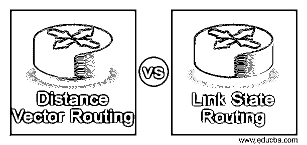
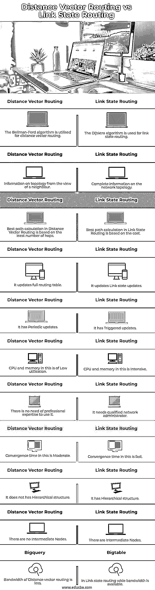

# 距离矢量路由与链路状态路由

> 原文：<https://www.educba.com/distance-vector-routing-vs-link-state-routing/>

## 距离矢量路由与链路状态路由的区别

以下文章概述了距离矢量路由和链路状态路由。在距离矢量路由中，路由器不需要知道到每个网段的完整路由；它只需要了解传递数据包的向量或方向。这种方法计算距离(即跳数)和方向(即通往互联网络中任何网络的向量)。距离矢量路由方法定期在下一个邻居中广播部分路由表。因此，即使网络没有变化，使用距离矢量路由协议的路由器也会频繁更新。根据从相邻路由器收到的更新信息，路由器会验证所有已知路由，并修改其本地路由表。因为路由器拥有的网络拓扑的路由知识依赖于邻居路由器的路由表，所以这种方法被称为“流言路由”使用路由度量或跳数的典型距离矢量协议是 RIP 和 IGRP。

在链路状态路由中，每台路由器都试图创建其网络基础设施的内部映射。当路由器开始工作时，它向网络传输消息，并从与其直接相连的路由器收集数据。它会告诉您到路由器的链路是否处于活动状态。其它路由器利用这些信息来创建网络拓扑图。然后路由器扫描地图选择最佳路线。链路状态路由方法可以快速响应网络变化。如果网络发生变化，它会发送触发更新，并每 30 分钟进行一次定期更新。如果链路状态发生变化，检测到变化的设备会生成更新消息并发送给所有路由器。一旦每个路由器接收到更新消息的副本并更新其路由数据库，该消息就被转发到所有相邻路由器。更新消息必须被泛洪，以保证所有路由器在生成包含新技术的更新路由表之前更新其数据库。OSPF 协议就是链路状态路由的一个例子。

<small>网页开发、编程语言、软件测试&其他</small>

### 距离矢量路由与链路状态路由的全面比较(信息图)

以下是距离矢量路由与链路状态路由之间的 11 大区别:

### 距离矢量路由与链路状态路由的主要区别

让我们讨论一下距离矢量路由与链路状态路由之间的一些主要区别:

*   贝尔曼-福特算法用于距离矢量路由；另一方面，Dijsktra 算法用于链路状态路由。
*   路由器在距离矢量路由中接收拓扑信息。相反，在链路状态路由中，路由器接收全面的网络拓扑信息。
*   距离矢量路由根据两点之间的距离来确定最佳路径。另一方面，链路状态路由根据最低成本确定最佳路由。
*   这两种路由技术都有不同的更新频率，其中一种技术会定期改变距离矢量，另一种技术会触发更新。
*   与链路状态路由相比，距离矢量路由占用的 CPU 和内存更少。
*   距离矢量路由的带宽较小，而链路状态路由的带宽较大。
*   距离矢量路由易于设置和维护。另一方面，链路状态路由很复杂，需要使用合格的网络管理员。
*   距离矢量路由会延迟收敛时间，并且经常会遇到计数到无穷大的问题。另一方面，链路状态路由具有更快、更一致的收敛时间。
*   虽然距离矢量没有，但链路状态路由中的节点可以有分层结构。

### 距离矢量路由与链路状态路由对照表

我们来讨论距离矢量路由与链路状态路由之间的主要比较:

| **Sr 号** | **距离矢量路由** | **链路状态路由** |
| One | 贝尔曼-福特算法用于距离矢量路由。 | Dijsktra 算法用于链路状态路由。 |
| Two | 来自邻居的拓扑信息。 | 网络拓扑的完整信息。 |
| Three | 距离矢量路由中的最佳路径计算基于最少的跳数。 | 链路状态路由中的最佳路径计算基于开销。 |
| Four | 它会更新完整的路由表。 | 它更新链路状态更新。 |
| Five | 它会定期更新。 | 它触发了更新。 |
| Six | 这种情况下 CPU 和内存的利用率很低。 | 这需要大量的 CPU 和内存。 |
| Seven | 使用它不需要专业的知识。 | 它需要一个合格的网络管理员。 |
| Eight | 收敛时间适中。 | 收敛时间很快。 |
| Nine | 它没有等级结构。 | 它有一个等级结构。 |
| Ten | 没有中间节点。 | 有中间节点。 |
| Eleven | 距离矢量路由的带宽较小。 | 在链路状态路由中，宽带是可用的。 |

### 结论

在距离矢量路由中，完全自治系统的信息和数据只与邻居共享。另一方面，在链路状态路由中，路由器只传送关于它们邻居的信息；所有路由器共享该信息。这里我们看到了距离矢量路由和链路状态路由之间的主要区别。

### 推荐文章

这是距离矢量路由与链路状态路由的对比指南。这里我们分别讨论信息图和比较表的主要区别。您也可以看看以下文章，了解更多信息–

1.  [OSPF vs 瑞普](https://www.educba.com/ospf-vs-rip/)
2.  [SCTP vs TCP](https://www.educba.com/sctp-vs-tcp/)
3.  [Java Vector vs ArrayList](https://www.educba.com/java-vector-vs-arraylist/)
4.  [Java vs Java EE](https://www.educba.com/java-vs-java-ee/)

