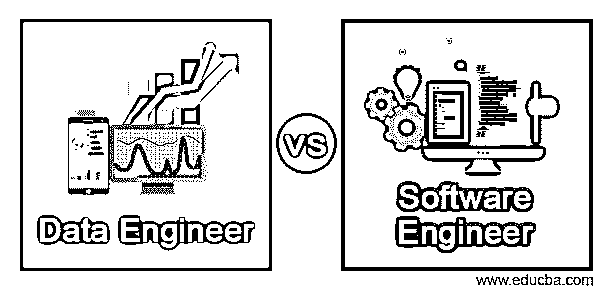
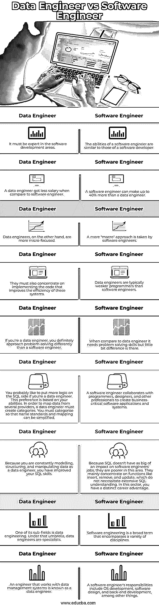

# 数据工程师 vs 软件工程师

> 原文：<https://www.educba.com/data-engineer-vs-software-engineer/>

## 数据工程师和软件工程师的区别

下面的文章提供了数据工程师和软件工程师的概要。数据工程师创建可以存储、组织和检索软件工程师系统和应用程序所需数据的系统；因为数据工程师被训练来处理没有分配给软件工程部门的任务，所以数据工程在软件工程专业中已经成为一种独特的才能，并且它还通过 API 获得一些信息，这些 API 是健壮的和有良好文档记录的，并且被设计来从第三方软件中检索历史数据，然后根据研究，对于以前在 it 部门担任软件工程师的数据工程师来说，它大约有一些中级百分比。

数据工程师为他们的系统和应用程序设计存储、组织和检索软件工程师数据的方法。数据工程师已经成为软件工程职业中的一项独特技能，因为他们被训练来处理没有分配给软件工程部门的任务。数据工程师使用强大的、文档完善的、旨在从第三方获取历史数据的 API 来获取信息。根据研究，超过 90%的数据工程师曾经做过软件工程师.数据工程师是软件开发领域的专家。他们负责数据分析师，这样他们就可以做出重要的决定。数据工程师的职责包括分布式计算、复杂数据结构、数据管道开发，这类似于其他并行编程语言。数据工程师需要定期刷新他们的技能，如 Kafka、Hadoop、Hive 和 Spark 以及其他软件库。对编程语言、数据库和工具的最佳理解可以收集查询存储并从数据库中检索其他数据，从而成为一名成功的数据工程师。数据工程师还有其他与大数据最近的扩展相关的职责，以及防止编程逻辑中的法律修改和隐私问题。此外，它还需要自信地驾驭新环境，并具备数据工程师所需的数据库和 Java 编程语言方面的良好知识。

<small>网页开发、编程语言、软件测试&其他</small>

相反，软件工程师与设计师、程序员和开发人员合作创建应用程序和系统。软件工程师的职责包括操作系统开发、软件设计、前端和后端编程以及移动应用程序开发。基础设施和平台工程师是软件工程师的其他术语。他们主要关注数据建模、SQL 以及 Spark 和其他基于 Amazon 的 web 服务等技术的使用。软件工程师的工作水平比数据工程师高，数据工程师专注于他们的任务。他们负责开发数据输入和存储系统，无论是网站、专业软件还是应用程序。因为他们与软件工程师打交道必须快速高效。

### 数据工程师与软件工程师的面对面比较(信息图表)

以下是数据工程师和软件工程师之间的 9 大区别:

### 数据工程师和软件工程师的主要区别

让我们讨论一下数据工程师和软件工程师之间的一些主要区别:

*   数据工程师:如果我们真的想成为一名数据工程师，学士学位是一个很好的起点(但这并不是获得职位的必要条件)。我们还应该准备好使用特定的编程语言，比如 SQL，来进行数据挖掘。如果我们能证明你能熟练地从海量数据集中提取洞察力，我们将被录用为入门级的数据工程职位。一年的工作经验之后，你可能会继续攻读硕士学位，或者申请更高级的职位。有些人考虑获得大数据认证，但许多雇主更看重相关的数据分析能力和专业知识，而不是证书。在您作为数据工程师的整个职业生涯中，利用每一个机会与跨学科团体(如数据建模师、架构师和其他 IT 专家)接触，从他们的项目中学习并改进您自己的方法。
*   **软件工程师:**在代码之外，软件开发人员使用并实现了应用中实现的其他技术逻辑。软件工程师可能专攻数据库和其他技术概念，这取决于公司的需要。虽然这些工作马上吸引你，但是要集中更多的技术在工程领域。也有一些专业资格，有 n 个技能，以招聘该公司的工程师。变量可能会导致一个有利可图的软件工程职位。

### 数据工程师与软件工程师对照表

让我们来讨论一下数据工程师和软件工程师之间的主要对比:

| **数据工程师** | **软件工程师** |
| 它必须是软件开发领域的专家。 | 软件工程师的能力类似于软件开发人员的能力。 |
| 与软件工程师相比，数据工程师的工资较低。 | 软件工程师的收入比数据工程师高 40%。 |
| 另一方面，数据工程师更关注微观。 | 软件工程师采用一种更“宏观”的方法。 |
| 他们还必须专注于实现提高这些系统效率的代码。 | 数据工程师通常比软件工程师更弱。 |
| 如果你是一名数据工程师，你解决问题的方式肯定与软件工程师不同。 | 与数据工程师相比，it 需要解决问题的技能，但还是有一点不同。 |
| 如果您是一名数据工程师，您可能喜欢将更多的逻辑放在 SQL 端。这种偏好是基于你的能力。为了映射来自多个提供者的数据，数据工程师必须创建类别。您必须进行分类，以便简化命名标准和映射。 | 软件工程师与程序员、设计师和其他专业人员合作创建业务关键型软件应用程序和系统。 |
| 因为作为一名数据工程师，您不断地对数据进行建模、结构化和操作，所以您已经提高了 SQL 技能。 | 因为 SQL 对软件工程师的工作没有那么大的影响，所以他们在这方面比较穷。他们主要关注插入、删除和更新等功能，这些功能不需要深入理解 SQL。在这方面，你有明显的职业优势。 |
| 它的一个子领域是数据工程。在这个保护伞下，数据工程师是专家。 | 软件工程是一个包含多种学科的广义术语。 |
| 使用数据管理系统的工程师被称为数据工程师。 | 软件工程师的职责包括操作系统开发、软件设计和后端开发等。 |

### 结论

当在数据工程师和软件工程师之间进行选择时，你希望你的新团队成员担任的特定角色的列表是要考虑的最重要的事情。在许多情况下，团队将受益于同时拥有一个数据工程师和一个软件工程师，以及各种额外的职位。

### 推荐文章

这是数据工程师和软件工程师的指南。这里我们分别讨论信息图和比较表的主要区别。您也可以看看以下文章，了解更多信息–

1.  [软件工程师 vs 软件开发人员](https://www.educba.com/software-engineer-vs-software-developer/)
2.  [计算机工程 vs 计算机科学](https://www.educba.com/computer-engineering-vs-computer-science/)
3.  [程序员 vs 软件工程](https://www.educba.com/programmers-vs-software-engineering/)
4.  [网络钓鱼与视觉攻击](https://www.educba.com/phishing-vs-vishing/)

