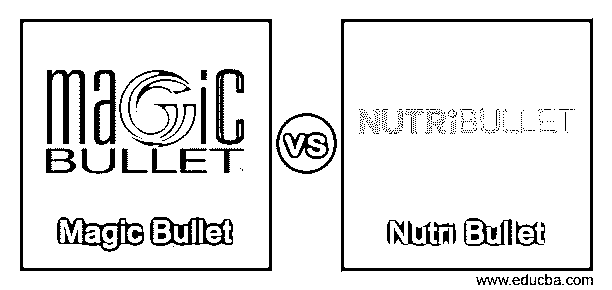
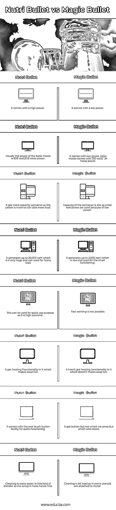

# 魔术子弹 vs 营养子弹

> 原文：<https://www.educba.com/magic-bullet-vs-nutri-bullet/>

## 魔术子弹和营养子弹的区别

市场上有很多工具可以满足厨房的需求。如果需要混合、搅拌和制作果汁，那么就需要一台搅拌机。Bullet 是市场上制造这两种产品的大品牌。这两种产品具有不同的特点和要求。根据其独特的功能，这两个产品使他们的方式。当大型搅拌机的生活变得更加忙碌时，这些搅拌机让厨房生活变得更加轻松，因为它们的尺寸和重量都很方便。由于它们的体积小，可以满足快速获取的需求。他们让我们的生活健康，因为我们得到了营养奶昔、冰沙和非常天然和自制的酱料。

这两款产品分别是 Nutribullet 和 Magic bullet。这两款产品有不同的型号，并且都有不同的配置。其中，我们将讨论他们的一些优点和缺点，我们会建议哪一个是好的。

<small>网页开发、编程语言、软件测试&其他</small>

### 魔弹与纽崔莱的面对面比较(信息图)

以下是 Magic Bullet vs Nutri Bullet 的 8 大区别:

### 魔术子弹和 Nutri 子弹的主要区别

魔术子弹 vs. Nutri 子弹都是市场上的热门选择；让我们讨论一下 Magic Bullet 与 Nutri Bullet 之间的一些显著差异:

*   Nutri bullet 有三种不同的型号 1。营养子弹 600 2。营养子弹临 900 3。营养子弹 RX。魔术子弹只有一个型号，名为魔术子弹 250 瓦。
*   通常，Nutri 子弹的碗有 18 盎司、24 盎司和 32 盎司。魔术子弹的碗是 12 & 8 盎司。
*   如果你正在处理思慕雪和奶昔，不想在搅拌机上花更多的钱，你有更便宜的选择，但如果你要做更多的事情，那么选择是 Nutribullet。
*   如果考虑搅拌机和搅拌机日常使用的用电点。当这个时候，你的服务被限制在一天一到两次，魔术子弹是一个很好的选择，因为它可以节省你的电力。如果你不在乎电力，想要更多电力，Nutri bullet 是最佳选择。
*   魔弹与 NutriBullet 的主要区别在于，Nutri Bullet 相对于魔弹来说是相对无声的。如果你想在早上做奶昔，又不想被吵醒，你可以快速到厨房做奶昔，而不会发出烦人的声音。
*   嗯，我们可以说 Nutri bullet 不是一个很好的研磨搅拌机，但它配有一个不同的刀片，用于切割和研磨种子、咖啡豆和小燕麦。而魔弹没有处理这种磨人的特性。
*   有些功能保持不变，由于用途不同，Magic Bullet 有 12 种不同类型的碗或杯子，而 Nutri bullet 有 18 种不同类型的面。
*   两种型号都在中国制造，但 Nutri bullet 有一个一键式按钮设施，使用户能够快速运行，并可以使用该按钮随时启动和停止。同时，我们在魔术子弹中没有得到这个特征。
*   我们可以看到 Nutri Bullet 具有加热功能，这意味着如果我们从冰箱中取出配料来制作思慕雪，那么我们可以在搅拌机中加热，因为他们中的许多人都有喝热思慕雪和奶昔的习惯。魔弹里面没有这个特点，可以说这是它滞后的一个突出特点。
*   颜色是另一个不重要但取决于用户的特征。Nutri bullet 有灰色和黑色两种颜色，非常吸引人，因为许多人喜欢在厨房里保持黑色，因为有污渍。但是魔术子弹只有银色，这意味着购买魔术子弹的人没有太多选择。
*   最后要讨论的一件事是 Nutri bullet 附带一本食谱。那本食谱有所有思慕雪的食谱和正确的思慕雪的正确杯子，这使得用户在更短的时间内变得对搅拌器更友好。不像这本食谱，它没有魔法子弹。不过，这没什么大不了的，但唯一的问题是，他不能为适当的食谱确定适当的杯子。

### 魔术子弹与 Nutri 子弹对照表

以下是 Magic Bullet 与 Nutri Bullet 之间最重要的比较:

| 【Magic Bullet 与 Nutri Bullet 的比较基础 | **Nutri Bullet** | **神奇的子弹** |
| **1。** | 它有很高的功率。 | 它的功率很低。 |
| **2。** | 通常基本款的功率是 600 瓦/0.8 马力。 | 它的功率很低，基本型号为 250 瓦/0.34 马力。 |
| **3。** | 它有一个容量更大的集装箱，因为功率更大，所以可以装载更多的货物。 | 由于功率低，使用小容器，所以容器的容量低。 |
| **4。** | 它可以产生高达 20，000 转/分的转速，这是非常巨大的，可以用于重载。 | 它产生高达 2，000 转/分的低转速，用于小型功能。 |
| **5。** | 这可以用于快速使用的目的，因为它是高功率的。 | 快速工作是不可能的。 |
| **6。** | 它有加热功能，可以让汤变热。 | 它没有加热功能，不会使汤变热。 |
| 7 .**。** | 它配有一个快速操作的一键式按钮设施。 | 它的按钮不是我们按下的，而是我们旋转的。 |
| **8。** | 这种搅拌机的清洗要容易得多，因为安装起来没有任何麻烦。 | 清洗有点困难，因为有些器具是装在马达上的。 |

### 结论

当比较所有的搅拌机时，如果你比较价格、功能和配置，就会发现它们有很大的不同。营养子弹比魔法子弹更有效。尽管如此，用户必须通过定义其要求来进行选择，因为两者都来自同一制造商，这样人们将获得相同质量但配置不同的产品。

### 推荐文章

这是魔术子弹和 Nutri 子弹之间最大区别的指南。在这里，我们还讨论了 Magic Bullet 与 Nutri Bullet 的关键区别，包括信息图表和比较表。你也可以看看下面的文章来了解更多。

1.  [最佳设计模式面试问答](https://www.educba.com/design-pattern-interview-questions/)
2.  [您必须在 InDesign CS6 中探索的顶级新功能](https://www.educba.com/indesign-cs6-top-ten-new-features/)
3.  [标志设计和品牌推广的惊人意义](https://www.educba.com/logo-design-and-branding/)

