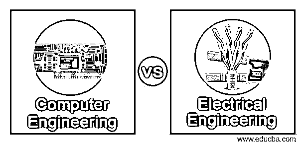
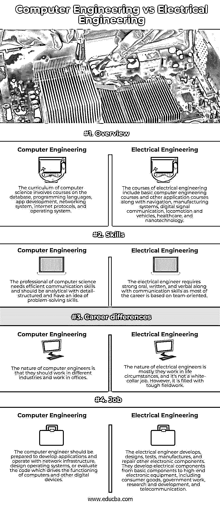

# 计算机工程 vs 电气工程

> 原文：<https://www.educba.com/computer-engineering-vs-electrical-engineering/>

## 计算机工程和电气工程的区别

确定学生想在计算机技术领域从事什么工作是一种方法，但是确定计算机技术的哪个分支是一项复杂的任务。有时，很难做出选择的原因取决于他们的职业和显著的优点。例如，与电子工程相比，计算机科学提供了更好的就业机会和更高的薪水，而电子工程的通用性较低，并且需要研究生学位。另一方面，尽管这两个领域都有各自的优势和局限性，但是选择电子工程而不是计算机工程的好处是巨大的，而且并不明显。在这篇计算机工程与电气工程的文章中，我们简要讨论了这两个领域的不同观点。

### 计算机工程与电气工程的直接对比(信息图)

以下是计算机工程和电气工程之间的四大区别:

<small>网页开发、编程语言、软件测试&其他</small>

### 计算机工程与电气工程的主要区别

这两个领域的主要区别是课程、薪水、职业差异、兴趣和技能。

#### 1.作业

电气工程的广泛领域管理电能的产生、传输和转换。它包括操作安装在办公室和发电厂的电路和电子元件。电气工程师的职能是设计和实施新的电气系统，测试元件，并解决不同的问题。专业领域找到了从小型计算器到超级计算机、通信系统、布线系统和发电机的所有东西。计算机工程是电气工程的一部分，顾名思义，它包括不同的数字组件和软件程序。计算机工程师应该在计算机体系结构、硬件、IT 安全、网络、IT 通信和软件工程方面有责任心和技能。基于专业领域，设计应该增强计算机硬件，实现和设计 IT 通信网络，或者与开发人员一起寻找具有不同类型软件的灵活硬件。

#### 2.薪水

在美国，计算机工程和电子工程的最高工资是 37，690 美元。在激情话题上进行深刻的争论，而不是选择一份高薪的工作。如果这个人有兴趣学习复杂的理论，计算机科学是他最好的选择，因为它包括计算机编程、数值分析、算法和计算理论。但是很少有人被计算机所吸引，因为它们报酬很高，而且就业增长也很快。但不包括任何实际应用。电气工程领域的基础是实施科学、技术和数学工程，以解决与计算机设计相关的问题，并开发吸引对解决算法不感兴趣的学生的程序。电气工程师开发电气组件并测试他们开发的 BLS 设计。他们的工作使计算机的使用从电路水平到软件和硬件系统的集成有了显著的不同。

#### 3.职业

电气工程是一条不需要高级学位课程的职业道路。如果用户希望获得任何专业工程许可证，学士学位将有资格成为电气工程的初级角色。当电气工程师进入研究生院时，他们选择学习博士或硕士学位，以发展更多专门技能或为任何领导角色进行培训；它不仅致力于找工作。另一方面，根据 BLS 报告，信息和计算机研究科学家需要硕士学位。但是当谈到职业道路时，学生应该在基础教育课程之外再计划三年。这个额外学位可以增加基础学士学位的价值，但很少是昂贵的。但是，如果学生想快速工作，赚取合理的工资，对实际或实时工作感兴趣，他可以选择电气工程。计算机工程中常见的职业角色是计算机系统分析师、数据库管理员或软件开发员。

#### 4.课程

计算机工程和电子工程都有一个狭窄的研究领域。计算机科学专业专注于游戏开发，移动计算，网络安全，人工智能和机器学习。然而，学生应该操作计算机，并且很难转换到其他职业。电气工程的好处之一是它比计算机科学更广泛。电气工程学生学习电路，数字系统，计算机工程基础和电气工程深度等课程。据 BLS 报道，计算机科学专业的学生还学习电机、通信系统、电子元件和发电系统。

### 计算机工程与电气工程对照表

我们来看一下计算机工程 vs 电气工程的对比表。

| **属性** | **计算机工程** | **电气工程** |
| 概观 | The computer science curriculum involves courses on the database, programming languages, app development, networking system, internet protocols, and operating system. | Electrical engineering courses include basic computer engineering and other application courses, navigation, manufacturing systems, digital signal communication, locomotion and vehicles, healthcare, and nanotechnology. |
| 技能 | The computer science professional needs efficient communication skills and should be analytical with detail-structured and have an idea of problem-solving skills. | The electrical engineer requires strong oral, written, and verbal communication skills as most careers are team-oriented. |
| 职业差异 | The nature of computer engineers is that they should work in different industries and work in offices. | 电气工程师的性质主要是他们在生活环境中工作，而不是白领工作。然而，它充满了艰苦的野外工作。 |
| 职位 | The computer engineer should be prepared to develop applications and operate with network infrastructure, design operating systems, or evaluate the code which drives the functioning of computers and other digital devices. | The electrical engineer develops, designs, tests, manufactures, and repairs other electronic components. They develop electrical components from basic components to high-end electronic equipment, including consumer goods, government work, research and development, and telecommunication.. |

### 结论

计算机和电子工程部门属于电气工程的更广泛的学科。计算机工程被认为是电子工程和计算机科学的混合学科。

### 推荐文章

这是一本计算机工程与电气工程的指南。在这里，我们还通过信息图和比较表讨论了计算机工程和电气工程的主要区别。您也可以看看以下文章，了解更多信息–

1.  [需求工程](https://www.educba.com/requirement-engineering/)
2.  [AutoCAD vs. SolidWorks](https://www.educba.com/autocad-vs-solidworks/)
3.  [Rails 与 PHP](https://www.educba.com/rails-vs-php/)
4.  [AMD vs 英伟达](https://www.educba.com/amd-vs-nvidia/)

