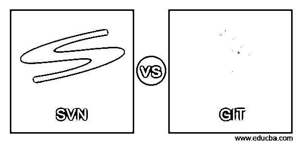

# SVN 与 go

> 原文：<https://www.educba.com/svn-vs-git/>

## SVN 和 GIT 的区别

这是一个关于 SVN vs GIT 的概要。让我们看看 Git 和 SVN 的一些基础知识，包括它们的主要优点和最突出的缺点，来强调这些区别。

### 什么是 SVN？

Apache Subversion(通常缩写为 svn，后来其命令名为 SVN)是一个在 [Apache 许可](https://www.educba.com/apache-hive-vs-apache-spark-sql/) 下作为开源发布的软件版本和修订控制系统。软件开发人员使用 Subversion 来管理数据的当前和历史版本，例如源代码、网页和文档。它的目的是成为广泛使用的并发版本系统(CVS)的最兼容的继承者。开源社区已经广泛使用 Subversion:例如，在 Apache Software Foundation、Free Pascal、FreeBSD、GCC 和 SourceForge 等项目中。CodePlex 用于允许访问 Subversion 以及不同类型的客户端。Subversion 由 CollabNet Inc .于 2000 年设计，目前是由全球贡献者社区构建的顶级 Apache 项目。SVN 的特性是符号链接的版本控制，对二进制文件的本地支持，包括节省空间的二进制差异存储，作为真正的原子操作提交(CVS 中中断的提交操作会导致存储库不一致或损坏)，重命名/复制/移动/删除保存整个修订历史的文件。系统保持目录、重命名和文件元数据的版本控制(但不包括时间戳)。用户可以快速移动和复制所有目录树，同时保留完整的修订历史。

<small>网页开发、编程语言、软件测试&其他</small>

此外，Apache HTTP Server 作为网络服务器，WebDAV/Delta-V 作为协议，一个名为 Svnserve 的独立服务器进程使用 TCP/IP 上的自定义协议。此外，分支是一种廉价的操作，与文件大小无关(尽管 Subversion 本身并不区分分支和目录)。本机客户端-服务器，分层库设计。此外，客户机/服务器协议在两个方向上传输差异，成本与大小的变化成比例，而不是与数据大小成比例。最后是可解析的输出，包括 XML 日志输出。

### GIT 是什么？

Git 是一个版本控制系统，用于跟踪计算机文件的修改，并在不同的人之间协调这些文件的工作。它主要用于软件开发中的源代码管理；但是，它可以用来跟踪任何一组文件中的修改。作为一个分布式修订控制系统，它的目标是速度、数据完整性和对分布式非线性工作流程的支持。 [Git 由 Linus Torvalds](https://www.educba.com/github-interview-questions/) 于 2005 年创建，用于开发 Linux 内核，其他内核开发人员为其主要开发做出了贡献。它目前的维护者是 2005 年之后的 Junio Hamano。与大多数其他分布式版本控制系统一样，与大多数客户机-服务器系统不同，每台计算机上的每个 Git 目录都是一个完整的存储库，拥有完整的历史和完整的版本跟踪技术，独立于网络访问或中央服务器。Git 是在 GNU 通用公共许可证版本 2 下发布的免费开源软件。

### SVN 与 GIT 的对决(信息图)

下面是 SVN 和 GIT 的五大区别:

### SVN 与 GIT 的主要区别

SVN 和 GIT 都是市场上的热门选择；让我们讨论一下 SVN 和 GIT 之间的一些主要区别。

*   SVN 已经运行了超过 15 年，并且已经集成到当今大多数的集成服务器、问题跟踪系统、ide 和其他系统中。当考虑 Git 和 SVN 之间的差异时，尽管比 SVN 年轻 5 岁，Git 绝不落后。和其他软件集成起来很简单。Git 只提供了命令行工具，但是几家公司已经在它的基础上创建了不同的 UI，比如 Atlassian 的 Source Tree、Github、Git Extensions 等等。
*   当切换到 Git 时，最显著的区别之一是它的速度。整个存储库都存储在开发人员的本地机器上，这样他们可以在很差的互联网连接下工作几天。由于 Git 的分支实现，创建分支很快。在 Git 中，分支只是一个对提交的引用，下面的提交将被附加到这个引用中。它甚至不包含必要的信息，如创建日期、创建它的用户或一些消息。
*   由于是分布式的，开发人员不需要向其他人提供提交访问权来使用版本控制特性。相反，开发人员可以决定何时合并以及从谁那里合并。也就是说，因为 subversion 控制访问，所以为了允许每日签入，用户需要提交访问。在 Git 中，用户可以对他们的工作进行版本控制，而回购所有者控制源代码。
*   在 git 的初始版本中，对二进制文件的看似无关紧要的修改，例如调节图像的亮度，可能会有足够的差异，Git 会将它们解释为新文件，从而导致内容历史被分割为 Subversion 轨道，这些差异的历史被保留。
*   使用 Subversion，可以检查存储库的子目录。这是 Git 做不到的。对于一个大项目，你总是需要下载整个存储库，即使你只需要某个子目录的当前版本。当高速互联网连接只能在大多数城市获得，移动互联网连接的流量非常昂贵时，Git 在农村地区或移动设备上可能会花费更多的时间和金钱。少量的 git 存储库可以缓解这种情况。

### SVN 与 GIT 对比表

下面是 SVN 和 GIT 之间最重要的比较。

| **比较的基础** | ******【SVN】****** | **去** |
| **定义** | Apache Subversion (SVN)是由 Apache 软件基金会开发的免费开源软件，它作为一个控制系统运行，用于跟踪对文件、文件夹和目录的修改。 | Git 是由 Linux 开发人员 Linus Torvalds 创建的内容管理和跟踪系统。它包括一个目录，在整个应用程序或网站开发过程中，随着代码的添加，该目录会不断变化。Git 还跟踪对存储数据进行的修改。 |
| **提交** | SVN 上的每次提交都会生成对远程存储库的新修订，这意味着为了能够提交对代码的一些修改，开发人员需要访问主存储库。 |  

在 git 上，提交发生在本地，所以开发人员不需要访问远程。工作可以在本地提交，然后当开发人员获得对远程存储库的访问权时，可以一次提交所有的提交。

 |
| **安全** | SVN 提供了更精细的安全控制，您可以对存储库上的所有文件夹拥有不同的访问权限，请记住，标签和分支也是文件夹，这对于自上而下的管理非常有用。 | GIT 安全性是基于存储库的，您只能授权或拒绝用户访问整个存储库。您还可以对某些分支实现只读访问，但是对于整个存储库，不要对单个文件夹或文件进行只读访问。 |
| **标签** | 对于 SVN 来说，标签只是主存储库中的另一个文件夹，它不应该接收任何更新并保持静态，这可以通过对新标签的访问限制来实现。 | 在 git 上，标签是指向特定提交的静态指针。与分支指针不同，标记指针是静态的，这表明它不能移动到另一个提交。 |
| **客户端** | SVN 有命令行界面，加上一些图形用户界面客户端，如乌龟 SVN 和视觉 SVN。 | Git 还有命令行界面和许多 GUI 客户端，如 Git 扩展、源代码树、GitHub、GIT 北海巨妖和 Tortoise Git。 |

### 结论

总之，这两个版本控制系统可以交付现代开发人员需要的几乎所有东西。通常，GIT 更直观，更快，也更可靠。无论您的团队实践 Git 还是 SVN，您都将受益于能够跟踪和审查您的代码以获得更好的发布。只要确保选择一个问题跟踪软件来帮助您的选择，这样您就能够随着时间的推移准确地跟踪这项工作。

### 推荐文章

这是一个 SVN vs GIT 的指南。在这里，我们讨论定义、主要区别、比较表以及信息图表。您也可以看看以下文章，了解更多信息–

1.  [SVN vs CVS |主要区别](https://www.educba.com/svn-vs-cvs/)
2.  什么是 SVN？
3.  [gitlab vs azure devotes](https://www.educba.com/gitlab-vs-azure-devops/)
4.  [github vs 代码](https://www.educba.com/github-vscode/)

