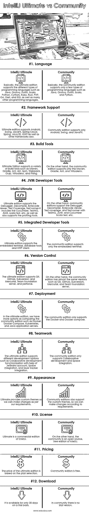

# IntelliJ 终极版 vs 社区版

> 原文：<https://www.educba.com/intellij-ultimate-vs-community/>

## IntelliJ 旗舰版与社区版的区别

下面的文章提供了 IntelliJ Ultimate vs Community 的概要。终极版和社区版不过是 IntelliJ 的两个不同版本。基本上，Ultimate 是 Intellij 的付费版本，通常用于全栈开发，并支持不同类型的后端和前端框架。Ultimate 包括分析、HTTP 和其他特性。另一方面，该社区是一个开源的免费版本，通常用于 JVM 开发。

Ultimate 是 IntelliJ 的付费版本，基本上用于 web 和企业应用程序开发。对不同类型编程语言的最终支持意味着广泛的编程语言，它允许我们进行版本控制。终极版的价格是每年 500 美元。另一方面，我们有一个社区版，这是 IntelliJ 的免费版本。它只支持 JVM 类型的应用程序开发和较少的编程语言。

<small>网页开发、编程语言、软件测试&其他</small>

### 什么是 IntelliJ Ultimate？

IntelliJ 终极版是 IntelliJ Idea 的版本之一。与社区版本不同，它支持多种编程方言，如 Java、HTML、Python、CSS 和 Go。除了本地版本的三种结构之外，它同样支持一些不同的系统，如 spring、reactions 和 Selenium。IntelliJ IDE 的最终版本提供了不同的发送设备；为工程师构建仪器和协调的设计设备。毫无疑问，与社区版相比，终极版给了你许多亮点；无论如何，它是一个授权的或者我们可以说是付费的 IDE，如果我们想要这个版本，我们需要购买它。

### 什么是社区？

这也是 IntelliJ 的一个版本，而且是免费开源的。它支持几种编程方言，如 Java、HTML 和 Kotlin，但不支持众多不同的方言，如 JavaScript、CSS、PHP 和 Go。社区版 IDE 只给出了三种结构，Android、JavaFX 和 Swing。与终极版本相比，它提供了受限的排列工具，并构建了装置。

### IntelliJ Ultimate 与 Community 的直接对比(信息图)

以下是 IntelliJ Ultimate 与 Community 的 12 大区别:

### IntelliJ Ultimate 与 Community 的主要区别

让我们看看 IntelliJ Ultimate 与 Community 的主要区别:

*   基本上，IntelliJ 提供了两种不同类型的版本，如旗舰版和社区版。
*   社区是开源版。因此，对于一款出色的设备来说，这是毫无疑问的，你应该注意到它的根本缺点是它只支持 Java、HTML 和 Kotlin 等几种编程方言，而不支持 Javascript、CSS、PHP 和 Go 等多种不同的方言。
*   此外，社区版只提供了三个系统，Android、JavaFX 和 Swing。你同样应该意识到，与最终版本相比，它提供了受限的组织和组装设备。
*   这是一个付费版，它必须与社区版有所不同，终极版支持用于开发的不同类型的编程语言。它同样包含额外的结构，如弹簧、反应和硒。
*   虽然很明显，IntelliJ 的终极版本提供了一个更加强大的贡献设置，但它是一个授权的 IDE，这意味着你要为它付费。建议是，当你熟悉了一切，并寻找可以将它带到更高水平的示范性装置时，让一切都随着免费演奏滚动起来。

### IntelliJ 旗舰版与社区版对比表

我们来讨论一下 IntelliJ Ultimate 与 Community 的顶级对比:

| **参数** | **终极** | **社区** |
| **语言** | 基本上，终极版支持不同类型的编程语言，如 Java、Groovy、Kotlin、Scala、Python、Cython、Ruby、Rust、PHP、Go、Dart 和 SQL 以及许多其他编程语言。 | 基本上，社区版只支持几种编程语言，比如 Java、Groovy、Kotlin、Scala 和 Python。 |
| **框架支撑** | 旗舰版支持 Android，Swing，JavaFX，Spring Cloud，Spring，Java EE，GWT 以及其他框架。 | 社区版仅支持 Android、Swing 和 JavaFX。 |
| **构建工具** | Ultimate Edition 支持多种构建工具，如 Maven、Gradle、Ant、sbt、npm、Webpack、Gulp、Virtualenv 和 Phing。 | 另一方面，社区版只支持 Maven、Gradle、Ant 和 Virtualenv。 |
| **JVM 开发者工具** | Ultimate edition 支持调试器、反编译、字节码查看器、测试覆盖率、测试运行器——它包括 Cucumber、TestNG、JUnit、scala test 等，也支持概要分析工具。 | 另一方面，community editions 支持调试器、反编译器、字节码查看器、测试覆盖率，以及 TestNG、JUnit 和 Cucumber Scala test 等测试运行器。 |
| **集成开发工具** | 终极版支持嵌入式终端、数据库工具和 HTTP 客户端。 | 社区版仅支持嵌入式终端。 |
| **版本控制** | 终极版支持 Git、GitHub、Subversion 和 Mercurial、Team foundation server 和 perforce。 | 另一方面，社区版有 Git、GitHub、Subversion、Mercurial、Team foundation server 等几乎相同的版本。 |
| **部署** | 在终极版中，我们有更多的选项来比较社区版，如 Docker、Docker Compose、Kubernetes 和 Java 应用服务器。 | 社区版只支持 Docker 和 Docker compose。 |
| **团队合作** | 终极版支持不同的开发选项，如协作开发、JetBrains 帐户帮助下的同步、空间集成和问题跟踪器集成。 | 社区版只支持协同开发和空间整合。 |
| **外观** | Ultimate 提供自定义主题，因此我们可以根据自己的要求进行更改。 | 社区版也支持自定义主题，因此我们可以根据需要进行更改。 |
| **执照** | Ultimate 是 IntelliJ 的商业版。 | 另一方面，该社区是 IntelliJ 的开源免费版。 |
| **定价** | 终极版的价格根据方案选择而定。 | 社区版免费。 |
| **下载** | 它只有 30 天的试用期。 | 在社区中没有试用版。 |

### 结论

在本文中，我们看到了什么是 Ultimate 和 IntelliJ 的 Community edition，以及 Ultimate 和 Community with configuration 之间的一些基本差异。我们还看到了 Ultimate 和 Community 的用途和特性，以及如何在 IntelliJ 中使用它们。

### 推荐文章

这是 IntelliJ 终极版 vs 社区的指南。在这里，我们讨论 IntelliJ Ultimate 与 Community 的主要区别，并提供信息图表和比较表。您也可以看看以下文章，了解更多信息–

1.  [Eclipse vs IntelliJ](https://www.educba.com/eclipse-vs-intellij/)
2.  [IntelliJ vs NetBeans](https://www.educba.com/intellij-vs-netbeans/)
3.  [Julia vs Python](https://www.educba.com/julia-vs-python/)
4.  [TestNG vs JUnit](https://www.educba.com/testng-vs-junit/)

