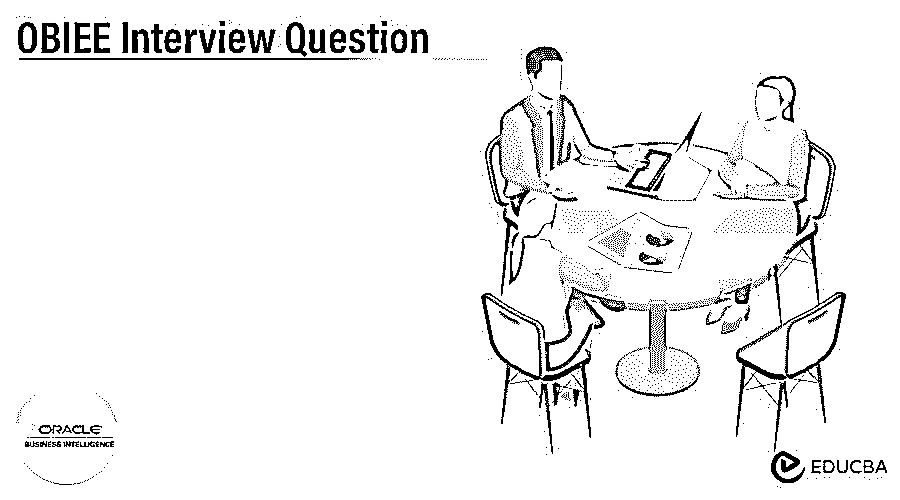

# OBIEE 面试问题

> 原文：<https://www.educba.com/obiee-interview-question/>

## OBIEE 面试问答介绍

Oracle 商业智能企业版(OBIEE)是由 Oracle 公司开发的商业智能产品。这个也叫 OBI EE Plus。该工具是 Oracle 商业智能工具的一部分。这个工具主要是用支持多平台的 Java 和 C++编程语言编写的。这是一个商业分析软件，也是许可的专有软件。

如果你找的是和 OBIEE 相关的工作，你需要准备好 2022 年 OBIEE 的面试问题。虽然每个 OBIEE 面试都是不同的，工作范围也是不同的，但我们可以帮助你解决 OBIEE 面试中的问题和答案，这将帮助你在面试中取得成功。牢记这一点，我们设计了最常见的 OBIEE 面试问题和答案，以帮助你在面试中取得成功。

<small>网页开发、编程语言、软件测试&其他</small>

以下是 2022 OBIEE 面试中被问到最多的问题列表。该问题列表分为以下两部分:

*   [第 1 部分 OBIEE 面试问题(基础)](#1)
*   [第二部分 OBIEE 面试问题(高级)](#2)

### 第 1 部分 OBIEE 面试问题(基础)

这第一部分包括基本的面试问题和答案。

#### 1.什么是 Oracle 商业智能企业版(OBIEE)？

**回答:**
Oracle 商业智能企业版(OBIEE)是一个开发商业智能和分析应用程序的平台，这些应用程序用于提供全面的功能，如仪表板、报告、分析、警报和通知、定制查询以及财务报告业务流程、集成系统管理。OBIEE 建立在支持复杂部署和更多工作负载的现代技术基础之上。
Oracle 商务智能企业版(OBIEE)包含一个交互式仪表盘解决方案，可提供完全交互式的报告工具。OBIEE 还提供了与 Microsoft Excel 的集成。Oracle 商业智能服务器是 Oracle 商业智能企业版(OBIEE)的关键组件和基础。OBIEE 在其执行引擎、内存管理、高吞吐量数据和连接适配器中提供了并行查询，这允许高效的数据源并最小化数据检索时间。

#### 2.OBIEE 的主要特点是什么？

**回答:**
OBIEE 的功能包括交互式仪表盘、企业报告、自助式报告创建、Microsoft Office 集成、主动检测和警报、可操作情报、地图可视化。在 OBIEE 中，用户可以创建自己的交互式仪表盘。OBIEE 提供企业报告，用于定制和生成不同形式的模板。OBIEE 还包含一个强大的[实时](https://www.educba.com/real-time-analytics/)警报引擎，它基于业务事件提供通知和警报。这用于消息事件或高度用于应用程序警报的应用程序监控系统。
OBIEE 的优势在于可视化、从头开始创建报告、用户友好、flash 报告、报告模板、与主要数据源的集成、在线分析处理(OLAP)以及带有演示和事务处理的分析。可以与 Oracle Business Intelligence Enterprise Edition(OBIEE)集成的不同类型的数据库有 IBM DB2、Microsoft SQL Server、Teradata、Microsoft Analysis Services 和 SAP Business Information Warehouse(BW)。使用 OBIEE 有几个操作上的好处。

#### 3.OBIEE 中的交互式仪表盘是什么？

**答:**
Oracle 商业智能企业版(OBIEE)有一个交互式仪表盘，通过提供几种不同格式的可视化图形结构来呈现不同的数据格式。用户可以通过使用仪表板功能获得即席查询分析的好处。OBIEE dashboard 位于向用户视图提供演示的应用程序的表示层之下。Business Intelligence publisher 提供 BI 仪表板。对于所需的下拉工具和多个复选框工具以及要查看的选定列，可以为不同的用户以不同的方式自定义仪表板。
交互式仪表盘根据个人的角色、身份和需求，提供对所需、可行和动态定制信息的交互式访问。Oracle Business Intelligence Enterprise Edition(OBIEE)和 Oracle Business Intelligence interactive dashboards 环境提供了不同的功能，最终用户可以使用实时报告、图表、表格、数据透视表、图形、提示和不完整的 web 架构。OBIEE 提供了来自不同来源的不同内容格式的聚合，如互联网、文件托管服务器和文档或内容管理存储库。OBIEE 中的访问管理系统根据个人用户的角色和身份交互式地提供信息。

### 第 2 部分 OBIEE 面试问题(高级)

这第一部分包括高级面试问题和答案。

#### 4.OBIEE 服务器有哪些不同的组件？

**答案:**
OBIEE 的不同服务器组件有 Oracle BI (OBIEE)服务器、应用服务器、Oracle Presentation Server、集群控制器、调度器。Oracle BI Server 是 Oracle Business Intelligence Enterprise Edition(OBIEE)的主要组件和基础，负责建立系统中不同组件之间的通信。报告将在该组件中生成，并将被发送到数据库进行查询。OBIEE 应用服务器提供了与客户端组件协同工作的机制。OBIEE suite 包含一个应用服务器，作为 oracle 提供的内置特性。
OBIEE 组件包括服务器和客户端组件，以及各种基于客户端的组件，如交互式仪表盘、Oracle Delivers、BI Publisher、BI Presentation Service Administrator、Answers、Disconnected Analytics 和 MS Office 插件。它还包含非基于 web 的客户端，如 OBIEE 管理和 OBIEE 客户端。OBIEE 管理用于构建存储库，包含业务表示层和物理层三层。用于连接到数据库系统并执行 SQL 查询命令的客户端。表示层是一个单页应用程序，它为用户提供仪表板和用户界面，以便根据需要与服务器组件进行交互。OBIEE 还包含一个 OBI 调度程序，它将用于调度需要关系存储库进行设置的作业。

#### 5.什么是 Oracle BIEE 系统信息库？

**答案:**
Oracle 商业智能企业版(OBIEE)存储库包含商业智能服务器的重要元数据信息，可以通过管理控制台管理。存储在应用程序环境中的不同类型的信息是数据建模、聚合导航、缓存、安全性、连接信息和 SQL 信息。可以通过 BI 服务器访问多个存储库。管理控制台包含一个存储库选项卡，该选项卡用作上传或发布到发布模式存储库中的控件。上传存储库后，将添加一个存储库编号后缀。

如果需要多个存储库，所需的更改将在存储库部分的配置文件中执行。使用该配置，还可以修改存储库。OBIEE 有两个不同的版本，称为 10g 和 11g，作为其软件包版本。在创建生命之前，首先应该离线创建一个存储库。创建存储库之前，应始终导入元数据信息。数据源配置也将在创建存储库的过程中执行。在 OBIEE 中，创建存储库时可以选择不同的元数据类型和数据源视图。

### 推荐文章

这是一个 OBIEE 面试问题和答案的列表，以便候选人可以轻松地解决这些面试问题。这是 OBIEE 面试问答上最牛逼的帖子。您也可以阅读以下文章，了解更多信息——

