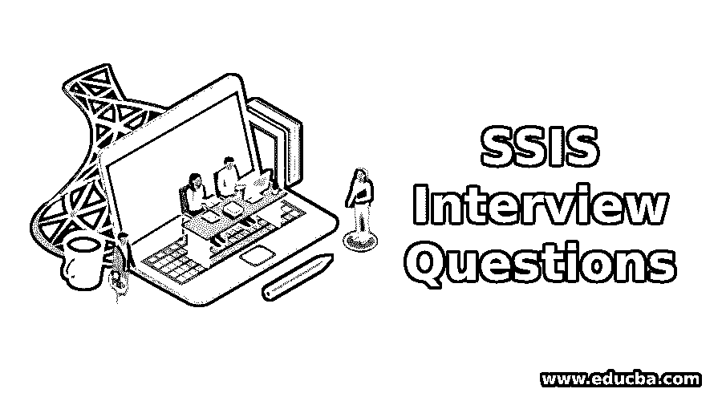

# SSIS 面试问题

> 原文：<https://www.educba.com/ssis-interview-questions/>

## SSIS 面试问答介绍

SQL Server Integration Services(SSIS)是微软公司开发的数据集成工具，用于广泛的数据迁移活动。这是一个数据集成和工作流应用的平台。它是由微软提供的专有商业软件，运行在微软视窗平台上。

如果你想找一份与 SSIS 相关的工作，你需要准备 2021 年 SSIS 面试的问题。尽管每个 SSIS 面试都是不同的，工作范围也是不同的，但我们可以帮助你解决 SSIS 面试中的问题和答案，这将帮助你在 SSIS 面试中取得成功。牢记这一点，我们设计了最常见的 SSIS 面试问题和答案，以帮助你在面试中取得成功。

<small>网页开发、编程语言、软件测试&其他</small>

以下是 2021 年 SSIS 面试中最常被问到的问题:

### 第 1 部分 Basic 面试问答(基础)

以下是 SSIS 面试中最常被问到的基本问题:

#### 1.什么是 SQL Server Integration Services？

**回答:**
SQL Server Integration Services(SSIS)是一个集成不同企业级应用和转型解决方案的平台。集成服务将用于提供复杂的业务解决方案，这些解决方案可以轻松地交付业务需求。不同类型的复杂业务解决方案包括传输文件、发送消息以响应传入事件、数据仓库应用程序、数据挖掘、数据清理操作以及更新 SQL Server 对象或实体。SSIS 还是一个执行数据转换操作的提取、转换和加载(ETL)工具。

SQL Server Integration Services(SSIS)是 SQL Server 数据库软件的一个关键组件，用于执行不同的数据迁移操作。SSIS 有不同的特性，如连接、事件处理程序、任务、变量等。SQL Server Integration Services(SSIS)提供编程功能和扩展性选项，以开发用于转换和任务的自定义模型。

#### 2.SQL Server 集成服务(SSIS)的重要组件是什么？

**答:**
主要和重要的组件是四样东西，分别是 SSIS 运行时引擎、数据流管道引擎、SSIS 对象模型、SSIS 窗口服务。运行时引擎提供对包工作流的管理。数据流管道引擎提供从源到目标的数据转换以及内存中的转换。

integration services 体系结构包含 integration services 服务，该服务将在 SQL Server Management Studio 软件中提供，可用于监视和管理 SQL Server Integration Services(SSIS)包。Integration Services 对象模型包含应用程序编程接口(API ),可以通过管理这些接口来访问命令行实用工具、自定义应用程序和 Integration Services 工具。

Integration Services 运行时布局包含包、运行包，并提供对断点、配置、连接、日志记录和事务的支持，所有这些都可以保存。数据流任务将封装数据流引擎。内存中的缓冲区将由数据流引擎提供，数据流引擎将数据从源位置移动到目标位置。

### 第 2 部分-SSIS 面试问答(高级)

以下是面试中最常被问到的高级 SSIS 面试问题列表:

#### 3.SSIS 的检查站是什么？

**答:**
检查点用于存储 SQL Server Integration Services(SSIS)包中的故障，该包提供检查点功能，通过终止失败的作业来恢复失败的包，并通过提供故障恢复功能来恢复下一个作业。在检查点标题中,“属性”窗口提供了检查点文件名、检查点使用情况和保存检查点。完整路径可以在检查点文件名中指定，包变量和已完成的任务日志将存储在该文件中。使用检查点是为了从上一次任务失败的地方重新开始。

要实现检查点行为，应将检查点保存设置为 true。检查点将主要用于重启失败的 SSIS 软件包。应该在 SSIS 包中配置检查点。可以使用属性配置来生成或启用检查点。可以通过检查包含包 id 的检查点元素来检查检查点文件。每当 SSIS 程序包启动时，SSIS 都会搜索和加载检查点文件，并读取所有配置或属性详细信息。

#### 4.SSIS 有哪些不同的流量？

**答案:**
SQL Server Integration Services(SSIS)中不同的流是数据流和控制流。数据流任务将由数据流引擎执行，数据流引擎在源和目标之间移动或传输数据。通过将数据流任务添加到包中，control 将提供提取、转换和加载(ETL)工具功能。一个数据流至少包含一个数据流组件。

典型的数据流组件包含从源提取数据，将数据转换到可以修改的目标，以及在目标加载数据。在执行时，数据流引擎将提供一个执行计划。可以利用批量处理功能而不是数据流任务将批量数据插入 SQL Server 数据库。控制流为要执行的任务的工作流的执行提供了路径。循环概念是控制流执行方法的一个例子。

数据流提供从源到目的地的数据转换，而控制流通过逻辑执行和要执行的控制流操作来定义数据流的方式。每个 SQL Server Integration Services(SSIS)包都包含一个控制流，并且可以选择至少包含一个数据流。控制流元素有三种类型:包中提供结构的容器、提供任务的功能以及优先约束。integration services 体系结构也提供了嵌套容器的选项。

#### 5.有哪些不同类型的转换？

**答:**
不同类型的转换有商业智能转换、拆分和连接转换、行转换、行集转换、其他转换。同样，对于上述 SSIS 变换，存在许多变换的子类型。除了上述转换之外，还存在一些自定义转换。

转换是数据流任务的主要组成部分，它按照所需的格式或结构将数据从源数据源转换到目标数据源。转换的主要优点是它们在内存中，不需要 SQL 脚本中的任何细节。还有同步和异步转换，这对于并发转换很有用。

数据转换和派生列是同步转换，在转换过程中，数据流入内存缓冲区，相同的缓冲区流出。异步转换会导致数据流阻塞，有两种类型，称为部分阻塞转换和完全阻塞转换。SQL Server Integration Services(SSIS)中的这两个重大转变。

### 推荐文章

这是一个 SSIS 面试问题和答案的列表指南，以便候选人可以轻松地打击这些 SSIS 面试问题。这是关于 SSIS 面试问答的最有价值的帖子。您也可以阅读以下文章，了解更多信息——

1.  [大数据面试问题](https://www.educba.com/big-data-interview-questions/)
2.  [阿帕奇猪面试问题](https://www.educba.com/apache-pig-interview-questions/)
3.  [数据科学面试问题](https://www.educba.com/data-science-interview-questions/)
4.  [COBOL 面试问题](https://www.educba.com/cobol-interview-questions/)

