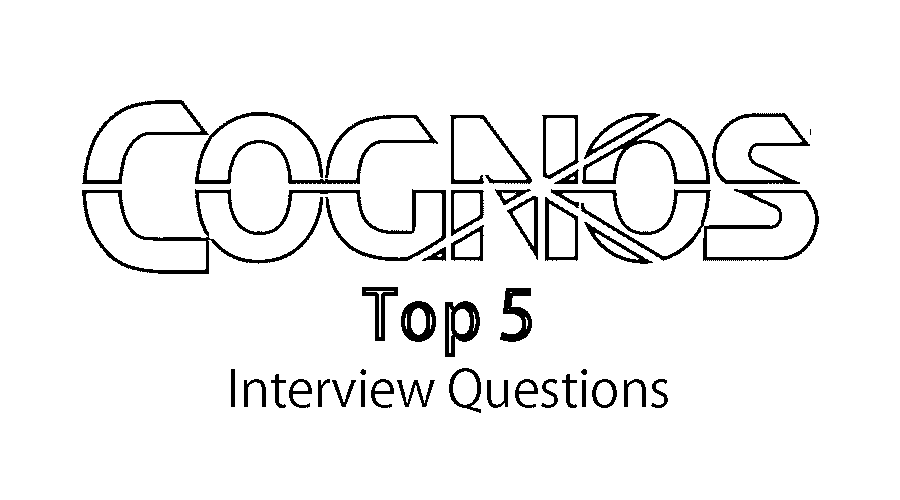

# Cognos 面试问题

> 原文：<https://www.educba.com/cognos-interview-questions/>

## Cognos 面试问答介绍

Cognos 是由加拿大安大略省的一家公司开发的商业智能工具，该公司开发商业智能和性能管理软件产品，其母公司是 IBM 公司。IBM Cognos 是一个分析解决方案软件，提供交互式业务解决方案。这是一个基于网络的报告和分析工具，是一个企业软件。

所以在 Cognos 准备工作面试的时候。我们相信你想知道最常见的 2022 年 Cognos 面试问题和答案，这将有助于你轻松破解 Cognos 面试。下面列出了 Cognos 面试中常见的问题和答案。

<small>网页开发、编程语言、软件测试&其他</small>

### 最常见的 Cognos 面试问题和答案

以下是 2021 年 Cognos 面试中最常被问到的问题:

#### 1.Cognos 工具有哪些特性？

**答:**
Cognos 工具的几个特性是模板和样式引用、选项卡式报告输出、动态多维数据集硬件调整向导、活动报告实时预览、我的数据集、可扩展可视化增强、多维数据集设计器增强、内存聚合。数据集功能允许用户将数据直接导出为不同的格式，这些格式将用于根据研究或分析数据的要求可视化现有数据。

Cognos 工具提供了可扩展的可视化增强。多维数据集设计器还包含几个新的增强功能。多维数据集设计器还有另一个新功能，可以导入框架管理器元数据信息。框架模型元数据可以直接导入到多维数据集设计器模式中。

#### 2.Cognos 中的报表项是什么？

**回答:**
报告是 Cognos 在绩效管理流程方面最重要的功能。它提供了极具挑战性的商业智能解决方案的路径和方式。可以使用 IBM Cognos 商业智能版本的商业智能解决方案提供的 Tivoli 公共报告特性来完成报告。报表项被定义为从包添加到报表中的项。报表项显示为报表列表中的列以及交叉表报表部分中的行和列。

不同的报告类型包含 Cognos 状态和趋势报告、打开 Cognos Report Studio 门户、创建自定义 Cognos 报告、运行 Cognos 报告、计划和通过电子邮件发送 Cognos 报告、共享 Cognos 报告。Cognos 报告包含关于 Tivoli Storage Manager 服务器及其客户机的状态和趋势数据报告。通过将数据源中的项目插入到一个空报告中，可以创建定制的 Cognos 报告。任何现有的 Cognos 报告都可以通过修改它或将其作为新的定制报告的基础来打开和查看。

#### 3.Cognos 中使用的网关有哪些？

**回答:**
IBM Cognos 服务器中的 web 通信通常通过网关进行。Cognos 提供了不同类型的 web 网关:CGI、ISAPI、Servlet、Apache mod，其中[公共网关接口](https://www.educba.com/what-is-common-gateway-interface/) (CGI)是一个基本网关。Internet 服务器应用程序编程接口(ISAPI)用于 Windows 环境。Servlet 是支持 servlet 的应用服务器的最佳网关。Apache mod 是由像 Tomcat 这样的 Apache 服务器支持的网关。网关组件通过使用 IBM Cognos BI Server 来管理。

当 IBM Cognos BI gateway 服务器收到请求时，它总是对密码进行加密以确保安全性。它还提取向 IBM Cognos BI 服务器提交请求所需的信息。它将请求传递给 IBM Cognos BI Server 进行分派和处理。它还将环境变量附加到 Web 服务器中，并将默认名称空间添加到请求中，以确保服务器总是在正确的名称空间目录中对当前用户进行身份验证。

#### 4.Cognos 中的查询工作室是什么？

**回答:**
Query Studio 是 Cognos 中的一个报告工具，用于在 IBM Cognos 商业智能服务器中创建简单的查询和报告。在 Query Studio 中，我们可以查看数据、创建报告、更改报告的外观以及处理报告中的数据。可以通过连接到数据源来查看数据，并通过展开查询主题查看查询项的详细信息来查看分层树中的数据。可以使用数据源创建报告，并可以保存和重复使用。也可以通过打开现有报告并使用不同的名称保存来更改它，从而创建新报告。

可以通过改进报告的布局来改变报告的外观。例如，可以通过添加标题并指定文本和[边框样式](https://www.educba.com/css-border-style/)来创建图表，或者通过对列进行重新排序来轻松比较数据。报告中的数据可以通过使用筛选器、摘要和计算来计算，方法是比较和分析数据，并向上钻取和向下钻取数据以查看相关信息。为了有效地使用 Cognos 中的 Query Studio，应该熟悉组织的业务操作、过程和数据。您可能还需要熟悉 IBM Cognos 商业智能的其他组件和架构。

#### 5.Cognos 工具的优点是什么？

**答:**
IBM Cognos tools 的优势在于其完整的报表覆盖和更少的环境占用，降低了维护成本。由于其集成和自适应创作，提供的结果在缩短报告方面更快。熟悉的业务术语使这更具适应性，也更能发挥作用。能够使用不同类型的数据表示，如条形图或三维条形图、饼图或圆环图、交叉表、仪表图、折线图、散点图、漏斗图、瀑布图和点密度图。使用多个数据源的复杂和多页面创建功能。

无论环境如何，所有数据源都具有高性能的数据访问能力，提供高性能的数据可访问性和开放架构标准支持，如 SOAP、WSDL 和 XML。多种导出格式—Excel、可扩展标记语言(XML)、可移植文档格式(PDF)、逗号分隔值(CSV)和超文本标记语言(HTML)，通过为用户的工作语言提供自动交付报告实现无缝集成。此外，这些功能还包括部署应用程序、设计报告和进行比较分析。通过使用预测工具进行彻底的分析来识别可能的风险和结果，可以将业务模型转换为反应模型。

### 推荐文章

这是 Cognos 面试问答的综合指南。在这里，我们列出了最好的 5 组面试问题，以便求职者可以轻松地破解面试。您也可以阅读以下文章，了解更多信息——

