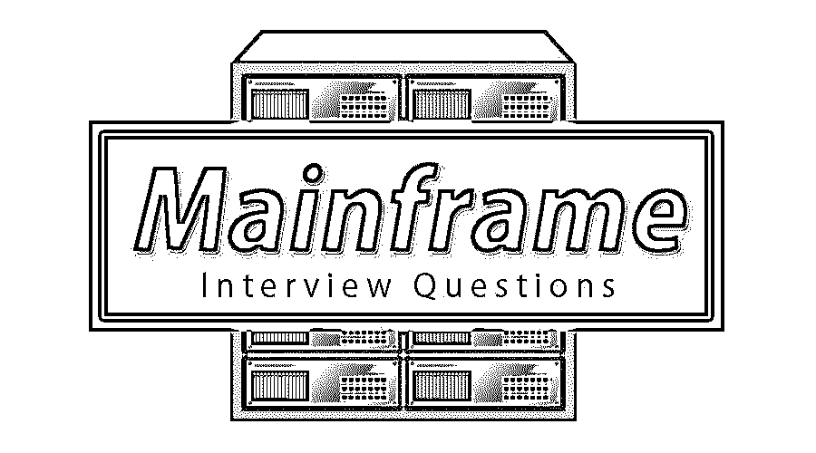

# 大型机面试问题

> 原文：<https://www.educba.com/mainframe-interview-questions/>

## 大型机面试问答介绍

大型机是一种高性能计算机，用于大规模计算，需要比小型计算机更高的可用性和安全性。它具有最用户友好的连接、单线程性能和可靠性因素。传统上，大型机与分布式计算有关，而不是分布式计算。如果是找主机相关的工作，需要准备 2022 年的主机面试题。尽管每个面试都是不同的，工作范围也是不同的，但我们可以帮助你解决顶级大型机面试问题和答案，这将帮助你迈出这一步，并在面试中取得成功。

在本文中，我们讨论了 10 大大型机面试问题和答案。这些问题分为以下两部分:

<small>网页开发、编程语言、软件测试&其他</small>

### 第 1 部分—大型机面试问题(基础)

这第一部分包括基本的面试问题和答案。

#### 1.什么是大型机？

**答案:**
一台[主机](https://www.educba.com/what-is-mainframe/)也被称为“大铁”。这是一个大型多用户计算机设备，每秒钟帮助执行提示。传统上，大型机与分布式计算有关，而不是分布式计算；传统的集中式计算和分布式计算之间的区别越来越模糊，因为小型计算机变得更加强大，大型机变得更加多功能。

#### 2.HIDAM 和 HDAM 数据库有什么区别？

**答案:**

| 希达姆 |  |
| HIDAM 用于类似于随机存取的串行存取 | HDAM is employed for random access |
| HIDAM 需要 2 个 I/O，一个指向索引，一个指向数据，以便通过 HIDAM 索引提供对 root 的直接访问 | HDAM 提供了快速，直接通过随机数发生器访问根。 |
| HIDAM 包含一个独立的索引文件，它依赖于基础部分。 | 另一方面，HDAM 文件没有单独的索引文件；但是，每个记录的关键字段都可以作为一个随机数发生器，将记录放在信息中选定的位置。 |

#### 3.什么是大型机测试？

**答案:**
大型机测试是对大型机系统支持的计算机代码服务和应用程序的测试。大型机测试在应用程序开发、整体开发价格和质量中起着积极的作用。大型机检查可能是跨平台的端到端测试覆盖的一部分。

*   大型机测试有时在部署的代码上执行，牺牲了输入数据中设置的各种信息组合。
*   运行在大型机上的应用程序是通过终端访问的。有人是购物机器上必须输入的唯一计算机代码。
*   在活动主机测试中，测试人员只需要实现 CICS 屏幕的导航。它们是为特定应用定制设计的。

#### 4.大型机计算的各种属性是什么？

**回答:**
以上是面试中被问到的基本大型机面试问题。尽管一些人认为大型计算机正预示着恐龙走向灭绝，但这个星球上的大公司仍然在大型计算机上运行。下面的方块衡量使大型机计算可扩展、稳定和安全的属性。

**虚拟存储**

*   这是一种让处理器模拟大于特定计算机存储量的主存储器的方法。
*   它使用磁盘存储作为计算机存储的扩展。

**多道程序**

*   pc 在相似的时间执行一个程序。
*   这是一种为节约使用中央处理器而提供的设施。

**批处理**

*   这是一种以作业为单位完成任何任务的方法。
*   就业可能会导致一个或更多的程序执行在一个非常序列。
*   用于执行的强制数据通过 JCL(作业管理语言)提供。

**分时**

在非常分时的系统中，每个用户都可以通过终端设备访问系统。用户输入 square measure 立即处理的命令，而不是提交 square measure 定期执行的作业供以后执行。

**假脱机**

*   假脱机代表在线同步外设操作。
*   这是一种利用缓冲的优势来形成输出设备的经济使用的设施。

#### 5.静态 SQL 和动态 SQL 有什么区别？

**回答:**
在 Stats SQL 中，语句在程序死之前就准备好了，因此语句的操作类型在程序执行的远端持久存在。一个包含静态 SQL 语句的程序应该在编译之前由 associate degree SQL 预编译处理。
在关联度 SQL 应用程序的整个执行过程中，动态 SQL 语句是准备好的，因此语句的操作类型不是持久的。该语句提供的类型可以是传递给 DB2 的字符串，牺牲静态 SQL 语句 PREPARE 或 EXECUTE。

### 第 2 部分—大型机面试问题(基础)

第二部分包括高级面试问题和答案。

#### 6.在 DB2 中如何使用 EXPLAIN？

**答:**
当关联度 SQL 与 DB2 信息完全相反或确定时，DB2 优化器工具定义了访问该信息的访问路径。这个访问路径是根据 DB2 Runstats 工具生成的表的统计信息来描述的。通过牺牲以下方式，我们可以在 DB2 中使用

*   创建灵感表
*   对问题编号为的问题运行 justify 语句(这将在高于设置表中插入信息)
*   检索(选择*)问题编号设置表中的信息保留

#### 7.什么是更新光标？

**答:**
一个更新指针允许你删除或更新当前行；这是最近获取的最前面的行。指针中的关键字 UPDATE 是为了让信息服务器理解程序将更新(或删除)它获取的任何行。信息服务器在通过关联度更新指针获取的 square measure 行上放置一个额外的严格锁，并在获取未声明 with 关键字的指针行时放置一个不太严格的锁。

#### 8.JCL 是如何用于测试批处理程序的？

**回答:**
JCL 是在非常批处理的氛围下运行程序的管理语言。一旦运行了检查作业，真正控制方法的 JCL 就会作为检查作业提交。

让我们转到下一个大型机面试问题。

#### 9.QTP 工具支持大型机应用程序测试吗？

**答案:**
是的，QTP 支持大型机应用测试；是 TE(终端模拟器)。添加确定的支持主机氛围。

#### 10.你能说出几个在大型机上运行的软件吗？

**答:**
IBM 是大型机计算领域的先驱。他们的一些软件 square measure COBOL，Enterprise COBOL，JCL， [VSAM](https://www.educba.com/vsam-interview-question/) ，CICS，DB2 等。
市场广场内的其他参与者评估了优利系统(Clear path)、日立(zSeries)、马力(不间断)和富士通(BS2000/ ICL VME)以及其他几个公司。

### 推荐文章

这是主机面试问题和答案列表的指南，以便候选人可以轻松解决这些面试问题。您也可以阅读以下文章，了解更多信息——

1.  [Sqoop 面试问题](https://www.educba.com/sqoop-interview-questions/)
2.  [SharePoint 面试问题](https://www.educba.com/sharepoint-interview-questions/)
3.  [甲骨文面试问题](https://www.educba.com/oracle-interview-questions/)

