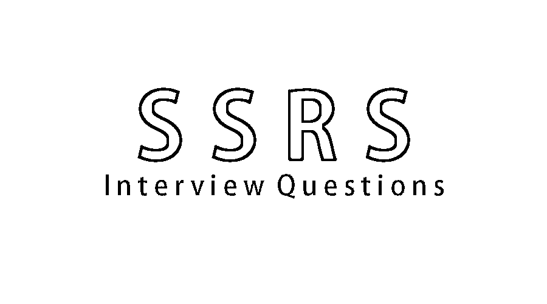

# SSRS 面试问题

> 原文：<https://www.educba.com/ssrs-interview-questions/>

## SSRS 面试问答介绍

SQL Server Reporting Services(简称 SSRS)是一个 Microsoft 组件，用于使用图表、图形、地图和其他来自多维数据源的可视化技术来创建报表。您可以使用 SSRS 为业务用户创建、管理、测试和部署报告。 [SSRS 是微软商业智能平台的](https://www.educba.com/what-is-ssrs/)组件之一。

你终于在 SSRS 找到了梦想中的工作，但你想知道如何破解 2022 年 SSRS 的面试，以及 SSRS 的面试可能会有哪些问题。每次面试都不一样，工作范围也不一样。牢记这一点，我们设计了最常见的 SSRS 面试问题和答案，以帮助你在面试中取得成功。

<small>网页开发、编程语言、软件测试&其他</small>

以下是 SSRS 面试中最常被问到的问题

### 第 1 部分-SSRS 面试问题(基础)

这第一部分包括基本的 SSRS 面试问题和答案。

#### 1.列出 SSRS 的一些重要特征？

**答案:**
以下是 SSRS 的一些重要特性，它们对创建商业报告很有用:

*   可以使用关系、XML、Excel 或多维数据源来生成报告，并且可以从 ODBC 和 OLE DB 连接提供程序中恢复数据。
*   在 SSRS，用户可以创建不同形式的报告，如表格、自由形式、图形、图表和矩阵形式。
*   它还支持基于 web 的功能；任何人都可以直接与 web 上的报表服务器进行交互，并可以在基于 web 的应用程序中查看报表。
*   通过使用图形、图像或外部内容并将其保存在服务器上，可以创建任何即席报告。
*   在 SSRS 中创建的所有报告都可以导出为各种格式，如 [XML](https://www.educba.com/xml-features/) 、CSV、TIFF、PDF、HTML 和 Excel。
*   它提供了向用户邮箱、手机和共享位置订阅报告的自动化选项。
*   它支持[简单对象访问协议](https://www.educba.com/what-is-soap/) (SOAP)编程接口和可插拔架构。

#### 2.SQL Server Reporting Services 的优势是什么？

**答案:**
以下是 SQL Server Reporting Services 的一些优势:

*   它非常易于部署，因为报告存储在一个集中的 web 服务器中，用户可以从一个位置运行报告。
*   由于 SSRS 允许以各种格式导出报告，因此进一步分析多种文件格式的报告非常容易。
*   对于关系或多维数据，最终报告的处理速度更快。
*   向业务组织交付信息的速度更快，因此有助于提供更好的决策支持。
*   管理 SSRS 不需要专家，因此也不需要昂贵的专业技能。
*   业务用户可以在没有 IT 专业人员参与的情况下与信息进行交互。
*   安全性可以应用于文件夹和报表，并以基于角色的方式进行管理。

#### 3.SQL Server Reporting Services 有哪些缺点？

**答案:**
尽管 SSRS 是一个拥有许多优点的伟大工具，但它也有一些缺点，它们是:

*   SSRS 主要是为开发商而建的。为了利用 SSRS 的所有特性，你需要学习 SQL 代码和 SSRS 函数。一般的商业用户是无法理解的。
*   当您运行一个包含大量数据的大型报表时，它会占用服务器上的许多资源。
*   SSRS 只在 windows 中运行，所以许多不使用 windows 的公司不能使用这个工具。
*   在移动设备上运行报告需要单独的移动服务器。
*   没有在主报表和子报表之间共享值的选项；您只能通过参数将值从子报表传递到主报表。
*   您需要专家来调试表达式和自定义代码。

让我们转到下一个 SSRS 面试问题。

#### 4.SSRS 对软件的最低要求是什么？

**答案:**
以下是 SQL Server Reporting Services 的最低软件要求列表:

*   **处理器:**英特尔奔腾 II 或更高处理器
*   **操作系统:** Windows Server 2003(标准版或企业版)、Windows 2000 或 Windows XP Professional，含 Service pack 4 或更高版本。
*   **内存:** 256 MB 内存和 512 MB 或更多内存，视需要而定。
*   **硬盘:** 50 MB 用于报表服务器，100 MB 用于。Net framework，30 MB 用于报表设计器，145 MB 用于示例。
*   **数据库:**带有服务包 3 的 SQL Server 2000(标准版、企业版和开发版)

#### 5.列出并解释 SSRS 建筑的组成部分？

**答:**
以下是 SQL Server Reporting Services 的重要组件:

*   **报表生成器:**在该组件中，您可以使用报表设计功能，该功能对于创建即席报表非常有用。它充当在客户端计算机上执行报告的报告发布工具。
*   **报表设计器:**用于开发简单和复杂的报表；它被用作发布工具。
*   **报表管理器:**所有基于 web 的报表都可以使用该组件进行访问。
*   **报表服务器:**这是使用 SQL server 数据库引擎存储元数据信息的服务器。
*   **报表服务器数据库:**用于存储元数据、报表定义、安全设置、数据传递等信息。
*   **数据源:** SSRS 接收来自关系、XML、Excel 和多维数据源的数据。

#### 6.SSRS 的核心组成部分是什么？

**答:**
下面是 SQL Server Reporting Services 的三个主要组件:

*   **全套工具:**用于开发、测试、管理和查看报告
*   **报表服务器组件:**用于处理 HTML、XML、PDF、Excel、CSV 等各种格式的报表。
*   **应用程序编程接口(API):** 用于与其他应用程序集成，以及构建和管理报表。

### 第 2 部分-SSRS 面试问题(高级)

现在让我们来看看高级 SSRS 面试问题。

#### 7.列出 SSRS 创建的不同类型的报告？

**答:**
下面是创建的不同类型的 SSRS 报表:

*   临时报告
*   明细报告
*   钻取报表
*   链接报表
*   子报表
*   参数化报表
*   缓存报表
*   快照报告
*   点击链接型报表

#### 8.什么是不同的报告生命周期在 SSRS 和解释？

**答案:**
SSRS 的申报生命周期有三个阶段；它们是:

*   **报表开发:**此阶段主要涉及开发人员；在这里，所有的报告都是由报告开发人员设计和开发的
*   **报告管理:**这个阶段主要涉及数据库管理员(DBA)，他必须确保
    *   只有授权用户才能访问报告。
    *   执行报表时优化数据源性能
    *   维护向用户发送报告的计划。
*   **报告交付:**此阶段将确保开发和执行的报告能够到达业务用户手中，以供决策使用。如果报告中需要任何缺陷或更改，那么它会返回到开发阶段进行更正或更改。

让我们转到下一个 SSRS 面试问题。

#### 9.列出并解释 SSRS 的一些命令提示符实用程序？

**答:**
SQL Server Reporting Services 的许多命令提示实用工具都可以用来管理报表服务器。安装报表服务器时，将自动安装这些实用工具。以下是实用程序列表:

*   **RSS 实用程序:**命令文件为‘RS . exe’；这支持本地和 [SharePoint 开发模式](https://www.educba.com/sharepoint-alternatives/)。这用于执行脚本操作，也用于在报表服务器上部署报表。
*   **Powershell cmdlet:**这仅支持 [SharePoint](https://www.educba.com/sharepoint-interview-questions/) 模式；它将安装报告 SharePoint 服务和代理服务器；它还提供 Reporting service 应用程序和代理的设置和管理。
*   **Rsconfig 实用程序:**命令文件为‘Rsconfig . exe’；这仅支持本机开发模式。它用于配置和管理报表服务器与存储库数据库的连接。
*   **RsKeymgmt 实用程序:**命令文件为‘RsKeymgmt . exe’；它仅支持本机开发人员模式。它是一个加密的密钥管理工具，用于通过命令行备份、删除、应用和[重新创建对称密钥](https://www.educba.com/symmetric-key-encryption/)。

#### 10.列出 SSRS 支持的不同类型的数据源？

**答案:**
SSRS 支持多种数据源；以下是 SSRS 的数据来源列表:

*   神谕
*   可扩展标记语言
*   开放式数据库连接性
*   成为 DB
*   SAP BW
*   Teradata
*   Microsoft SQL server
*   土卫七
*   报表服务器模型
*   [微软 SharePoint 列表](https://www.educba.com/)
*   Microsoft Azure SQL 数据库

### 推荐文章

这是 SSRS 面试问答列表的指南。这里我们列出了最有用的 10 组面试问题，这样求职者就能轻松应对面试。你也可以看看下面的文章来了解更多-

1.  [Tableau 面试问题](https://www.educba.com/tableau-interview-questions/)
2.  [SSAS 面试问题](https://www.educba.com/ssas-interview-questions/)
3.  [基于信息化场景的面试](https://www.educba.com/informatica-scenario-based-interview-questions/)

