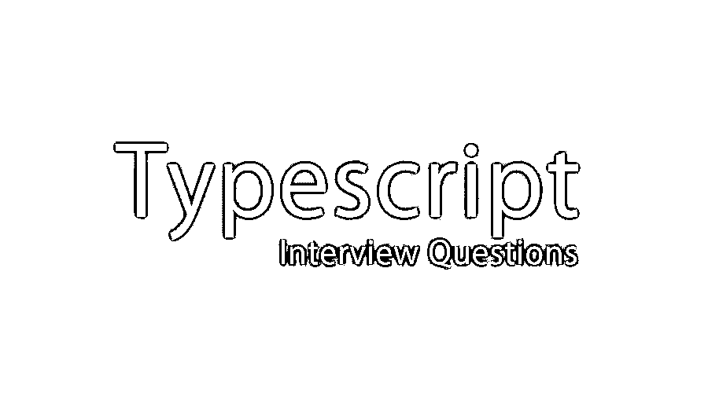

# 打印面试问题

> 原文：<https://www.educba.com/typescript-interview-questions/>

## 打字稿面试问答介绍

Typescript 是微软开发的开源语言。它充当 JavaScript 的上标。它主要用于大型应用程序的开发。当 JavaScript 应用程序要在客户端和服务器端构建时，也可以使用它。可以说它既是一种语言，也是一套工具。它支持各种 JS 库，并且是可移植的。让我们来看看如果你参加打字面试会被问到的不同问题。

如果你要找的是与 Typescript 相关的工作，你需要准备 2022 年的 Typescript 面试题。每个面试都不同于不同的职位描述，但是，要想顺利通过面试，你需要有良好清晰的打字知识。在这里，我们准备了重要的打字稿面试问题和答案，将有助于你在面试中取得成功。

<small>网页开发、编程语言、软件测试&其他</small>

以下是面试中经常被问到的 10 个重要的打字稿面试问题和答案。这些问题分为如下几个部分:

*   [第一部分——打字面试问题(基础)](#1)
*   [第二部分-打字面试问题(高级)](#2)

### 第 1 部分-打字面试问题(基础)

这第一部分包括基本的面试问题和答案。

#### Q1)解释什么是 Typescript，它与 JavaScript 有什么不同？

**答案:**
Typescript 是 JavaScript 的上标，用于大型应用的开发。它提供可选的静态类型、类和接口。它可以说是一种语言，也是一套工具。它帮助开发人员使用高效的工具，并有助于代码重构。Typescript 和 JavaScript 之间的主要区别是:

Typescript 支持帮助程序员以面向对象的方式工作的类，而 JavaScript 使用具有函数和基于原型的继承的可重用组件。JavaScript 没有任何接口；另一方面，typescript 有接口。Typescript 支持静态类型，而 JavaScript 不支持静态类型。Typescript 提供可选参数；JavaScript 没有。

#### Q2)Typescript 支持哪些不同的数据类型，并解释了如何实现继承？

**回答:**
Typescript 还支持所有其他语言提供的数据类型。它包括:

*   **布尔:**这可以有真或假的值
*   **数字:**可以是任意数字值
*   **字符串:**可以是任意字符值
*   **数组:**这可以是一个数字的列表
*   **枚举:**这允许创建用户定义的数据类型。

可以通过使用 extends 关键字在 Typescript 中实现继承。

`class Car {
public domestic:boolean;
constructor(public name: string) { }
}
class SUV extends Car {
constructor(name: string, domestic: boolean)
{
super(name);
this.domestic = true;
}
}
class Sedan extends Car {
constructor(name: string, domestic: boolean)
{
super(name);
this.domestic = false;
}
}`

让我们转到下一个打字稿面试问题。

#### Q3)解释 tsconfig.json 文件？

**答案:**
这个文件用来表示目录是 Typescript 项目的根。该文件指定编译该特定项目需要根文件和编译器选项。这个文件也可以用来简化项目的构建。下面的例子可以作为一个例子:

`{
"compilerOptions": {
"removeComments": true,
"sourceMap": true
},
"files": [
"main.ts",
"othermodule.ts"
] }`

#### Q4)解释 Typescript 中的 Lambda/Arrow 函数？

**答:**
arrow 函数的作用就像是 typescript 中的一个附加功能，也被称为 lambda 函数。这个函数没有名字。

`var mulNum = (n1: number, n2: number) => n1 * n2;`

在此示例中，= >是 lambda 运算符,( n1 * n2)是函数体，n1、n2 是参数。

`let addNum = (n1: number, n2: number): number => { return n1 + n2; }
let multiNum = (n1: number, n2: number): number => { return n1 * n2; }
let dividNum = (n1: number, n2: number): number => { return n1 / n2; }
addNum(10, 2);// Result - 12
multiNum(10, 2);// Result - 20
multiNum(10, 2);// Result – 5`

#### Q5)什么是匿名功能？

**答:**
这个函数是在没有任何命名标识符引用的情况下声明的。

`var anonyFunc = function (num1: number, num2: number): number {
return num1 + num2;
}
//RESULT
console.log(anonyFunc(10, 20)); //Return is 30
//RESULT
console.log(anonyFunc(10, "xyz"));
// error: This will throw an error as string is passed instead of an integer.`

### 第 2 部分-打字面试问题(高级)

现在让我们来看看高级打字稿面试问题。

#### Q6)如何在模块外使用模块中定义的类？

**答案:**
模块中定义的类在模块内部可用，在模块外部不可访问。

`module Vehicle {
class Car {
constructor (
public make: string,
public model: string) { }
}
var audiCar = new Car("Audi", "Q7");
}
var fordCar = Vehicle.Car("Ford", "Figo");
The variable fordCar will give an error as the class Car is not accessible and the user needs to use export keyword for the classes.
module Vehicle {
export class Car {
constructor (
public make: string,
public model: string) { }
}
var audiCar = new Car("Audi", "Q7");
}
var fordCar = Vehicle.Car("Ford", "Figo");`

当 export 用于使汽车在其模块外可访问时，此变量现在将起作用。

#### Q7)什么是 decorator，并列出 TypeScript 中的一些 decorator？

**答:**
装饰器使用户能够修改一个类及其成员。它允许用户添加注释和元编程语法来实现类声明和成员。这些只是在实验的基础上发布的。可以使用命令行或通过编辑 tsconfig.json 文件来启用 Decorators。要使用命令行启用装饰器，应该使用以下命令:

`tsc --target ES5 --experimentalDecorators`

#### Q8)如何编译 Typescript 文件？

**答:**
编译一个打字稿文件要遵循以下步骤:

*   用户必须检查 Typescript 引擎是否已启用。用户可以去标题栏，检查他们的用户名，并选择选项。
*   在项目导航器中，选择并右键单击要编译的 TS 文件。
*   选择编译成 JavaScript
*   用户可以在 HTML 代码中添加对这个编译的 Javascript 文件的脚本引用。
*   完成后，用户可以进入命令行 tsc <typescript file="" name="">进行编译。</typescript>

让我们转到下一个打字稿面试问题。

#### q9)Typescript 中有哪些接口？

**答案:**
接口定义了任何变量或实体的语法。接口定义属性、方法和各种事件。这里只声明成员。接口帮助定义各种成员，并帮助定义派生类的结构。可以使用 interface 关键字声明接口。

#### Q10)为什么 typescript 被称为可选静态类型语言？

**答案:**
Typescript 作为可选的静态类型语言，意味着编译器可以忽略变量的类型。使用“任何”数据类型，用户可以分配任何类型的变量。Typescript 不会引发任何错误。

`var unknownType: any = 4;
unknownType = "Okay, I am a string";
unknownType = false; // A boolean.`

使用它，可以声明任何数据类型。

### 推荐文章

这是打字稿面试问题和答案列表的指南。这里我们列出了 10 个最佳面试问题，这样求职者就可以轻松地通过面试。您也可以阅读以下文章，了解更多信息——

1.  [HTML 面试问题](https://www.educba.com/html-interview-questions/)
2.  [Scala 面试问题](https://www.educba.com/scala-interview-questions/)
3.  [Javascript 面试问题](https://www.educba.com/javascript-interview-questions/)
4.  [MS SQL 面试问题](https://www.educba.com/ms-sql-interview-questions/)

