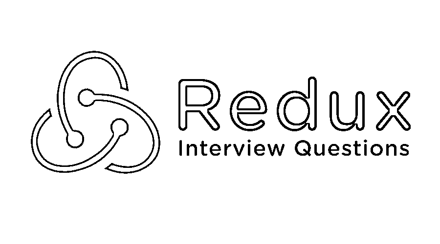

# 重复面试问题

> 原文：<https://www.educba.com/redux-interview-questions/>

## Redux 面试问答介绍

React 是一个用户界面库。核心 Redux 是建立在动作、状态和 reducers 之上的。所有的数据都保存在商店里。Reacts 组件使用动作来更新商店。减速器帮助商店自我更新。道具确保更新后的商店可供 React 使用。

现在 Redux 是一个为 JavaScript 应用程序构建的可知状态容器。它允许管理应用程序状态，并且是开源的。持续运行的应用程序有助于在不同的环境(客户端、服务器和本机)中运行，并且易于测试。

<small>网页开发、编程语言、软件测试&其他</small>

现在，如果你要找一份与 Redux 相关的工作，你需要准备 2022 年的 Redux 面试问题。每个面试都不同于不同的职位描述，但是，要想通过面试，你需要对 Redux 有一个清晰的了解。在这里，我们准备了重要的 Redux 面试问题和答案，将帮助您在面试中取得成功。

以下是在面试中经常被问到的 10 个重要的 Redux 面试问题和答案。这些问题分为以下两部分:

### 第 1 部分-重复面试问题(基础)

这第一部分包括基本的面试问题和答案。

#### 1.Redux 的好处？

**答案:**

*   **可维护性:**由于严格的代码结构和组织，Redux 的维护变得更加容易。
*   **组织:**代码组织非常严格；因此代码的稳定性高，增加实习生的工作就容易多了。
*   **服务器渲染:**这很有用，特别是对于初步渲染来说，这可以保持更好的用户体验或搜索引擎优化。服务器端创建的存储被转发到客户端。
*   **开发者工具:**具有高度可追溯性，所以位置的变化，应用的变化；所有这样的实例使开发者有一个实时的体验。
*   编写可测试代码的第一条规则是编写只做一件事并且独立的小函数。Redux 的代码是由以前的函数组成的:小、纯、隔离。

#### Q2。与 MVC 和 Flux 有多大区别？

**回答:**
就 MVC 架构而言，数据层、表示层、逻辑层都是很好的分离和处理的。即使在较小的位置对应用程序的改变也可能涉及应用程序中的许多改变。这是因为就 MVC 而言，数据流是双向的。MVC 结构的维护并不复杂，调试也需要大量的经验。

Flux 与 redux 密切相关。基于故事的策略允许捕获应用于应用程序状态的更改，事件订阅和当前状态通过组件连接。回调有效载荷通过 Redux 广播。

#### Q3。函数式编程概念？

**答案:**
下面列出了用来构造 Redux 的各种函数式编程概念，

*   函数被视为一级对象。
*   能够以参数的形式传递函数。
*   能够使用递归、函数和数组控制流。
*   使用辅助函数，如 reduce 和 map 过滤器。
*   允许将功能链接在一起。
*   状态不会改变。
*   区分代码执行顺序的优先级并不是真正必要的。

#### Q4。Redux 状态变化？

**答:**
对于动作的释放，应用状态的改变；这确保了改变状态的意图将被实现。

**举例:**

*   用户单击应用程序中的一个按钮。
*   函数以组件的形式被调用。
*   所以现在一个动作被相关的容器分派。
*   发生这种情况是因为 prop(刚刚在容器中被调用)被绑定到使用 mapDispatchToProps(在容器中)的动作调度程序。
*   Reducer 在捕获到动作后，它会执行一个函数，这个函数会返回一个有特定变化的新状态。
*   容器知道状态变化，并且由于 mapStateToProps 函数而修改组件中的特定属性。

#### Q5。Redux 可以用在哪里？

**答:**
Redux 主要与 reacting 连用。它还能够适应其他视图库。一些著名的实体，如 AngularJS、Vue.js 和 Meteor。它可以很容易地与 Redux 结合。这是 Redux 在其生态系统中受欢迎的一个关键原因。有如此多的文章、教程、中间件、工具和样板文件可用。

### 第 2 部分-重复面试问题(高级)

现在让我们来看看高级面试问题。

#### Q6。React + Redux 应用中典型的数据流是什么样的？

**回答:**
来自 UI 组件的回调调度一个带负载的动作；这些调度的动作被 reducers 截获并接收。这个拦截将生成一个新的应用程序状态。从这里开始，动作将通过 Redux 存储中的组件层次结构向下传播。下图描述了 redux+react 设置的实体结构。

#### Q7。redux 中存储了什么？

**答:**
商店保存应用程序状态，并提供访问状态的帮助器方法。
注册监听器，调度动作。使用 Redux 时只有一个商店。存储是通过 createStorefunction 配置的。单个商店代表整个州。R
领袖们通过行动返回一个国家。

`export function configureStore(initialState) {
return createStore(rootReducer, initialState);
}`

根缩减器是应用程序中所有缩减器的集合。

`const rootReducer = combineReducers({
donors: donorReducer,
});`

让我们转到下一个 Redux 面试问题。

#### Q8。解释 Redux 中的 Reducers？

**答案:**
通过 reducer 函数更新一个商店的状态。一个稳定的归约器集合形成一个存储库，每个存储库维护一个与其自身相关联的独立状态。为了更新捐献者的数组，我们应该定义一个捐献者应用程序。
减速器如下。

`export default function donorReducer(state = [], action) {
switch (action.type) {
case actionTypes.addDonor:
return [...state, action.donor];
default:
return state;
}
}`

减速器接收初始状态和动作。基于动作类型，它返回商店的新状态。reducers 维护的状态是不可变的。下面给出的 reducer 保存当前状态和动作作为参数，然后返回下一个。

`state:function handelingAuthentication(st, actn)
{
return _.assign({}, st,
{
auth: actn.pyload
});
}`

#### Q9。Redux 工作流功能？

**答案:**

*   **复位:**允许复位存储状态
*   **恢复:**回滚到上次提交的状态
*   **清除:**您可能误触发的所有禁用动作都将被删除
*   **提交:**使当前状态成为初始状态

#### Q10。解释动作在 Redux 中？

**答案:**
Redux 中的动作是返回一个动作对象的函数。动作类型和动作数据打包在动作对象中。这也允许将供体添加到系统中。动作在存储和应用程序之间发送数据。这些操作产生由存储检索的所有信息。

`export function addDonorAction(donor) {
return {
type: actionTypes.addDonor,
donor,
};
}`

内部动作建立在 Javascript 对象的[之上，并将一种类型的属性与其相关联。](https://www.educba.com/javascript-objects/)

### 推荐文章

这是一份关于重复面试问题和答案的指南，这样候选人就可以很容易地解决这些面试问题。在这篇文章中，我们研究了一些常见的面试问题，这些问题在面试中经常被问到。您也可以阅读以下文章，了解更多信息——

1.  [OS 面试问题](https://www.educba.com/os-interview-questions/)
2.  [VB.NET 面试问题](https://www.educba.com/vb-net-interview-questions/)
3.  [jQuery 面试问题](https://www.educba.com/jquery-interview-questions/)
4.  [自举面试问题](https://www.educba.com/bootstrap-interview-questions/)
5.  [Bootstrap vs Jquery:有什么区别](https://www.educba.com/bootstrap-vs-jquery/)
6.  [Bootstrap vs WordPress 及其优势](https://www.educba.com/bootstrap-vs-wordpress/)
7.  [Bootstrap vs jQuery UI:有什么特点](https://www.educba.com/bootstrap-vs-jquery-ui/)
8.  [引导程序 4 备忘单](https://www.educba.com/bootstrap-4-cheat-sheet/)
9.  [反应状态 vs 道具| 4 强对比](https://www.educba.com/react-state-vs-props/)

