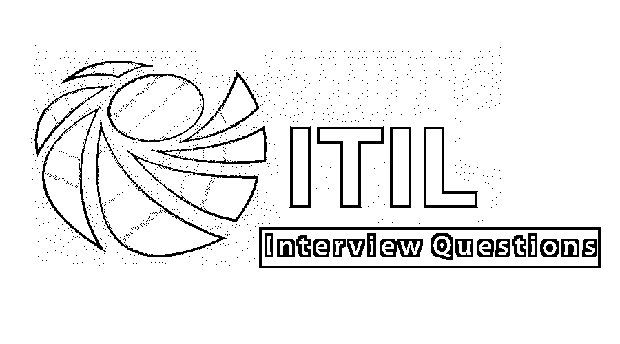

# ITIL 面试问题

> 原文：<https://www.educba.com/itil-interview-questions/>

## ITIL 面试问答介绍

itIL(也称为信息技术基础设施库)是一组 ITSM 实践，它主要关注根据当前市场和业务标准的 IT 服务调整和维护。

如果你想找一份与 ITIL 相关的工作，你需要准备 2022 年 ITIL 的面试问题。根据不同的职位描述，每次面试都是不同的。在这里，我们准备了重要的 ITIL 面试问题和答案，将帮助你在面试中取得成功。

<small>网页开发、编程语言、软件测试&其他</small>

在这篇 2022 年 ITIL 面试问题的文章中，我们将呈现 10 个最重要和最常用的 ITIL 面试问题。这些面试问题分为以下两部分:

### 第 1 部分 Basic 面试问题(基础)

这第一部分包括基本的面试问题和答案。

#### Q1。解释 ITIL 服务生命周期模型管理？

**回答** :
ITIL 服务管理始终试图根据当前的市场情况实施丰富的绩效和业务标准。为了保持和实施这些变化，ITIL 提供了 5 个不同的生命周期阶段。

*   **服务策略:**是服务生命周期的基础核心层，主要用于检查所有的策略和策略是否得到正确的实施和维护。这主要是从高级性能的角度来看。
*   **服务设计:**这一阶段主要处理从用户的角度将思维过程和策略实现到不同的过程和所提供的服务。
*   **服务转换:**主要涵盖并整合项目与运营之间的沟通。它还包括服务效率的提高(无论何时需要)以实现更好的服务转换。
*   **服务运行:**该流程主要用于从最终用户的角度确保端到端的流程溢出和稳定的服务运行。
*   **持续服务改进:**该流程基本上与上述四个阶段一起实施，以改进服务和工作机会，并保持与当前行业标准的适当一致。

#### Q2。解释 ITIL 服务管理措施？

**回答** :
这些是面试中常见的 ITIL 面试问题。ITIL 提供了四层服务管理度量来控制和管理不同的服务操作和各种结果。

*   **进度:**主要处理当前服务操作的进度。
*   **符合性:**处理当前行业流程和市场标准的符合性。
*   **有效性:**它作用于流程以有效地维护服务
*   **效率:**这涉及服务维护和工作流效率。

#### Q3。你所说的 RACI 模式是什么意思？

**答** :
RACI 模型主要用于从 ITIL 服务和运营的角度定义角色。在下面找到 RACI 模型的四个部分。

*   **负责人:**这明确了成功处理和完成分配的工作的责任和定义的人员。
*   **负责:**定义了负责与不同工作项目相关联的分配任务的人员。
*   **咨询:**标识或定义咨询的团体或人员。
*   **通知:**定义了被通知正在进行的任务及其相应进度的人员。

让我们转到下一个 ITIL 面试问题。

#### Q4。解释服务组合和服务目录之间的区别？

**回答** :
服务组合主要处理不同地区和市场的不同厂商和提供商提供的服务。他们过去常常从当前行业标准和客户可行性角度提供相同的服务。但是在服务目录的情况下，它提供服务目录中提到的服务和产品。

#### Q5。你说的投资组合管理是什么意思？

**回答** :
项目组合管理基本上处理基于当前市场和行业标准的整体组织服务管理及其不同的工件。它有四个不同的层来产生适当的管理表示。

*   **定义:**它处理需要考虑的范围和业务需求。
*   **分析:**根据定义的业务范围和要求，关联适当的计划管理流程。
*   **批准:**这主要与基于范围分析和开发执行的工程的批准接收过程相关联。
*   **章程:**收到批文后，这是最后一个阶段。在这里，所有的规划和相关工作都得到了部署和正确执行。

### 第 2 部分-ITIL 面试问题(高级)

现在让我们来看看高级面试问题。

#### Q6。解释不同类型的维修操作？

**回答** :
找到以下不同类型的维修操作:

*   **内包:**处理内部组织管理。
*   **外包:**处理外部组织管理。
*   **合作外包:**它处理维持内包和外包程序的平衡和结合。
*   **BPO:** 定义业务流程外包相关的流程。

#### Q7。解释不同类型的服务提供商？

**回答** :
这是 ITIL 面试中问得最多的面试问题。查找以下属于 ITIL 流程的不同类型的服务提供商:

*   **内部服务提供者:**它处理内部组织管理，并且它在服务组织中有其物理存在。
*   **外部服务提供者:**处理外部组织管理。它根据当前的市场标准处理一些特定和特殊的场景。
*   **共享服务:** It 在组织中有其独立的存在。

#### Q8。解释 ITSM 服务连续性服务管理的用途？

**回答** :
找到以下 ITSM 服务连续性服务管理的不同用途:

*   它维护业务连续性计划。
*   它根据业务范围和验证参数定义测试计划。
*   它确定和分析风险管理及其预防方法。
*   它创建并定义 ITSCM 计划。
*   它还参与常规的[风险分析服务](https://www.educba.com/how-risk-analytics-helps-in-risk-management/)。
*   它还从最终用户的角度分析了业务影响和比较分析。

让我们转到下一个 ITIL 面试问题。

#### Q9。解释变革管理系统的 7 R？

**回答** :
在下面找到变更管理系统的不同参数:

*   **提了:**谁提了零钱？
*   **退货:**变更会带来什么样的退货？
*   **原因:**变化的原因是什么？
*   **风险:**我们实施或不实施变更会有什么风险？
*   **资源:**执行此变更需要哪些资源？
*   **关系:**这个和其他变化有什么关系？
*   **负责:**谁负责正在执行的变更？

#### Q10。解释服务设计的几个方面？

**回答** :
找到以下几个重要的已实现服务:

*   服务组合设计和管理。
*   过程、度量设计和技术架构分析。
*   确定业务需求和相应的方法。

### 推荐文章

这是一个 ITIL 面试问题和答案的列表指南，以便候选人可以轻松地解决这些 ITIL 面试问题。在本帖中，我们研究了 ITIL 面试中常见的问题。您也可以阅读以下文章，了解更多信息——

1.  [AWS 面试问题](https://www.educba.com/aws-interview-questions/)
2.  [Java 春季面试试题](https://www.educba.com/java-spring-interview-questions/)
3.  [Teradata 面试问题](https://www.educba.com/teradata-interview-questions/)
4.  [ITIL 服务设计](https://www.educba.com/itil-service-design/)

