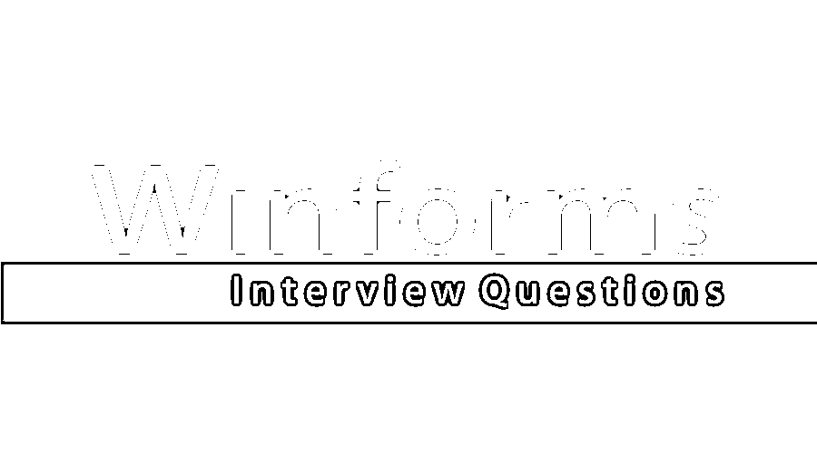

# WinForms 面试问题

> 原文：<https://www.educba.com/winforms-interview-questions/>

## WinForms 面试问答介绍

WinForms 是一个 GUI(图形用户界面)类库，是微软。NET Framework 提供了一个平台，用于为笔记本电脑、台式机和平板电脑开发富互联网或独立客户端应用程序。微软。NET 框架堆栈包含不同的组件，如 Windows、.NET 堆栈、应用程序和开发工具。WinForms 是微软支持的基于事件的应用程序。NET 框架。Windows 窗体类似于开发客户端应用程序的那种 Windows 基础类库。Windows 窗体为微软提供了图形用户界面工具包。NET 框架类似 Java API 中的 AWT(抽象窗口工具包)。Windows 窗体驻留在. NET 堆栈中。NET 堆栈驻留在微软。NET 框架。Windows 窗体将以 API 的形式出现在。NET 框架。

下面是面试中被问到最多的面试问题:

<small>网页开发、编程语言、软件测试&其他</small>

如果是找 WinForms 相关的工作，需要准备 2022 年 WinForms 面试问题。根据不同的职位描述，每次面试都是不同的。在这里，我们准备了重要的 WinForms 面试问答，帮助你在面试中取得成功。这些顶级问题分为以下两部分:

### 第 1 部分 WinForms 面试问题(基础)

这第一部分包括基本的面试问题和答案。

#### Q1。什么是 Windows 窗体？

**回答** :
Windows Forms 是微软的一个 API。NET 框架来开发富客户端应用程序。这个 API 位于微软内部。NET 堆栈，并提供接口来扩展 API 抽象类或实现接口来开发富客户端应用程序。Windows 窗体是。NET 框架。它提供图形 API，并在客户端应用程序中提供更多的安全性。

#### Q2。Windows 窗体的生命周期包括哪些步骤？

**回答** :
这些是面试中问的基本 WinForms 面试问题。Windows 窗体中涉及的不同步骤是

*   **加载:**这是将特定表单加载到应用程序中的第一步。
*   **激活**:当表单高亮显示，或者从最小化状态返回焦点，或者第一次加载时，该步骤将进入画面。
*   **Deactivate** :如果窗体没有焦点，或者窗体被关闭或最小化，或者被移动到后台，这个步骤将被触发。
*   **关闭**:该步骤在应用即将关闭时触发，也就是即将关闭的步骤之前。
*   **关闭:**该步骤将在应用程序关闭时执行。
*   **Disposed:**此步骤在窗体或应用程序关闭后执行一次，执行垃圾收集机制。

#### Q3。Windows 窗体中有哪些不同的组件？

**回答** :
基于不同的功能需求，开发富客户端应用有不同的 Windows Forms API 组件。它们是文本框、列表框、标签、控件等。,

**举例:**
如果一个应用程序中有任何一种登录页面，那么整个登录页面将被视为一个 Windows 窗体，Windows 窗体中的不同组件，即登录页面，分别是文本字段控件、登录按钮控件和标签控件。文本字段控件捕获来自用户的数据并对其进行验证，按钮控件在单击后通过验证用户给出的文本字符串来执行一组操作。标签控件将定义要输入的文本字段，它帮助用户登录到应用程序。

#### Q4。中有哪些不同类型的属性。网？

**回答** :
下面是。NET，它们作为访问器来读取或写入 Windows 窗体或任何种类的类或对象的属性。两个属性访问器是 GET 和 SET:

*   **GET:**GET 属性访问器需要根据定义的不同访问级别返回属性值。只读属性必须获取访问器，而不是集合。
*   **SET:**SET 属性访问器需要根据定义的访问级别分配一个值，通常是一个新值。只写属性有 SET 访问器，但没有 GET。

#### Q5。Windows 窗体有哪些不同的功能和应用？

**回答** :
使用 Windows 窗体可以执行的不同功能如下:

*   构建富客户端应用程序。
*   开发丰富的交互式用户界面。
*   创建事件处理程序。
*   在窗口中开发不同种类的面板。
*   创建图形用户界面或图形表单。
*   显示和管理用户提交的数据。
*   执行数据绑定操作。

### 第 2 部分 WinForms 面试问题(高级)

现在让我们来看看高级面试问题。

#### Q6。如何在 Windows 窗体中开发上下文菜单？

**答**:
context menustrip 控件提供了开发微软现有的上下文表单的功能。NET 框架。这可以用 C# (C Sharp)编程语言开发。在 Windows 窗体中，上下文菜单也可以称为弹出菜单。创建上下文菜单时，可以简单地将工具箱中的 ContextMenuStrip 控件拖放到 Visual Studio 开发环境窗体上。ContextMenuStrip 控件可以设置不同的属性，并根据功能需求进行配置。

#### Q7。Windows 窗体中可以使用哪些不同的数据类型？

**回答** :
可以使用的不同数据类型取决于编程语言，一般基于 C#编程语言，如下:

*   **值类型:**简单类型，枚举类型，结构类型，可空值类型。
*   **引用类型:**类类型，接口类型，数组类型，委托类型。

让我们转到下一个 WinForms 面试问题。

#### Q8。如何在 Windows 窗体的文本框中显示默认值？

**答案** :
文本框中文本字段的默认值可以通过使用 InputBox()方法的 DefaultResponse 参数来设置。DefaultResponse 是 InputBox()函数的参数。

#### Q9。UI Windows 窗体中的进度条是什么？

**回答** :
这是在面试中经常被问到的 WinForms 面试问题。Windows UI 窗体中的进度条是向用户表示或显示正在运行的操作的进度信息的状态栏，尤其是运行时间较长的操作。它支持在一个进度条上显示两个值。

#### Q10。Windows 窗体中不同的后台操作是如何进行的？

**回答**:
Windows 窗体执行的不同类型的后台操作如下:

*   在 Visual Studio 中对不同的接口使用不同的线程。
*   导致延迟的长时间运行操作将通过使用不同的表单在后台执行。

### 推荐文章

这是一个 WinForms 面试问题和答案列表的指南，以便候选人可以轻松地解决这些 WinForms 面试问题。在本帖中，我们研究了 WinForms 面试中常见的问题。您也可以阅读以下文章，了解更多信息——

1.  [Oracle 数据库面试问题](https://www.educba.com/oracle-database-interview-questions/)
2.  [电子商务面试问题](https://www.educba.com/e-commerce-interview-questions/)
3.  [JSP 面试问题](https://www.educba.com/jsp-interview-questions/)
4.  [SOA 面试问题](https://www.educba.com/soa-interview-questions/)

