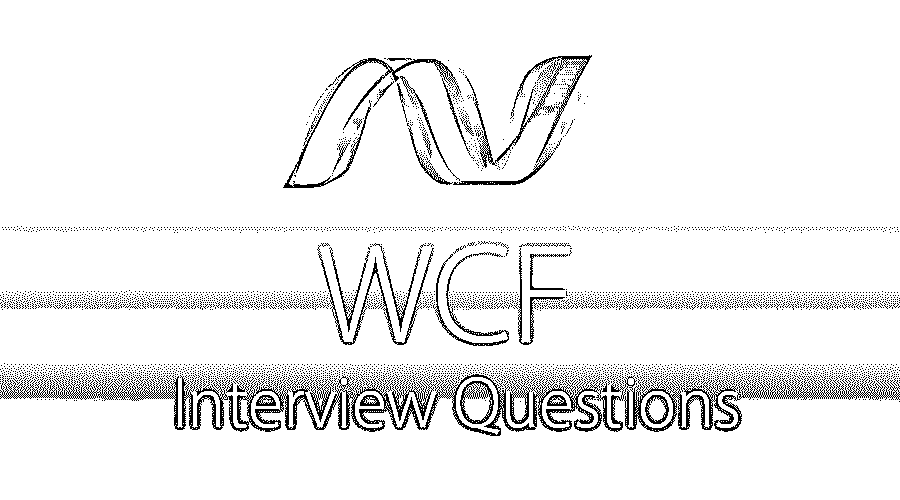

# WCF 面试问题

> 原文：<https://www.educba.com/wcf-interview-questions/>

## WCF 面试问答介绍

WCF 代表视窗通讯基金会。它是一个框架，将用于构建面向服务的应用程序。在 Windows Communication Foundation 的帮助下，您可以从一点向另一点发送任何类型的异步消息。不同的协议可以访问这些服务，这些服务都是由 WCF 创建的，例如 HTTP、TCP、msmq 等。

如果你想找一份与 WCF 相关的工作，你需要准备 2022 年 WCF 的面试问题。根据不同的职位描述，每次面试都是不同的。在这里，我们准备了重要的 WCF 面试问题和答案，将帮助你在面试中取得成功。

<small>网页开发、编程语言、软件测试&其他</small>

在这篇 2022 年 WCF 面试问题的文章中，我们将提出 21 个最重要和最常见的面试问题。这些问题将帮助学生建立他们对 WCF 的概念，并帮助他们解决面试问题。这些问题分为以下两部分:

### 第 1 部分-WCF 面试问题(基础)

这第一部分包括基本的面试问题和答案。

#### Q1。你说的 WCF 是什么意思？

**答案:**
WCF(Windows Communication Foundation)是一个用于构建面向服务应用的框架。

#### Q2。解释 WCF 的基本原理

**答案:**
WCF 基本面给出如下:

*   统一——(COM+服务， [Web 服务](https://www.educba.com/web-services-interview-questions/)，。NET 远程处理、Microsoft 消息队列)
*   互用性
*   面向服务

#### Q3。WCF 需要什么？

**答案:**
这些都是 WCF 面试中问的基本问题。我们需要 WCF，因为不同的协议将支持使用 WCF 创建的服务。

#### Q4。WCF 有什么特色？

**回答:**
面向服务、互操作性、服务元数据、数据契约、安全性、事务、AJAX 和 REST 支持、可扩展性。

#### Q5。描述 WCF 的优势。

**答:**
面向服务，位置无关，语言无关，平台无关，支持多种操作，它支持各种协议。

#### Q6。WCF 和 Web 服务的区别是什么？

**答:**
[【WCF】是一个框架](https://www.educba.com/what-is-wcf/)，用于构建面向服务的应用，而 web 服务是将通过 Web 协议访问的应用逻辑。Web 服务将托管在 IIS 上，而 WCF 可以在 IIS 上启动并自托管。

#### Q7。解释一下 SOA？

**答案:**
它代表面向服务的架构；这是软件开发的架构方法。

#### Q8。在 WCF 你说的服务合同是什么意思？

**答:**
服务契约是服务的兼容性，客户的需求将与服务机制捆绑在一起。

#### Q9。WCF 应用程序的组件是什么？

**答案:**
WCF 应用程序由 3 个组件组成:

*   WCF 服务
*   WCF 服务主机
*   WCF 服务客户

#### Q10。WCF 提供什么样的隔离级别？

**答:**
WCF 提供的隔离等级如下:

*   未提交读取。
*   已提交读取。
*   反复阅读。

### 第 2 部分-WCF 面试问题(高级)

现在让我们来看看高级面试问题。

#### Q11。WCF 的各种地址格式是什么？

**答案:**
WCF 的地址格式如下:

*   HTTP 格式
*   TCP 格式
*   MSMQ 格式

#### Q12。数据协定序列化程序是什么意思？

**答案:**
这是 WCF 面试中经常被问到的问题。当对象实例更改为可移植且可见的格式时，该过程称为序列化，数据序列化也称为 Datacontractserilizer。

#### Q13。描述一下 WCF 的装订？

**答案:**
下面列出了 WCF 的装帧:

*   基本 HTTP 绑定
*   NetTcp 绑定
*   WSHttp 绑定
*   NetMsmq 绑定

#### Q14。WCF 服务使用的命名空间名称是什么？

**答案:**
ServiceModel 服务用于 WCF 服务。

#### Q15。什么是 WCF 的欧洲议会议员？

**答案:**
WCF 的议员如下:

*   数据报
*   请求和响应
*   双层公寓

#### Q16。WCF 支持什么样的事务管理器？

**答案:**
它们如下:

*   轻量级选手
*   WS-原子事务
*   对象链接和嵌入

#### Q17。WCF 有哪些不同的数据合约？

**答案:**
WCF 不同数据联系人如下:

*   数据联系人
*   数据成员

#### Q18。WCF 有哪些不同的实例模式？

**答案:**
下面给出 WCF 的不同实例模式:

*   每次通话
*   每次会话
*   单一的

让我们转到下一个 WCF 面试问题。

#### Q19。托管 web 服务有哪些不同的方式？

**答:**
WCF 服务可以通过以下方式托管:

*   （同 ImmigrationInspectors 移民检查）
*   自托管

#### 问题 20。WCF 支持哪些不同的传输模式？

**回答:**
下面给出了传输的模式:

*   超文本传送协议
*   传输控制协议（Transmission Control Protocol）
*   对等网络
*   工业程序控制（ industrial process control 的缩写）
*   MSMQ

#### 问题 21。解释 WCF 不同类型的合同定义？

**答案:**
有四个契约:

*   劳务合同
*   数据契约
*   过失合同
*   消息契约

### 结论:

以上是对 WCF(Windows communication foundation)非常重要的问题，但是你应该亲自动手。从职业角度来看，这是一个非常新的和先进的技术和资源也不多。

### 推荐文章

这是一个 WCF 面试问题和答案的列表指南，以便候选人可以轻松地解决这些面试问题。您也可以阅读以下文章，了解更多信息——

1.  [VB.NET 面试问题](https://www.educba.com/vb-net-interview-questions/)
2.  [ISTQB 面试问题](https://www.educba.com/istqb-interview-questions/)
3.  [CCNA 面试问题](https://www.educba.com/ccna-interview-questions/)
4.  [Java 8 面试问题](https://www.educba.com/java-8-interview-questions/)

