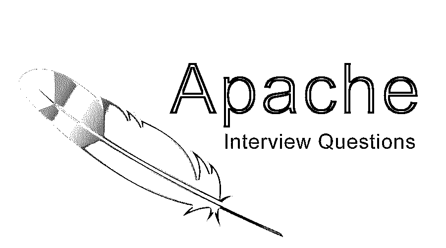

# Apache 面试问题

> 原文：<https://www.educba.com/apache-interview-questions/>

## Apache 面试问答介绍

Apache 也称为 Apache HTTP web server，是通过在网络上托管 web 文件来在 web 服务器上托管网站的最强大和开放的源代码。它最初是由罗伯特·麦克库尔和阿帕奇软件基金会在 1995 年开发的。

现在，如果你想找一份与阿帕奇相关的工作，你需要准备 2022 年的阿帕奇面试问题。根据不同的职位描述，每次面试都是不同的。在这里，我们准备了重要的阿帕奇面试问题和答案，这将有助于你在面试中取得成功。

<small>网页开发、编程语言、软件测试&其他</small>

在这篇 2022 年 Apache 面试问题的文章中，我们将提出 26 个最重要和最常用的 Apache 面试问题。这些面试问题分为以下两部分:

### 第 1 部分 Apache 面试问题(基础)

第一部分包括基本的 Apache 面试问题和答案。

#### Q1。Apache Web 服务器是什么意思？

**答:**
Apache web server 是开源的 HTTP web 服务器，用于[托管网站](https://www.educba.com/launching-your-website/)。

#### Q2。如何查看 Apache 版本？

**回答** :
可以使用命令 httpd -v

#### Q3。apache 在哪些用户上运行，如何检查配置文件的位置？

**回答** :
Apache 运行在 nobody 用户上，配置文件的位置是/etc/httpd/conf/httpd.conf

让我们转到下一个 Apache 面试问题。

#### Q4。Apache 的 HTTP 和 https 的端口是什么？

**答案:**
HTTP 的端口是 80，Apache 中 https 是 443。

#### Q5。你将如何在 Linux 机器上安装 Apache 服务器？

**回答** :
这是面试中常见的阿帕奇面试问题。我们可以对 [Centos 和 Debian](https://www.educba.com/centos-vs-debian/) 分别给出以下命令:
**Centos:**yum install httpd
**Debian:**apt-get install Apache 2。

#### Q6。Apache 服务器的配置目录在哪里？

**回答:**
可以使用以下命令:
cd /etc/HTTP 并键入 ls -l

#### Q7。我们可以在一台机器上安装两台 apache web 服务器吗？

**回答:**
答案是肯定的，我们可以在一台机器上安装两台 apache web 服务器，但是我们必须在那上面定义两个不同的端口。

让我们转到下一个 Apache 面试问题。

#### Q8。Apache 中的 DocumentRoot 指的是什么？

**答案:**
表示 web 文件位置，存储在服务器上。例如:/var/www。

#### Q9。别名指令是什么意思？

**答案:**
别名指令负责映射文件系统中的资源。

#### Q10。你说的目录索引是什么意思？

**回答** :
当任何请求来自一个域时，这是 apache 服务器查找的第一个文件。

让我们转到下一个 Apache 面试问题。

#### Q11。Apache 服务器的日志文件是什么意思？

**回答** :
我们可以从以下位置访问 Apache 服务器的日志文件:/var/log/httpd/access_log 和/var/log/httpd/error_log 中的错误日志。

#### Q12。虚拟主机是 Apache 是什么意思？

**回答** :
虚拟主机部分包含关于您的网站名称、目录索引、服务器管理和电子邮件的信息以及错误日志的信息。

#### Q13。解释位置和目录的区别。

**答案:**
对于设置 URL 相关的元素，我们用::Location。
指的是 server::目录的文件系统的位置。

### 第 2 部分 Apache 面试问题(高级)

现在让我们看看高级 Apache 面试问题和答案。

#### Q14。Apache 虚拟主机是什么意思？

**答案:**
在一台 web 服务器上托管多个网站被称为 Apache 虚拟托管。有两种类型的虚拟主机:基于名称的虚拟主机和基于 IP 的虚拟主机。

#### Q15。你说的阿帕奇的 MPM 是什么意思？

**答案:**
在 Apache 中，MPM 代表多处理模块。

#### Q16。mod_perl 和 mod_php 是什么意思？

**答案:**
mod_perl 用于增强 perl 脚本的性能。
mod_php 用于增强 php 脚本的[性能。](https://www.educba.com/php-interview-questions/)

让我们转到下一个 Apache 面试问题。

#### Q17。你说的 Mod _ avoidable 是什么意思？

**答:**
是帮助 web 服务器防止 web 攻击的模块，例如 DDOS。

#### Q18。httpd.conf 文件中的 Loglevel debug 是什么意思？

**答:**
在 Loglevel debugs 的帮助下，我们可以找到更多关于错误日志的信息，用来解决问题。

#### Q19。如何启动和停止 Apache Web 服务器？

**回答** :
这是阿帕奇面试中被问到最多的问题。在 Apache 实例位置中，有一个 bin 文件夹，在 bin 文件夹中，有一个可执行脚本。我们可以通过终端使用 bin 文件夹中的以下命令:
**启动:**。/Apache CTL start **For stop:**。/apachectl 停止

#### 问题 20。更改默认监听端口的命令是什么？

**答案:**
我们可以听 9.126.8.139:8000 发出这样的命令。该命令将更改默认监听端口，并使监听端口为 8000。

让我们转到下一个 Apache 面试问题。

#### 问题 21。WebLogic 模块的名称是什么？

**回答:**
WebLogic 模块名是**所以。**

#### 问题 22。Apache 的日志级别是什么？

**答案:**
**日志级别为:**调试、信息、警告、通知、暴击、报警、紧急、错误。

#### 问题 23。您将如何终止 Apache 进程？

**回答:**
我们可以使用下面的命令:
Kill $ PID $ number

#### 问题 24。这些错误代码 200、403 和 503 是什么意思？

**回答:**
**200**–服务器没问题。
**403**–服务器试图访问受限文件。
**503**–服务器忙。

#### 问题 25。如何检查 httpd.conf 的一致性？

**回答:**
通过给出下面的命令:
httpd -t

#### 问题 26。如何在服务器上启用 PHP 脚本？

**答案:**
我们要按照步骤:
首先，安装 mod_php。
第二次运行命令:AddHandler application/x-httpd-PHP。phtml。服务器端编程语言（Professional Hypertext Preprocessor 的缩写）

### 结论

这些是与 Apache 面试相关的重要 Apache 面试问题和答案。为了让面试顺利进行，多练习一些命令和基础知识。尤其是如何更改 httpd.conf 文件相关的设置和问题。

### 推荐文章

这是 Apache 面试问题和答案列表的指南。在本帖中，我们研究了阿帕奇面试中常见的问题，这些问题在面试中经常被问到，因此候选人可以轻松地解决这些问题。您也可以阅读以下文章，了解更多信息——

1.  [PLSQL 面试问题](https://www.educba.com/plsql-interview-questions/)
2.  [Linux 系统管理面试问题](https://www.educba.com/linux-system-administration-interview-questions/)
3.  [JMeter 面试问题](https://www.educba.com/jmeter-interview-questions/)
4.  [冬眠面试问题](https://www.educba.com/hibernate-interview-questions/)

