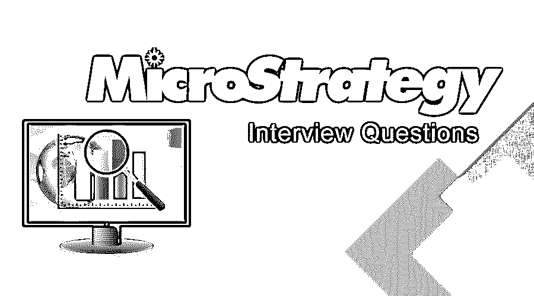

# 微观战略面试问题

> 原文：<https://www.educba.com/microstrategy-interview-questions/>

## MicroStrategy 面试问答介绍

MicroStrategy 是一个企业级的工具，在软件世界或者换句话说就是多种用法；它是一个企业商业智能应用程序和数据仓库报告工具。MicroStrategy 平台可以设想多个方面，如交互式仪表板、阈值和警报、自动化报告分发、高度格式化的报告等。可以对内部和外部数据进行全面分析，以做出业务决策并帮助开发移动应用程序。MicroStrategy 的显著优势在于，它使用单一的公共元数据来实现一致性和简化维护。它还支持内存分析，其概念称为“智能立方体”。指标和属性只能创建一次，然后可以在多种类型的报告中使用。所有需要的更改都可以在一个地方完成，并且相关的报告会自动更新。同样的好处也适用于安全权限；它们在一个地方授予，这可以降低管理成本。

现在，如果你要找的工作是与微观战略相关的，那么你需要准备 2022 年的微观战略面试问题。根据不同的职位描述，每次面试都是不同的。在这里，我们准备了重要的微策略面试问答，帮助你在面试中取得成功。

<small>网页开发、编程语言、软件测试&其他</small>

在这篇 2022 年微观战略面试问题的文章中，我们将介绍 10 个最重要和最常用的微观战略面试问题和答案。这些面试问题分为以下两部分:

### 第 1 部分 MicroStrategy 面试问题(基础)

这第一部分包括基本的面试问题和答案。

#### Q1。在 MicroStrategy 中定义元数据？

**答:**
MicroStrategy 由多个对象定义组成，这些对象定义使用称为元数据的数据库存储库来存储。它可以托管在大多数数据库上。元数据存储库也包含关于数据仓库的信息。所有需要的信息都以一种格式捕获在关系数据库中。所有的报告制作和数据分析都是通过映射 MicroStrategy 对象来完成的，并通过元数据来实现。类似地，报告创建过程使用各种对象，将数据表示为报告构建块，最终创建并存储在元数据存储库中。元数据通过为对象定义提供一个中央存储库，支持在整个 MicroStrategy 应用程序中共享对象。

#### Q2。描述各种对象是微观策略吗？

**回答** :
这是面试中常见的面试问题。物品可以分为三类:

*   **配置对象:**这些对象提供关键信息，并作为管理、用户权限和连接性等关键项目信息的参数。其中一些对象可以是数据库实例、用户组等。所有配置对象都由具有管理图标的管理员生成和维护。它们不被直接利用，而是由管理员生成来管理平台。
*   **模式对象:**所有数据库对象，如表、视图、列，都对应于应用程序中创建的模式对象。任何商业智能应用程序都有三个基本方面:事实、属性和层次结构；所有这些方面都存储在模式对象中。所有模式对象都是由 MicroStrategy 架构师创建和维护的。
*   **应用对象:**应用对象包括报表、过滤器、文档、模板、指标、提示、自定义组。使用应用程序对象可以洞察相关数据及其分析。与架构对象不同，这些对象是由 MicroStrategy developer 创建和维护的。这些对象是使用模式对象作为构建块创建的。

#### Q3。解释商业智能的范围以及为什么商业智能工具至关重要？

**答案:**
任何形式的商业都需要某种程度的智能来面对竞争对手和市场挑战。对市场和竞争的理解可以通过正确的分析和从中获得有用的信息来完成。它通过一些可靠的数据相关操作来帮助企业。拥有适当和强有力的智能策略的组织能够理解顾客频繁变化的需求。在任何业务场景中获得一定程度的智能后，其他业务可以可靠地与组织协作。商业中可以采用的任何操作都有过去、现在和未来的观点。商业智能工具让组织了解这种观点。如何有效地利用数据来执行任何商业智能任务，如报告、数据可视化、数据挖掘和审计，都可以通过 BI 工具来实现。因此，在 BI 工具的帮助下，生产可以提高，财务故障可以避免。

#### Q4。MicroStrategy 中的 2 层、3 层和 4 层架构有什么区别？

**答:**
在 2 层架构中，MicroStrategy desktop 以查询的形式与数据仓库和元数据交互，不需要任何智能服务器。因此，桌面和元数据之间会发生正常的交互。另一方面，3 层体系结构由桌面和数据仓库或元数据之间的智能服务器组成。4 层架构以 MicroStrategy Web 的形式在 3 层架构中增加了一个额外的组件。

#### Q5。MicroStrategy 和 IBM Cognos 有什么区别？

**答案:**
以下是不同之处:

*   MicroStrategy 支持多种语言，而 Cognos 提供了可定制的仪表板。
*   MicroStrategy 可用于 web 和桌面工具这两种形式，而 Cognos 是一种基于 web 的报告工具机制。
*   它基于单一的数据存储库策略，而 Cognos 有两个元数据存储库和基于数据库的。
*   与 MicroStrategy 工具相比，使用 MicroStrategy 报告很快，而 Cognos 报告功能很慢。

### 第 2 部分 MicroStrategy 面试问题(高级)

现在让我们来看看高级面试的问题和答案。

#### Q6。解释一下在 MicroStrategy 中创建智能立方体的过程？

**答案:**
在 MicroStrategy 中可以选择一个公共文件夹或者特定的用户文件夹来创建智能立方体。完成报告创建过程后，用户可以将报告指向一个立方体，然后右键单击文件夹，然后选择 cube-option 来创建一个新的立方体。一旦多维数据集创建完成，需要选择所需的报告对象，并保存多维数据集。然后，存储一个立方体并运行检查；现在，任何人都可以从多维数据集中创建多个报告。开发人员还可以在多维数据集中添加新的属性和指标，同样的功能也可以在我们运行报告时使用。

#### Q7。智能立方体技术在微策略中的实现方法有哪些？

**答案:**
这是在面试中被问到的最流行的微策略面试问题。智能多维数据集允许用户访问报告上的 OLAP 服务功能；共享数据集可以在多个报告之间共享。智能立方体是 BI 平台上的多维立方体，有两种独特的方法来实现智能立方体技术:

*   **个人智能多维数据集:**这是一个智能多维数据集功能，用户可以以常规方式开始创建报告，然后使用 [OLAP 服务功能](https://www.educba.com/olap-tools/)分析报告，如派生指标、视图过滤器和动态聚合。所有功能都通过内存中的数据副本进行处理，称为个人智能立方体。因此，处理不是在数据仓库中进行，而是通过内存中的副本进行。
*   **智能多维数据集:**包含一组数据的共享智能多维数据集可以作为单个内存副本在不同用户的报表之间共享。数据集从数据仓库返回，然后直接保存到智能服务器内存中。所有能够访问智能多维数据集的报告都可以利用 OLAP 服务功能进行报告和分析。

#### Q8。列出在 MicroStrategy 中使用的不同算法？

**回答:**
有不同的算法集合，在 MicroStrategy 中得到极大的支持；其中一些是:

*   回归算法
*   树算法
*   聚类算法
*   神经网络算法。

让我们进入下一个面试问题。

#### Q9。什么是提示，它有哪些类型？

**答:**
所有报表内容都可以通过一个叫做提示的属性进行动态修改。有许多类型的提示，如:

*   **对象提示**–允许用户选择具有运行时报告的对象。
*   **级别提示**–可以决定指标聚合计算的级别。
*   **值提示**–允许用户键入一个值，该值可与指标一起使用。
*   **过滤定义提示**–允许用户决定属性元素过滤器如何过滤报表数据。

#### Q10。什么是微策略中的隐式属性？

**答案:**
有其表达式的属性称为隐含属性。它在数据库中不是物理存在的，而是虚拟存在的。因此也可以称为虚拟属性。它是在应用程序级别创建的。

### 推荐文章

这是一份关于 MicroStrategy 面试问题和答案列表的指南，以便候选人可以轻松地解决这些面试问题。在本帖中，我们研究了面试中经常被问到的顶级微观策略面试问题。您也可以阅读以下文章，了解更多信息——

1.  [商业智能面试问题](https://www.educba.com/business-intelligence-interview-questions/)
2.  [冬眠面试问题](https://www.educba.com/hibernate-interview-questions/)
3.  [数据仓库面试问题](https://www.educba.com/data-warehouse-interview-questions/)
4.  [PLSQL 面试问题](https://www.educba.com/plsql-interview-questions/)

