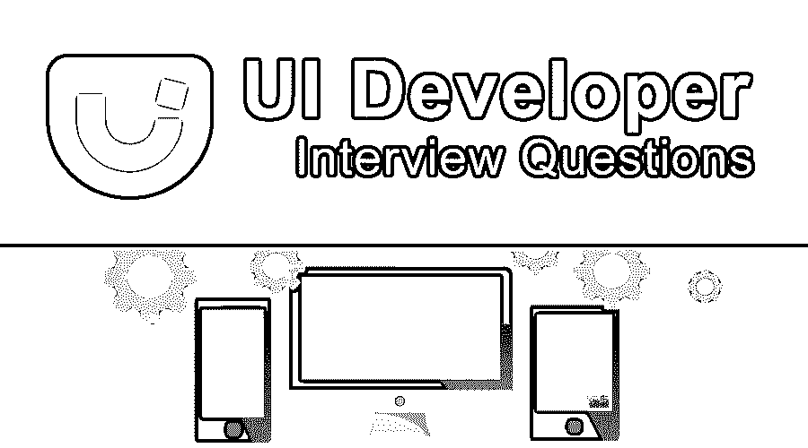

# UI 开发人员面试问题

> 原文：<https://www.educba.com/ui-developer-interview-questions/>

## UI 开发人员面试问答介绍

UI 开发人员在开发网站的过程中起着重要的作用，因为 UI 是第一个让用户进入网站的界面。这是第一印象。UI 开发人员的主要角色是为最终用户(客户、顾客或用户)提供用户界面解决方案，包括网站的外观、不同场景下用户界面的感觉和行为。我们可以说 UI 开发者是网页设计师和网页开发者的结合体。UI 开发人员在提供用户界面时需要考虑不同的方面，例如应用程序用户界面的外观、功能和安全性。UI 开发人员需要拥有不同的技能，例如不同语言的知识，如 CSS、HTML、JavaScript、Ajax 和 HTTP 等。基本心理学、用户界面的颜色组合、逻辑排序等。

UI 开发人员是一个具有多面性的挑战性角色，因为它负责将产品从研究、开发、测试、内容和布局转移到一个看起来和感觉上都丰富的界面中，并为最终用户提供适当的指导和响应体验。在用户界面的帮助下，用户和计算机可以以此为中介使用输入输出设备和软件进行交互。UI 开发人员是目前市场上炙手可热的工作角色之一。我们将看看 UI 开发人员角色最常被问到或最重要的面试问题。

<small>网页开发、编程语言、软件测试&其他</small>

现在如果你要找 UI 开发者相关的工作，需要准备 2022 UI 开发者面试题。根据不同的职位描述，每次面试都是不同的。在这里，我们准备了重要的 UI 开发者面试问答，帮助你在面试中取得成功。

这篇 2022 UI 开发者面试问题的文章将呈现 10 个最重要和最常用的 UI 开发者面试问题。这些问题分为以下两部分:

### 第 1 部分——UI 开发人员面试问题(基础)

这第一部分包括基本的面试问题和答案。

#### Q1。什么是语义 HTML？

**答:**
语义 HTML 是一种编码风格，其中标签将包含文本需要如何在用户界面上显示。像粗体、斜体这样的标签不应该与语义 HTML 一起使用，因为它们代表格式，没有任何意义或结构。从语义上来说，正确的做法是使用这些标签来获得与粗体和斜体相同的效果，以及意义和结构。

#### Q2。绝对、相对、静止和固定的位置会有什么不同？

**答案:**

这是面试时问的基本 UI 开发者面试问题。请在下面找到 UI Developer 支持的不同表格:
**绝对:**它会将元素准确地放置在用户想要放置的位置。一般来说，绝对位置相对于父位置。如果没有可用的父级，那么它相对于页面本身放置。

**Relative** :相对于自身放置元素(如果我们没有给任何相对定位)；例如，如果我们相对于一个元素设置 position，并给定为 top: 10px，那么它将把元素 10px 从该元素的实际位置向下放置。

**静态**:根据文档的流向放置元素。它使用默认位置；如果我们想去掉任何一个位置，那么我们可以用一个静态位置来代替它。

**Fixed** :滚动时视口不变，相对浏览器窗口或视口放置元素。因此元素将被固定在那个位置。

#### Q3。什么是响应式网站？

**回答:**
任何网站都应该是响应性的，只要它看起来不错，并且适合所有类型的屏幕分辨率设备类型。为了重新排列元素，在用户界面中显示或隐藏元素，我们可以使用 CSS 媒体查询来完成任务。

#### Q4。内联、块和内联块的区别是什么？

**答案:**
**内联:**在这个东西里，元素会随波逐流而不破。边距/填充将水平推动其他元素，而不是垂直，行内元素忽略高度和宽度。

**挡:**断了线，放不进线。它通常有 div，p，text，section 等。

**Inline-block:** 类似于 Inline 元素，遵循页面流程。唯一不同的是，它会考虑高度和宽度。

#### Q5。HTML 需要编译器吗？

**回答:**
一般来说，HTML、 [CSS、JavaScript](https://www.educba.com/css-vs-javascript/) 都有解释语言或者浏览器解释技术。相比之下，C，C++，ASP.NET，PHP 没有解释语言，他们需要一个编译器将他们的代码转换成机器语言。所以 HTML 不需要编译器，被称为前端语言。

### 第 2 部分–UI 开发人员面试问题(高级)

现在让我们来看看高级面试问题。

#### Q6。窗口和文档有什么区别？

**答案:**
JavaScript 使用一个全局对象，所有的东西都在它下面运行，这个对象叫做窗口和全局对象，它下面保存着全局变量、全局函数、历史和位置。与它一起，Ajax、setTimeout、控制台和本地存储也在窗口下。

文档也在窗口下，因为它是窗口对象的属性。文档表示用户编写的 HTML 标记的面向对象表示中表示的 DOM，并且可以通过文档上的 getElementById、addEventListener 获得元素。

#### Q7。reset.css 和 normalize CSS 有什么区别？

**回答:**
reset.css 和 normalize CSS 的区别在于，reset . CSS 去掉了所有内置的浏览器样式功能，如边距、填充和边框。而 normalize CSS 提供了类似书本的外观，包括表示字符的粗体系列、两个段落之间的边框以及用于整个文档页面的通用字体系列。

#### Q8。什么是网页可访问性？

**答:**
网络无障碍的定义是为不同能力的人或残疾人提供访问网站的机会。最近 [HTML5 推出了](https://www.educba.com/html5-interview-questions/) WAI-ARIA，使用它，即使是不同能力和残疾的人也可以使用网络，导航，理解和互动。

#### Q9。什么是 JavaScript 提升？

**答案:**
这是在面试中被问到最多的 UI 开发者面试问题。在 JavaScript 中，我们需要声明变量，然后只有我们能够访问变量。如果变量是在脚本的底部定义的，但在此之前被调用，JavaScript 抛出变量是未定义的。在 JavaScript 中，只有赋值变量才会被提升，比如字符串、数字等。未定义的变量和函数不会被提升，因为它们需要在调用前定义。

#### Q10。解释什么是事件冒泡和事件捕获？

**答案:**
事件传播是事件在元素上开火的顺序。冒泡是指当一个事件在元素上触发时，在 DOM 树中向上冒泡，即子节点将首先调用，然后父节点将调用，而捕获与冒泡相反，在冒泡中先调用父节点，然后调用子节点。

我希望你已经为你的面试做好了充分的准备，我保证在阅读完这篇 UI 开发者面试问题的文章后，你会对 UI 开发者面试的主题和准备有更好的理解。祝你面试准备和面试一切顺利。

### 推荐文章

这是一个 UI 开发人员面试问题和答案列表的指南，以便候选人可以轻松地解决这些面试问题。在这篇文章中，我们研究了顶级 UI 开发人员面试问题，这些问题在面试中经常被问到。您也可以阅读以下文章，了解更多信息——

1.  [可回答的面试问题](https://www.educba.com/ansible-interview-questions/)
2.  [阿帕奇面试问题](https://www.educba.com/apache-interview-questions/)
3.  [微观战略面试问题](https://www.educba.com/microstrategy-interview-questions/)
4.  [PowerShell 面试问题](https://www.educba.com/powershell-interview-questions/)

