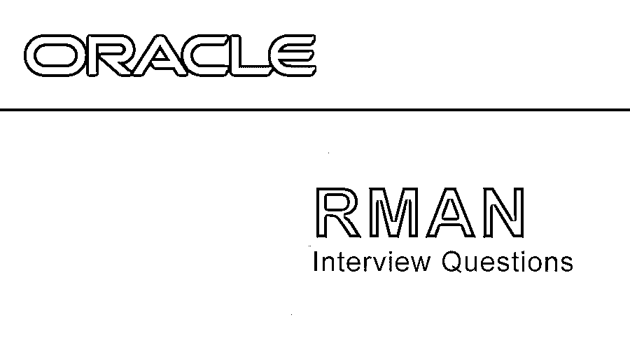

# RMAN 面试问题

> 原文：<https://www.educba.com/rman-interview-questions/>

## RMAN 面试简介面试问答

RMAN 代表恢复经理。它是一个用于数据库备份和恢复任务的 [Oracle 数据库客户端](https://www.educba.com/oracle-database-interview-questions/)，它还可以自动管理我们的备份策略。在 rman 的帮助下，可以轻松地管理生产数据库的还原、备份和恢复各种数据库文件。它有助于简化许多公司的 DBA 工作。

如果你在找与 RMAN 面试相关的工作，你需要准备 2022 年 RMAN 面试的问题。根据不同的职位描述，每次面试都是不同的。在这里，我们准备了重要的 RMAN 面试问题和答案，这将有助于你在面试中取得成功。

<small>网页开发、编程语言、软件测试&其他</small>

这篇 2022 年 RMAN 面试问题的文章将呈现 10 个最重要和最常用的 RMAN 面试问题。这些问题分为以下两部分:

### 第 1 部分-RMAN 面试问题(基础)

这第一部分包括基本的面试问题和答案。

#### Q1。RMAN 的主要特征是什么？

**答:**
Rman 为我们提供了各种备份、恢复技术以及许多其他功能。下面列出了其中的几个。

*   **自动指定要包含在备份中的各种文件:**在 RMAN 中自动设置备份文件的名称和位置。
*   **压缩未使用的数据块**:这是 RMAN 的特性之一，可以跳过从未使用过的数据块。
*   **维护的备份库**:备份记录在控制文件中，控制文件是 RMAN 元数据的主库。RMAN 的控制文件，所有数据都在这里备份。该文件也称为 RMAN 元数据的主存储库。它还有一个恢复目录来存储元数据。
*   **备份的二进制压缩**:这是一个减少数据备份大小的过程，这是与 Oracle 数据库相关的[。](https://www.educba.com/career-in-oracle-database-administrator/)
*   **增量备份**:仅备份自上次备份以来更改过的数据块。
    因此，它加快了压缩备份和快速恢复的速度。
*   **介质恢复**:<u>数据文件的恢复只有少量损坏的数据块，不需要脱机或从备份中恢复。</u>
<u>*   **加密格式备份:** RMAN 提供加密格式的数据备份，它集成到 Oracle 数据库中，用于存储加密格式的备份集。*   **损坏数据块检测功能** : Rman 可以在备份之前检查损坏的数据块。</u>

 <u>#### Q2。解释过期备份和过时备份？

**答:**
在 RMAN，过期状态表示备份数据，详细备份在目的地不存在，过时表示备份信息存在或发现当前不需要。这是因为 RMAN 已配置为在特定天数过后不再需要备份信息。

#### Q3。解释中的 0 级和 1 级备份。

**答案:**
0 级称为增量备份，是即将进行的后续增量备份的基础；复制包含数据的所有块，然后将整个数据作为备份进行备份。

**级别 1 可以是下面解释的** **类型之一:**
它可以是差异备份，这有助于在级别 1 的最近增量备份之后备份所有改变的块，或者
它可以是累积备份，其中在级别 0 的最近增量备份之后备份所有改变的块

#### Q4。当它处于关闭状态时，可以进行备份吗？

**答案:**
这是 RMAN 面试中问的基本问题。请在下面找到 RMAN 支持的不同表格。只有当目标数据库打开或处于装载阶段时，我们才能进行 RMAN 备份。这背后的原因是 RMAN 将备份元数据保存在控制文件中。只有在打开或装载模式下，控制文件才是可访问的。因此不可能在停机状态下进行备份。

#### Q5。告诉文件的 RMAN 可以备份，以及斜面备份？

**答案:**
RMAN 可以备份数据文件、归档日志、备用数据库 Spfile、控制文件等。不能作为备份的文件包括以下 p 文件、网络配置文件、重做日志、口令文件、外部表和 Oracle 主目录文件的内容。

### 第 2 部分-RMAN 面试问题(高级)

现在让我们来看看高级面试问题。

#### Q6。我们如何检测 RMAN 数据库中数据块的损坏？解决这个问题的步骤是什么？

**回答:**
使用命令 **v$block_corruption 找出损坏块的第一步；在**这个命令的帮助下，我们可以找到所有损坏的块。在下一步中，我们必须通过命令 **RMAN >块恢复数据文件名<文件 id >块<块 id >来恢复它；**

上述命令将帮助我们恢复所有损坏的数据。

#### Q7。安装 RMAN 恢复目录的步骤是什么？

**答:**
按照以下步骤安装 RMAN。

*   首先，在目录数据库中创建一个连接字符串。
*   在目录数据库中，创建一个新用户或使用现有用户，并授予该用户 recovery_catalog_owner 权限。
*   使用连接字符串登录 RMAN
*   导出 ORACLE_SID
*   rman 目标目录@连接字符串
*   rman >创建目录
*   注册数据库

#### Q8。解释 RMAN 建筑的组成部分，有哪些渠道？

**答案:**
**RMAN 的架构组成如下。**

*   媒体管理层(可选)
*   RMAN 可执行文件
*   服务器进程
*   备份、备份集和备份条目
*   目标数据库
*   恢复目录数据库(可选)
*   频道

**频道**
它是一个 RMAN 服务器，负责执行 RMAN 的大量工作；它在需要执行输入输出时启动。这可以通过与可以是不同存储设备的输入和输出设备的通信来实现。它习惯于在这些存储中读写备份文件。整个过程是通过分配通道给 I/O 设备来完成的。

*   这是文件读取的最大速率。
*   它是同时访问 I/O 设备的进程的数量。
*   这是在 I/O 设备上创建的文件的最大大小。
*   最大化一次打开的文件数量

#### Q9。解释为什么在 RMAN 目录是可选的？

**答案:**
这是 RMAN 面试中被问得最多的问题**。**由于 RMAN 管理备份和恢复操作，因此需要存储有关数据库及其相关元数据的必要信息。在 RMAN，这些信息存储在目标数据库的控制文件中。在 RMAN 恢复目录模式中，该模式用于恢复存储在单独数据库中的数据，以防止其他数据库损坏。它与目标数据库分离。

#### Q10。解释 RMAN 备份集？

**答案:**
可以称之为很多备份文件的逻辑组。这些文件是在使用 RMAN 备份命令进行备份时创建的。在 RMAN，备份集是与备份相关的各种备份相关文件的集合。它是用命令集合构建的。

### 推荐文章

这是一个 RMAN 面试问题和答案的列表指南，以便候选人可以轻松地解决这些面试问题。在本帖中，我们研究了 RMAN 面试中常见的问题。您也可以阅读以下文章，了解更多信息——

1.  [SSAS 面试问题](https://www.educba.com/ssas-interview-questions/)
2.  [Maven 面试问题](https://www.educba.com/maven-interview-questions/)

</u>