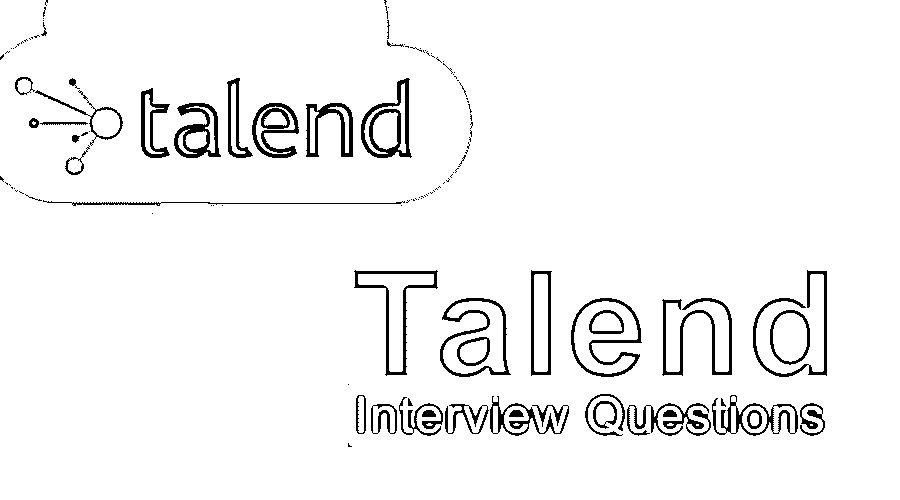

# 面试问题

> 原文：<https://www.educba.com/talend-interview-questions/>

## Talend 面试问答介绍

提取、转换和加载用于将原始数据转换成一些有用的信息。它可用于可操作的商业智能。数据提取自各种来源，如 Salesforce、SAP 以及 RedShift 和 Oracle 等数据库。也可以从 XML、CSV、AVRO、JSON 等文件格式中提取。然后对其进行转换和加载。Talend 是一个用于数据集成的开源平台，为数据管理、数据集成、数据质量、企业应用集成、大数据和云存储提供各种服务和软件。在这篇 Talend 面试问题的文章中，我们将讨论 Talend 的面试问题。

如果你要找的是与 Talend 相关的工作，你需要准备 2022 年 Talend 面试问题。根据不同的职位描述，每次面试都是不同的。在这里，我们准备了重要的 Talend 面试问题和答案，将帮助你在面试中取得成功。

<small>网页开发、编程语言、软件测试&其他</small>

在这篇 2022 年的 Talend 面试问题文章中，我们将呈现 10 个最重要和最常被问到的 Talend 面试问题。这些问题分为以下两部分:

### 第 1 部分–面试问题(基础)

这第一部分包括基本的面试问题和答案。

#### Q1。解释 Talend 中可用的各种连接？

**答:**
连接定义了数据必须是数据输出、处理还是逻辑序列。各种连接包括:

*   **基于行的**:查找、主、过滤、错误拒绝、拒绝、唯一/重复、输出、多输入/输出等类型。
*   **Iterate** :用于对目录中包含的文件执行循环。
*   **Trigger** :该连接用于创建子作业或作业之间的依赖关系，这些子作业或作业按顺序触发。两个通用类别是子作业和组件级触发器。
*   **Link** :用于将表模式转移到 ELT 组件中。

#### Q2。Talend 和代码生成器有什么关系？

**答案:**
这是面试中问的基本 Talend 面试问题。请在下面找到 Talend 支持的不同表格:Talend 被称为代码生成器，它提供了一个用户友好的图形用户界面，只需拖放组件即可设计作业。一旦提交作业，Talent Studio 会自动将[编译成 Java 类](https://www.educba.com/serialization-in-java/)，其中内部组件 begin、main 和 end 在控制流中提供帮助，因此它也被称为代码生成器。

#### Q3。Talend 支持哪些模式？

**回答:**
支持以下模式:

*   通用模式(Generic schema):它不依赖于任何特定的数据源，并被用作不同数据源之间的共享资源。
*   **固定模式**:只读模式，预定义了一些组件。
*   **存储库模式**:模式是可重用的，对模式所做的任何更改都将反映在所有作业中。

#### Q4。有哪些套路？

**答:**
它们是可重用的片段，可以通过使用自定义代码来优化数据处理。它还有助于增强 Talend Studio 的功能并提高工作能力。基本上有两种例程:用户例程和系统例程。

*   **系统例程**:只读代码，可以在任何作业中直接调用。
*   **用户例程**:用户通过新建或使用现有例程，自定义创建一个例程。

#### Q5。ETL 和 ELT 有什么区别？

**答:**
ETL 或提取、转换和加载是一个古老的概念，它涉及从外部来源提取数据，转换数据使其适合根据业务和运营需求使用，然后将其加载到最终[目标数据仓库](https://www.educba.com/data-warehouse-interview-questions/)或目标数据库。只要在整个过程中涉及多个数据库和源系统，这就是一种非常有效的方法。数据从一个地方传输到另一个地方，所以在一个单独的专用引擎中完成所有与转换相关的工作通常是明智的。
另一方面，ELT 是将提取的数据主要加载到终端系统的过程。此后，转换在其上完成。当您的目标系统足够高效和健壮来处理所有的转换时，这是一个更好的方法。今天的大多数分析数据库，如 Google Big Query 和 Amazon Redshift，经常使用 ELT 技术，因为它们的终端系统足以有效地处理、解决和处理所有转换的数据。

### 第 2 部分–面试问题(高级)

现在让我们来看看高级面试问题。

#### Q6。什么是子作业？数据是如何从父作业发送到子作业的？

**答:**
子作业定义为单个组件或由数据流连接的多个组件。一个作业至少可以有一个子作业。将值从父作业传递到子作业时，应使用上下文变量。

#### Q7。解释 tMap 组件，并列出使用它可以实现的不同功能。

**答案:**
这是面试中被问得最多的 Talend 面试问题。tMap 是构成“加工”家族核心部分的重要组成部分之一。主要用途是将输入数据与输出数据进行映射。tap 可执行的主要功能包括:

*   对任何类型的字段应用转换规则。
*   添加或删除列
*   拒绝数据
*   使用约束过滤输入和输出数据
*   数据的连接和交换
*   数据的多路复用和解复用

#### Q8。解释 tDenormalizeSortedRow。另外，在创建 SFTP 连接时，我们可以使用二进制传输模式或 ASCII 码吗？

**答案:**
tDenormalizeSortedRow 构成了处理家族不可或缺的组成部分。它用于合成排序的输入流，从而节省内存。所有输入的已排序行被组合到一个组中，其中项目分隔符与不同的值连接。不，当[创建 SFTP 连接](https://www.educba.com/what-is-sftp/)时，传输模式不可用。它只是 SSH 的扩展，因此不支持任何类型的传输模式。

#### Q9。解释 Talend 中的错误处理？

**答案:**
以下是错误处理流程:

*   可以依赖异常抛出过程，这也可以在红色堆栈跟踪的运行视图中看到。
*   每个组件和子作业都必须返回代码，这导致了额外的处理。OK/Error 链接可用于将错误重定向到错误处理例程。
*   处理错误的最好和最可靠的方法是定义一个错误处理子作业，在出现错误时调用它。

让我们进入下一个面试问题。

#### Q10。XMS 和 XMX 参数有什么区别？

**答案:**
XMS 参数用于定义 Java 中的初始堆大小，而 XMX 用于定义最大堆大小。

### 结论

在这里，我们为您带来了 10 个 Talend 面试问题及其答案。不要局限于这些，因为面试都是关于实践和亲身经历，这是你在一段时间内获得的。请继续关注我们的博客，获取更多类似的文章。

### 推荐文章

这是一份关于面试问题和答案的指南，这样候选人可以很容易地解决这些面试问题。在本帖中，我们研究了面试中经常被问到的几个顶级面试问题。您也可以阅读以下文章，了解更多信息——

1.  [虚拟化面试问题](https://www.educba.com/virtualization-interview-questions/)
2.  [冬眠面试问题](https://www.educba.com/hibernate-interview-questions/)
3.  [IT 安全面试问题](https://www.educba.com/it-security-interview-questions/)
4.  [Struts 2 面试问题](https://www.educba.com/struts-2-interview-questions/)

