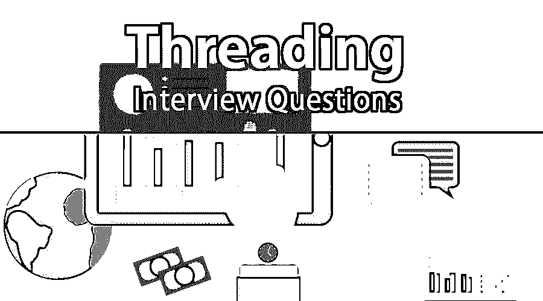
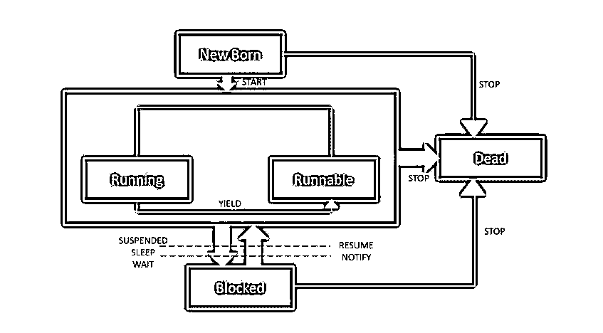

# 线程面试问题

> 原文：<https://www.educba.com/threading-interview-questions/>

## 线程面试问答介绍

线程被认为是轻量级进程。线程也可以理解为在进程中执行的路径。多线程背后的[概念是实现并行性，这有助于面向多进程。区分线程和多线程的非常细微的界限妨碍了相关进程的处理。下面提到的场景将帮助我们以类似的方式思考。](https://www.educba.com/multithreading-interview-questions/)

想象一下，在任何给定的浏览器上工作时，您需要收集与印度 IT 行业相关的数据；在收集详细信息的过程中，您试图打开一个新的选项卡窗口(在同一个浏览器中)，但不幸的是无法打开。这是解释什么是线程以及多线程如何给用户带来好处的一种方式。因此，在浏览器中，多个选项卡可以是不同的线程。另一个例子将更精确地理清思路；MS Word 应用程序在工作时使用多个线程，一个线程用于格式化，另一个用于处理输入，依此类推。

<small>网页开发、编程语言、软件测试&其他</small>

现在，如果你想找一份与线程相关的工作，你需要准备 2022 线程面试问题。根据不同的职位描述，每次面试都是不同的。在这里，我们准备了重要的线程面试问答，帮助你在面试中取得成功。

在这篇 2022 线程面试问题文章中，我们将介绍 10 个最重要和最常用的线程面试问题。这些问题分为以下两部分:

### 第 1 部分–线程面试问题(基础)

这第一部分包括基本的面试问题和答案。

#### Q1。多线程编程和单线程编程有什么区别？

**答案:**
在一个多线程进程中，多个线程同时工作。在多线程模型中进行池化时没有事件循环。CPU 时间得到了更好的利用，没有时间浪费。空闲时间最少。一个更高效的程序是多线程处理的结果。多线程编程的一个特殊行为是，当一个线程暂停时，另一个线程照常运行。

单线程同时运行在单线程编程中；该模型在池化期间使用流程事件循环。CPU 时间没有得到适当的利用，因为它有更多的空闲时间。单线程编程的效率较低，因为当一个线程暂停时，系统会等待该线程恢复，这导致程序效率较低。

#### Q2。什么是进程，它与线程有什么不同？

**答案:**
这是面试中问的基本穿线面试问题。两者的主要区别在于他们的工作行为。相关进程的线程运行在共享内存位置，而内存空间在一个进程中是不同的。线程的这种行为使得它在对其对应方的响应方面更加高效。由于线程相互关联，它们相互共享代码、数据和操作系统细节。关于线程的另一件事是，它们有自己的程序计数器(PC)、寄存器集和堆栈空间。

#### Q3。详细阐述一个线程的生命周期？

**答案:**

Whenever a thread is created, it is in the “New Born” state. After this, the thread can in 2 states namely.

*   运转
*   可追捕的

线程将调用 start 方法从新生状态导航或移动到运行或可运行状态。Runnable 意味着您的线程已经准备好执行，但是它正在等待处理器的可用性。分配处理器的那一刻，状态从 runnable 变为 running。但是，要将状态从 running 更改为 runnable，有专门的方法可以做到(像在 JAVA 中，有 YIELD 方法)。现在要阻止一个线程进入两种状态(即运行或可运行)，有三种方法。

*   暂停
*   睡眠
*   等待

此外，要运行一个已经被阻塞的线程，有不同的方法，如

*   简历
*   通知

最后，需要使用 STOP 方法将线程的状态从新生、运行、可运行或阻塞状态变为死亡状态。

**Note –** There can be multiple one-word interview questions based on this – like name the method to change the state from running to block or anyone mentioned above.

#### Q4。什么是 ThreadLocal 类？

**回答:**
Java 中的 ThreadLocal [类让](https://www.educba.com/serialization-in-java/)你可以创建变量。这些变量可以用相同的方法读写。如果两个线程正在执行相同的代码，但是这些代码都有一个 ThreadLocal 变量，那么这两个线程很可能看不到彼此的 ThreadLocal 变量。

#### Q5。什么是 Java 中的守护线程？

**回答:**
用户线程是前台执行者，恶魔线程就像助手。助手帮助完成一项任务。一旦任务完成，就不需要执行者了，作为回报，助手也离开了这个地方。JVM 主要创建这些。这些线程(恶魔)主要被创建来执行后台任务，如垃圾收集等。

### 第 2 部分–线程面试问题(高级)

现在让我们来看看高级面试问题。

#### Q6。如何用 Java 创建线程？

**答案:**
通过扩展线程类，可以创建一个线程。

`Public class MyThreadClass extends Thread {
Public void run () {
System.out.println (“Thread name is :”+Thread.currentThread().getName());
Try{
Thread.sleep(1000);
} catch (InterruptedException) {
e.printStackTrace();
}
}
}`

#### Q7。提供线程在 TCB(线程控制块)中包含的所有部分或细节的名称？

**答案:**
线程标识符

*   栈指示器
*   程序计数器
*   线程状态
*   线程寄存器组
*   父进程指针

让我们进入下一个线程面试问题。

#### Q8。什么是线程中的线程连接()。

**答案:**
thread 类包含几个方法；join()和 sleep()就是其中的 2 个。thread.join()方法用于调用线程并阻塞它，直到线程被终止。

#### Q9。如何在 C#中调试一个线程？

**答案:**
这是面试中被问得最多的穿线面试问题。在 visual studio 中，有一种快捷方式可以通过限制时间来提高生产率。

*   CTRL+T+T 或雪花=这将执行限制在当前线程，并冻结所有其他线程。
*   CTRL+T+J 或 Next 按钮=允许切换到下一个单线程。这只会对当前线程进行更改，并冻结所有其他线程。

#### Q10。运营商的地址在后台是做什么的？

**答案:**
address of 运算符在后台处理方法中创建对象。类型安全、面向对象的函数指针是 VB.NET 中任何[委托的结构。一旦线程被启动，就可以通过调用线程的 Start()方法来执行代码。](https://www.educba.com/vb-net-interview-questions/)

### 推荐文章

这是一份面试问题和答案的列表指南，以便候选人可以轻松地解决这些面试问题。在本帖中，我们研究了面试中经常被问到的顶级线程面试问题。您也可以阅读以下文章，了解更多信息——

1.  [道德黑客面试问题](https://www.educba.com/ethical-hacking-interview-questions/)
2.  [数据结构面试试题](https://www.educba.com/data-structure-interview-questions/)
3.  [JMeter 面试问题](https://www.educba.com/jmeter-interview-questions/)

