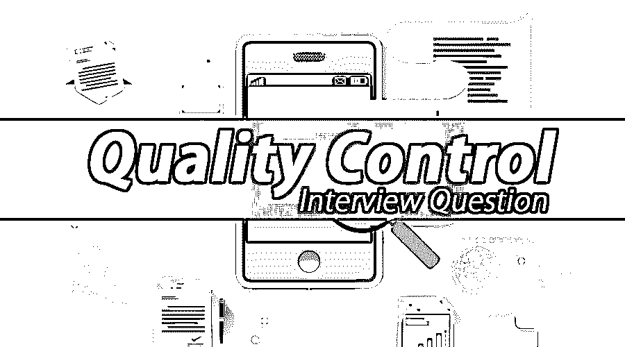

# 质量控制面试问题

> 原文：<https://www.educba.com/qc-interview-questions/>

## QC 面试问答介绍

软件系统或产品的 QC(质量控制)被定义为基于产品质量输出的参考，一个组织或任何可用的国际标准所遵循的一组程序，以确保有效的产品交付满足客户需求和满意度。考虑软件质量的不同参数是功能需求和非功能需求，它们直接和间接地影响产品，比如性能、可用性和可支持性。在产品执行过程中，主要考虑处理意外场景或情况的方式以及出错率。术语软件质量保证与[软件质量控制](https://www.educba.com/software-quality-control/)不同，因为软件质量保证包括稳定维护产品质量的不同标准和过程，例如软件交付、过程和文档，减少缺陷数量等。相比之下，软件质量控制是一种在发现缺陷时针对已建立的需求标准的人工制品符合性验证。

如果是找品控相关的工作，需要准备 2022 年品控面试题。根据不同的职位描述，每次面试都是不同的。在这里，我们准备了重要的质量控制面试问题和答案，将帮助您在面试中取得成功。

<small>网页开发、编程语言、软件测试&其他</small>

在这篇 2022 年质量控制面试问题的文章中，我们将提出 10 个最重要和最常见的质量控制面试问题。这些问题分为以下两部分:

### 第 1 部分-质量控制面试问题(基础)

这第一部分包括基本的面试问题和答案。

#### Q1。什么是软件质量控制并解释它的好处？

**答:**
软件质量控制是任何组织或机构所遵循的一套标准程序，或者是由国际小组基于一个高质量产品的标准参考而制定的任何标准，以确保高效的可交付产品满足客户的满意和要求。软件质量控制的几个好处如下

*   可以提高软件系统或产品的效率。
*   产品缺陷可以在交货前降到最低。
*   可以减少开发时间。
*   顾客满意指数可以提高。
*   可以与客户建立牢固的信任和关系。
*   更快的应用程序开发和更少的缺陷。

#### Q2。质量控制程序包括哪些不同的步骤或过程？

**答案:**
这是面试中问的基本品控面试问题。质量控制程序中涉及的不同步骤或过程是按照要求审查和测试产品。下述审查和测试阶段涉及的步骤——

**复习阶段:**

*   需求分析
*   设计阶段
*   代码构建和开发
*   应用程序或代码部署
*   测试计划阶段
*   实现测试用例

**测试阶段:**

*   单元测试
*   [集成测试](https://www.educba.com/integration-testing/)
*   系统试验
*   [系统集成测试](https://www.educba.com/system-integration-testing/)
*   [非功能性测试](https://www.educba.com/non-functional-testing/)
*   用户接受度测试

#### Q3。软件 QC 中有哪些不同类型的质量控制参数？

**答:**
软件质量控制中可用的不同类型的质量控制参数是产品、过程和资源，解释如下:

*   **产品:**产品是客户的实际需求，最多零缺陷交付。
*   **过程:**过程是测试软件系统或产品时要遵循的一组规则或程序，以确保最佳的产品可交付性。这组过程将[使测试程序](https://www.educba.com/testing-of-mobile-application/)能够有效地执行，以便按照客户要求规范测试完整的产品，而不遗漏任何功能或非功能的不可实现性。
*   **资源:**就团队或使用的工具或技术而言，要部署的资源要非常高效。根据项目预算，测试程序可以是自动的，也可以是手动的。如果是手动的，那么团队中应该有有效的资源，以避免任何手动错误或缺陷。相比之下，自动化测试也需要部署专业技术人员。

#### Q4。涉及哪些不同类型的质量控制流程？

**答:**
不同类型的质量控制流程包括计划、执行、检查和行动，下面将对其进行解释

*   计划(Plan)——这是一个阶段，所有的质量控制过程都被遵循并被收集成一个单一的测试覆盖文档，或者可以被称为测试计划文档
*   **Do**–这是一个以参数形式定义所有质量控制流程以制定质量标准的阶段。
*   **检查**——这是所有质量控制加工参数按照规定标准达到质量的阶段。
*   **行动**-这是一个采取必要行动以确保质量的阶段，如果需要，通过采取纠正措施来重复。

#### Q5。作为质量控制流程的一部分，有哪些不同类型的测试？

**答:**
作为质量控制流程的一部分，不同类型的测试包括:单元测试、功能测试、集成测试、[系统测试](https://www.educba.com/system-testing/)、系统集成测试、[非功能测试](https://www.educba.com/non-functional-testing/)、用户验收测试、Beta 测试、性能测试、回归测试、容量测试、恢复测试、[可用性测试](https://www.educba.com/what-is-usability-testing/)、压力测试、负载测试和安装测试。

### 第 2 部分-质量控制面试问题(高级)

现在让我们来看看高级面试问题。

#### Q6。质量控制的不同特征是什么？

**答:**
质量控制的不同特点描述如下:

*   采用一套不同的流程。
*   交付高质量的产品。
*   以低成本向客户提供优质产品。
*   始终通过实施不同组织或标准的过程来提高质量。
*   确保计划正确执行。
*   确保按照正确的审核流程计划执行。

#### Q7。系统或产品的软件质量控制涉及哪些不同的因素，并解释它们？

**答:**
系统或产品的软件质量控制涉及的不同因素有可用性、可移植性、可维护性、可靠性和效率，解释如下

*   **可用性**–软件的易用性。
*   **便携性**–能够在不同的地点或环境下使用。
*   **可维护性**–易于维护和升级功能。
*   **可靠性**–无任何停机或故障的长期可靠性
*   **效率**——能够高效地满足要求。

#### Q8。根据 ISO 标准，质量控制特征是什么？

**答:**
根据 ISO 标准的不同质量控制特性描述如下

*   轻便
*   可维护性
*   可靠性
*   效率
*   可用性

#### Q9。有哪些不同的软件控制视图？

**答案:**
这是面试中被问得最多的品控面试问题。这些是不同的软件控制视图

*   用户
*   结果
*   发展
*   价值

#### Q10。质量控制的最佳工具是什么？

**回答:**
质量控制的最佳工具是惠普 ALM(应用生命周期管理)，它是 HPE 公司的一款测试管理工具。

### 推荐文章

这是质量控制面试问题和答案列表的指南，以便候选人可以轻松解决这些面试问题。在本帖中，我们研究了常见的质量控制面试问题。您也可以阅读以下文章，了解更多信息——

1.  [产品经理面试问题](https://www.educba.com/product-manager-interview-question/)
2.  [Weblogic 面试问题](https://www.educba.com/weblogic-interview-questions/)
3.  [AutoCAD 面试问题](https://www.educba.com/autocad-interview-questions/)
4.  [道德黑客面试问题](https://www.educba.com/ethical-hacking-interview-questions/)

