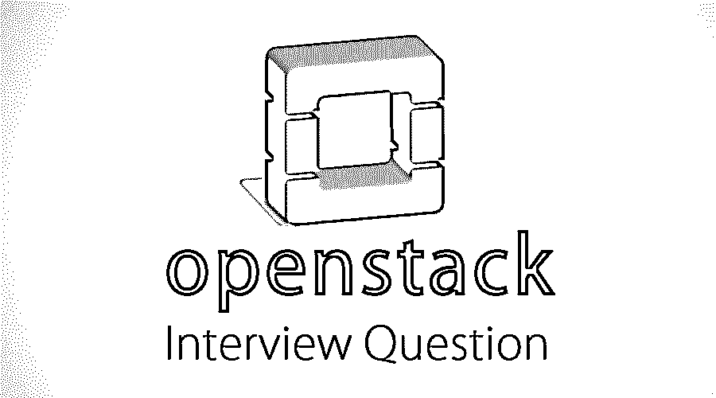

# OpenStack 面试问题

> 原文：<https://www.educba.com/openstack-interview-question/>

## OpenStack 面试问答介绍

OpenStack 是一个免费的[云计算软件平台](https://www.educba.com/cloud-computing-interview-questions/)，部署为基础设施即服务(IaaS)。它是根据 Apache License 2.0 许可的。它纯粹是用 [Python 编程语言](https://www.educba.com/cheat-sheet-python/)编写的。它最初发布于 2010 年。它支持跨平台操作系统。它向客户端或客户提供虚拟服务器和资源，以便将服务用作 IaaS。OpenStack 提供免费的公有和私有云服务。OpenStack 提供不同的服务组件，如网络、计算、块存储、仪表板、不同的 web 工作流、数据库、消息传递、DNS 服务、升级、长期支持服务等。 [OpenStack](https://www.educba.com/install-openstack/) 拥有不同的云服务，如公共、私有、内部和基于设备等。

现在，如果你想找一份与 OpenStack 相关的工作，你需要准备 2022 年 OpenStack 的面试问题。根据不同的职位描述，每次面试都是不同的。在这里，我们准备了重要的 OpenStack 面试问答，帮助你在面试中取得成功。

<small>网页开发、编程语言、软件测试&其他</small>

在这篇 2022 年 OpenStack 面试问题的文章中，我们将提出 10 个最重要和最常被问到的 Openstack 面试问题。这些问题分为以下两部分:

### 第 1 部分–open stack 面试问题(基础)

第一部分涵盖了基本的 OpenStack 面试问题和答案。

#### Q1。什么是 OpenStack，并解释它的用途？

**回答:**
open stack 是最受欢迎的开源云计算平台，为大多数客户提供虚拟机资源和 IaaS ( [基础设施即服务](https://www.educba.com/azure-paas-vs-iaas/))服务。它抓住了云计算未来的市场。OpenStack 提供的所有服务都可以通过基于 [GUI](https://www.educba.com/what-is-gui/) 的用户界面进行访问和管理。OpenStack 云计算的几大优势如下所示——

*   OpenStack 通过消除维护服务来推动业务发展。
*   提高敏捷性和高可用性。
*   提高效率并提供云基础架构。
*   它可以立即为按需基础架构服务提供出色的服务。
*   OpenStack 提供了构建自己的数据中心的机会，从而对被管理和控制的数据提供更多控制。
*   OpenStack 支持快速开发。
*   OpenStack 提高了高可扩展性和有效的资源利用率。

#### Q2。OpenStack 云计算平台涉及哪些不同的关键组件？

**回答:**
open stack 云计算平台提供的不同关键组件有 Keystone、Neutron、Nova、Cinder、Horizon、Swift、Heat、Ceilometer 和 Glance。云计算平台中涉及的不同关键组件解释如下

*   **Keystone**–为所有云用户和不同的 OpenStack 云服务提供身份服务。这也是为个人云用户提供不同可用服务的一种方式。
*   **中子**——它启用虚拟机的[联网功能](https://www.educba.com/networking-interview-questions/)。它还在其架构模型中计算节点和控制器节点。
*   **Nova**–它在计算级别控制虚拟机实例，并在虚拟机管理程序级别或计算节点级别执行不同的计算任务。
*   **Cinder**—它支持块存储设施，该设施通常与 Chef 和 Scale IO 集成，以便为计算节点和控制器节点提供块存储服务。
*   **Horizon**–它支持基于 GUI 管理模式的 GUI(图形用户界面)服务，并轻松执行整个日常运营任务。
*   **Swift**–启用对象存储功能，在对象存储器上提供浏览图像。相比之下，外部存储规模 IO 可以用作对象存储，并与 Glance 服务集成。
*   **Heat**—它通过使用 Heat admin 服务或功能来启用编排服务功能，并且可以通过轻松的扩展和缩小，根据堆栈中的要求轻松地将虚拟机用作堆栈 IO。
*   云高计–它支持计费服务和遥测服务。
*   **Glance**–它通过利用 Glance 管理服务来上传和下载云图像，从而实现云图像服务。

让我们进入下一个 OpenStack 面试问题。

#### Q3。OpenStack 云架构的控制器模式下运行的不同服务有哪些？

**答案:**
open stack 云计算控制器模式上运行的不同类型的服务如下——

*   Keystone 等身份服务。
*   Nova 服务，如 Nova APIs
*   图像服务，如 Glance
*   Nova 调度程序
*   Nova 数据库块和对象服务
*   云高仪服务
*   [MariaDB 或 MySQL](https://www.educba.com/mariadb-vs-mysql/) 数据库服务和 RabbitMQ 消息服务
*   网络管理服务，如中子
*   网络代理和编排服务，如 Heat

#### Q4。模块化 OpenStack 架构模型的三个不同组件是什么？

**回答:**
以上是面试中问的基本 OpenStack 面试问题。请在下面找到 OpenStack 支持的不同表格。三种不同类型的模块化 OpenStack 架构是 OpenStack 计算、OpenStack 对象存储和图像服务，解释如下

*   **OpenStack** **计算**–open stack 计算用于管理更大的虚拟机实例网络。
*   **OpenStack 对象存储**–open stack 对象存储用于提供对象存储和块存储模型的支持服务。
*   **映像服务**–映像服务用于发现交付服务，并提供注册服务和虚拟磁盘映像。

#### Q5。OpenStack 云计算服务有哪些不同的端点类型？

**答案:**
open stack 云计算服务中不同类型的端点如下——

*   公共类型端点
*   管理类型端点和
*   内部类型终结点。

### 第 2 部分–open stack 面试问题(高级)

现在让我们看看高级 OpenStack 面试问题。

#### Q6。OpenStack 中有哪些不同的可用节点？

**答案:**
节点有两种类型。

*   计算节点
*   网络节点

#### Q7。什么是虚拟机管理程序，OpenStack 云支持哪些不同类型的虚拟机管理程序？

**答:**
虚拟机管理程序定义为用于为云计算实例提供虚拟机实例的固件或计算机硬件，有不同类型的虚拟机管理程序，如 KVM、VMware、Containers、Xen 和 Hyper-V，解释如下-

*   **KVM**–这个管理程序是基于内核的虚拟机(KVM)中的一个虚拟化层。
*   **VMWare**—该虚拟机管理程序属于 ESXi 虚拟机管理程序类型和企业级版本虚拟机管理程序。
*   **容器**–该虚拟机管理程序是云原生类型的虚拟机管理程序
*   **Xen**–这种管理程序是一种微内核，旨在提供允许多台计算机操作系统以并发模式执行相同计算机硬件进程的服务。
*   **Hyper-V**–该虚拟机管理程序也称为 Windows 服务器虚拟化，它在 Windows OS x86–64 版本上创建虚拟机。

让我们进入下一个 OpenStack 面试问题。

#### Q8。OpenStack 云计算中的 CPU 牵制是什么？

**答案:**
CPU 钉住定义为保留按照需求指定的虚拟机物理核心部件的过程。它也被称为隔离 CPU 的过程。

#### Q9。OpenStack 云联网中的 OpenFlow 规则是什么？

**答案:**
这是在面试中被问得最多的 Openstack 面试问题。在[云计算](https://www.educba.com/cloud-networking/)中，OpenFlow 规则被定义为数据包从源到目的地的到达路径。

#### Q10。OpenStack 中有哪些不同的网络选项？

**答:**
open stack 中可用的联网选项如下:-

*   VLAN 网络经理
*   平面网络管理器
*   平面 [DHCP](https://www.educba.com/what-is-dhcp/) 网络管理器

### 推荐文章

这是 OpenStack 面试问答列表的指南。这里我们列出了最有用的 10 组面试问题，这样求职者就能轻松应对面试。您也可以阅读以下文章，了解更多信息——

1.  [RMAN 面试问题](https://www.educba.com/rman-interview-questions/)
2.  [产品经理面试问题](https://www.educba.com/product-manager-interview-question/)
3.  [UI 开发者面试问题](https://www.educba.com/ui-developer-interview-questions/)
4.  [冬眠面试问题](https://www.educba.com/hibernate-interview-questions/)

