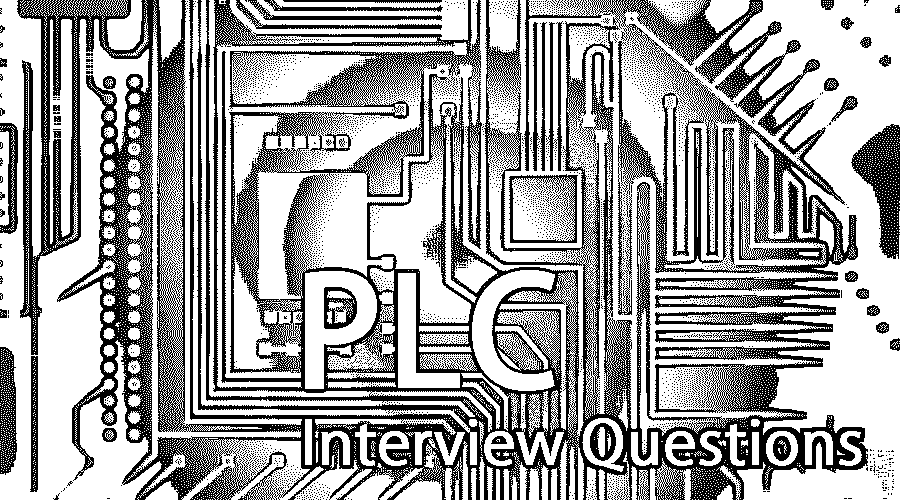

# PLC 面试问题

> 原文：<https://www.educba.com/plc-interview-questions/>

## PLC 面试问答介绍

可编程逻辑控制器是一类工业强化设备，用作输入和输出传感器的接口。i/p 现场元件包括开关、传感器、按钮等元件，以及执行器、电磁阀/控制阀、驱动器、警报器等终端元件。PLC 在自动化方面扮演着重要的角色。PLC，承担所有与监视和控制行动相关任务。PLC 的主要工作是通过模块感知输入，通过 CPU 处理逻辑，存储器应该通过输出模块提供必要的输出。

现在如果要找 PLC 相关的工作，需要准备 2022 年 PLC 面试题。根据不同的职位描述，每次面试都是不同的。在这里，我们准备了重要的 PLC 面试问答，帮助你面试成功。

<small>网页开发、编程语言、软件测试&其他</small>

在这篇 2022 年 PLC 面试问题的文章中，我们将提出 10 个最重要和最常见的 PLC 面试问题。这些面试问题分为以下两部分:

### 第 1 部分 PLC 面试问题(基本)

第一部分包括基本的 PLC 面试问题和答案。

#### Q1。解释 I/O 模块的作用？

**答:**
为了控制机器中的[过程，输入输出设备用于与电子插件接口。输入模块接收来自按钮、开关和发射器等输入设备的数据，输入设备将数据发送给处理器。输出模块接收来自处理器的所有数据，并将其发送到继电器、阀门等输出设备。这些设备可以是:](https://www.educba.com/uses-of-machine-learning/)

**模拟**:用于发送和接收各种输入输出信号。

**数字/离散**:用于发送和接收开/关信号。

#### Q2。什么是 SCADA？请说出 Scada 包中可用的四个编辑器。

**回答** :
监控和数据采集(SCADA)是计算机化的硬件和基于软件的项目，将提供单一的集成视图。该视图具有所有控制和信息资源，使工程师、主管、操作员能够查看整个操作的工作并与之交互。它提供了生产过程的图形表示。

**四位编辑如下:**

1.  inkscape SAGE–SCADA 动画图形编辑器
    b .通用逻辑
    c .跟踪模式
    d. UCanCode

让我们转到下一个 PLC 面试问题。

#### Q3。定义 SCADA 并列出它的好处？

**答:**
监控和数据采集(SCADA)是计算机化的硬件和基于软件的项目，将提供单一的集成视图。该视图具有所有控制和信息资源，使工程师、主管、操作员能够查看整个操作的工作并与之交互。它提供了生产过程的图形表示。

**SCADA 的好处是:**

*   它保护你的资本投资。
*   它有助于将您的业务系统集成在一起。
*   为了降低您的运行和维护成本，SCADA 是非常有益的。
*   SCADA 有助于提高产品质量
*   当您使用 SCADA 时，生产率将最大化。
*   它是可靠和健壮的。
*   它提供了查看和调整这些点以及远程设置这些点的能力。
*   它有助于预测性维护，并允许主动规划，而不是被动规划。

它还具有更高的可靠性和更大的灵活性，能够以更低的成本完成所有工作。

#### Q4。解释 PLC 和 DCS 的区别？

**答案:**
以上是面试中常见的 PLC 面试问题。PLC 和 DCS 之间的区别解释如下:

*   **PLC:** 可编程逻辑控制器是一个具有处理器和输入输出系统的系统，该系统具有一些使用基本模块、通信模块等的功能单元。它利用 SCADA 进行可视化，也不使用中央数据库。
*   **DCS:** DCS 主要采用多个处理器，一个中央数据库，功能分布均匀。这里，控制功能由控制子系统执行。历史节点用于连接数据；此外，IMS 节点提供报告，操作员站提供良好的 HMI。除此之外，工程站允许进行工程更改。

#### Q5。解释机架或机箱在 PLC 系统中的作用？

**回答** :
机架或机箱是一种硬件组件，有助于容纳处理器、通信和输入输出模块。它以下列方式工作:

*   它平均分配能量。
*   它包含不同的输入和输出模块。
*   它充当 I/O 模块和 CPU 之间的通信链路。

在不同的 PLC 系统中，有许多不同的机箱插槽可用。如果用户需要额外的机箱，可以使用机箱互连电缆进行连接。

### 第 2 部分 PLC 面试问题(高级)

现在让我们来看看高级 PLC 面试问题和答案。

#### Q6。西门子 PLC 中有哪些非致命错误？

**答案:**
被编译的错误和运行时错误被称为非致命错误。非致命错误应该会降低 PLC 的性能。它不会妨碍程序的执行或 I/O 模块中的任何更新。

*   **运行时错误:**这些是在运行时检测到的错误。这些都反映在程序的特殊内存位中，用户可以对其进行监控和评估。
*   **编译错误:**这些是在编译时检测到的错误，它们在下载时被检测到。遇到此错误时，编译会停止，并检索上一个程序。

#### Q7。解释实例数据块和共享数据块的区别？

**答案:**
实例数据块是分配给任意逻辑块的块。它作为一个功能块工作。实例块通常具有存储在变量声明表中的函数块中的数据。

另一方面，共享数据块从不分配给任何逻辑块。通常包含将要安装的设备或机器所需的值。它可以在程序的任何地方被直接调用。

让我们转到下一个 PLC 面试问题。

#### Q8。列举 PLC 相对于继电器的优势？

**答:**
PLC 在以下几个方面优于继电器

*   PLC 比继电器耗电更少
*   必要时，它们也可以是高功耗 PLC。
*   PLC 可以很容易地通过程序改变和扩展。
*   每当系统要求改变时，继电器中的接线需要改变。在 PLC 中情况并非如此。
*   PLC 中没有硬线要求。

#### Q9。什么是简单？

**答案:**
这是 PLC 面试中问得最多的面试问题。SCADA 有一个名为 simplicity 的包。一些服务器负责管理数据、数据的收集和分发。它基于客户机-服务器体系结构，有服务器和查看器。那里的查看者无法连接到服务器，因此他们无法完全访问收集的数据，也无法执行控制操作。

#### Q10。SCADA 用在哪里？

**答案:**
SCADA 用于不同的工业过程，如化工厂、发电、配电、核处理和冶金作业。它还可以用于处理核废料、反应堆等。

### 推荐文章

这是 PLC 面试问题和答案列表的指南。这里我们列出了最有用的 10 组面试问题，这样求职者就能轻松应对面试。您也可以阅读以下文章，了解更多信息——

1.  [Oracle Apps 面试问题](https://www.educba.com/oracle-apps-interview-questions/)
2.  [继承面试问题](https://www.educba.com/inheritance-interview-questions/)
3.  [区块链面试问题](https://www.educba.com/blockchain-interview-questions/)
4.  [科特林面试问题](https://www.educba.com/kotlin-interview-questions/)

