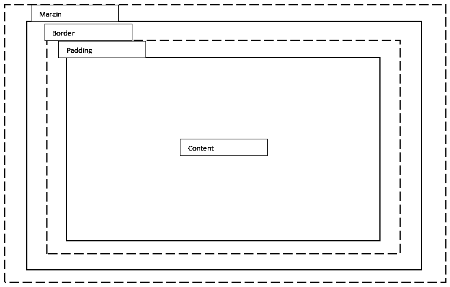

# 前端开发人员面试问题

> 原文：<https://www.educba.com/front-end-developer-interview-questions/>

## 前端开发人员面试问答介绍

你知道全球(截至 2018 年 10 月)大约有 1，673，535，333 个网站(离开移动应用)吗？所以，你知道吗，互联网用户的数量已经有了 800%的巨大增长(与过去十年 2008 年相比)。

震惊！!!好吧，这只是我们将要讨论的题目的一个大概。但在此之前，我们先来了解一下。然后，我们会用一个线索来帮助我们的读者——“它无处不在，在互联网上”。

<small>网页开发、编程语言、软件测试&其他</small>

这些统计数据只是全球前端开发人员压力的三倍。随着时间的推移，一个或多个网站应运而生，这是一个不断增长的需求。所以，是的，我们今天将在文章中讨论前端开发人员。

### 什么是前端开发人员？

那么，首先，什么是前端开发人员？他们做了什么？

前端是指出现在用户面前的东西(没错，就是网站)。因此，前端开发人员会实现与您打开网站或移动应用程序时看到的每一个细节相关的结构、设计、行为和动画。

如果你在找前端开发者的工作，你需要准备 2022 前端开发者面试问题。根据不同的职位描述，每次面试都是不同的。在这里，我们准备了重要的前端开发人员面试问题和答案，这将有助于您在面试中取得成功。

这篇 2022 年的文章将提出 14 个最重要和最常见的前端开发人员面试问题。这些问题分为以下两部分:

### 第 1 部分-前端开发人员面试问题(基础)

第一部分包括基本的前端开发人员面试问题和答案。

#### Q1。一个完整的前端开发人员需要具备哪些技能？或者说一个前端开发人员需要哪些至关重要的技能？

**答案:**
前端开发人员需要的关键技能如下。

*   超文本标记语言
*   半铸钢ˌ钢性铸铁(Cast Semi-Steel)
*   Java Script 语言
*   JQuery

除此之外，还有一些额外的技能可以提升形象:

*   了解跨浏览器测试
*   像 WordPress、Joomla 和 Drupal 这样的内容管理系统
*   搜索引擎优化知识

#### Q2。解释网页中的图层。CSS 是如何在其中发挥作用的？

**答案:**
任何网页都有 3 种层。

*   内容层
*   表示层
*   行为层

内容层是网站拥有的信息。它由文本细节、事实和信息部分组成。

#### Q3。说说 W3C 吧？

**回答:**
W3C 代表万维网联盟，是网络的国际标准。这些人负责标准化网络，并让所有用户都能访问它。

表示层将定义内容如何呈现给用户。也可以说是网页的外观和感觉。这是 CSS 的作用，也就是级联样式表是一种在 web 文档中控制和呈现表示层的方式。

行为层包括用户与网页的实时交互。

#### Q4。提一下 CSS 的一些优点？

**答案:**
CSS 的优势如下:

*   它节省时间
*   有助于快速加载页面
*   易于维护
*   优于 HTML 风格
*   多设备兼容性
*   网络的全球标准
*   离线浏览
*   独立于平台

#### Q5。作为一个开发者，有哪些方法可以减少任何给定网站的加载时间？

**答案:**
我们要考虑的一些关键因素是:

*   启用正确的浏览器缓存
*   优化图像文件
*   尽量减少 HTTP 请求
*   减少重定向

#### Q6。作为一名开发者，你认为哪些方法对于减少 web 应用程序的加载时间至关重要？

**回答:**
有很多方法可以做到这一点；这些可以降低复杂性。

*   浏览器缓存
*   通过优化图像文件
*   资源缩减(从源代码中删除不必要的字符)
*   最小化 HTTP 请求

#### Q7。如何在 Javascript 中声明一个三维数组？

**答案:**
使用以下语法:

`var myArray = [ [ [] ] ];`

### 第 2 部分-前端开发人员面试问题(高级)

现在让我们看一下高级前端开发人员面试问题。

#### Q8。9+6+“3”的结果会是什么？

**答案:**
o/p 会是 153。

**说明:**这里 9 和 6 是数据类型(整数)，所以会用数字相加。因为 3 是一个字符串，所以结果会被连接起来，变成 9+6 = 15，3 合起来形成 153 作为输出。

#### Q9。解释 CSS 盒子模型？

**回答:**
盒子模型有助于提供一种更加结构化的方式来分隔网页中彼此相关的元素。

箱式模型中有几个组件，如:

*   利润
*   边界
*   填料
*   内容

#### Q10。什么是 CSS 预处理器？我们为什么要使用它们？

**答案:**
前置处理器用于代码转换。像 [SASS 和 LESS](https://www.educba.com/sass-vs-less/) 这样的预处理语言被转换成更正式的 CSS 格式。

使用它们的原因是:

*   定义变量的能力
*   使用嵌套语法的能力
*   能够创建和使用 mixins(函数)
*   数学和运算函数的使用

#### Q11。说出一些 HTML5 中存在而 HTML 中缺失的新特性？

**答案:**
html 5 中的一些新特性有:

*   文档类型声明
*   章节标签(

    )

*   页眉和页脚标记
*   Flgcaption 标签

#### Q12。告诉我 CSS 样式的组成部分？

**答案:**
CSS 样式由三样东西组成。

*   选择器:选择器是一个可以应用样式的 HTML 标签。选择器标签可以是< h1 >或<表>中的任何一个
*   **属性**:这是 HTML 标签的一个属性。这个属性可以是任何东西，比如颜色、边框、阴影等等。将 [HTML 属性](https://www.educba.com/html-attributes/)转换成 CSS 属性。
*   **值**:一个值总是分配给任何定义的属性。

#### Q13。你能解释将 CSS 样式应用到网页的方法吗？

**答:**
第一种方法是在元素上使用内联样式属性。

`

<p  style=”color: maroon; “>

`

可以在 HTML 的部分使用

最后，在加载外部 CSS 文件时使用<link>标签。

#### Q14。在 Javascript 中，如何将非数值转换成数字？

**答案:**
实现这一点的 3 种主要方法是:

*   parseInt()
*   解析浮点()
*   数字()

### 推荐文章

这是前端开发人员面试问题和答案的指南。这里我们列出了最有用的 14 组面试问题，这样求职者就能轻松应对面试。您也可以阅读以下文章，了解更多信息——

1.  [PLC 面试问题](https://www.educba.com/plc-interview-questions/)
2.  [甲骨文 SOA 面试问题](https://www.educba.com/oracle-soa-interview-questions/)
3.  [闷棍 ABAP 面试](https://www.educba.com/sap-abap-interview-questions/)
4.  [ETL 测试面试问题](https://www.educba.com/etl-testing-interview-questions/)

