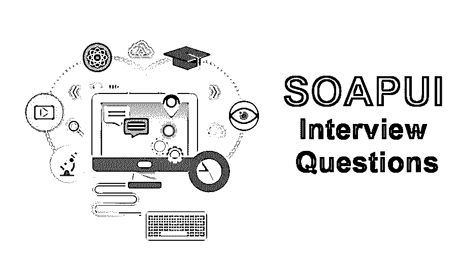

# SoapUI 面试问题

> 原文：<https://www.educba.com/soapui-interview-questions/>

## SoapUI 面试问答介绍

测试和开发一样重要。它不仅是绩效指标，也是对利益相关者的保证。在市场上，有几种测试 web 服务的替代方法，比如 JMeter、Postman、Widdler、HttpMaster 和 WebInject 等等。这个开源测试应用程序仍然在用户中流行。

这是一个为 SOA 和 web 服务保留的免费开源[功能测试](https://www.educba.com/functional-testing-tools/)应用程序。这使得它的用户能够测试基于 SOAP、Restful、[、JMS](https://www.educba.com/what-is-jms/) 、HTTP、数据库等不同种类的 web 服务。一个专用的丰富接口使其用户能够拥有一个交互式测试环境。用户可以在 Soap UI 中执行多种测试，如功能测试、回归测试和加载测试。

<small>网页开发、编程语言、软件测试&其他</small>

**技术性**:

开发者 SmartBear 软件

初始版本–2005 年

稳定发布–版本 5.4(2017 年 11 月)

类型–SOA 和 web 服务

如果你找的是 [SoapUI](https://www.educba.com/soapui-alternatives/) 相关的工作，需要准备 2022 SoapUI 面试题。根据不同的职位描述，每次面试都是不同的。在这里，我们准备了重要的 SoapUI 面试问答，帮助你面试成功。

在这篇 2022 SoapUI 面试问题的文章中，我们将呈现 10 个最重要和最常被问到的 [SoapUI](https://www.educba.com/what-is-soapui/) 面试问题。这些问题分为以下两部分:

### 第 1 部分–soap ui 面试问题(基础)

第一部分涵盖了基本的 SoapUI 面试问题和答案。

#### Q1。尽管市场上有这么多功能测试工具，为什么你更喜欢 Soap UI？

**答案:**
我们更喜欢 SoapUI 的原因如下:

*   易于安装
*   界面易于使用和理解
*   自动化测试用例的可用性
*   模拟可用性
*   易于集成

#### Q2。什么是 web 服务？

**答:**
任何 web 应用都有两端——客户端和服务器端，客户端发出请求，服务器端进行响应。Web 服务是支持 web 的组件，有助于在客户机和服务器之间传递数据。这可以很容易地通过互联网访问。它基于 XML 消息传递概念的概念。

让我们转到下一个 SoapUI 面试问题。

#### Q3。Soap UI 中的层次结构如何测试项目的构建？

**答案:**
操作顺序如下——

*   测试套件
*   判例案件
*   测试步骤

#### Q4。如何在 SoapUI 中实现 web 服务的自动化？

**答案:**
这是面试中问的基本的 SoapUI 面试问题。以下是关于如何在 soapUi 中自动化 web 服务的要点:

*   创建一个项目，并将其添加到 WSDL 文件中
*   添加测试套件、测试用例以及测试步骤。
*   使用 [groovy](https://www.educba.com/install-groovy/) 步骤进行定制验证
*   调用外部数据源(如果有)。
*   添加确定信息(如果有)
*   运行测试

#### Q5。说出 SoapUI 中不同种类的断言？

**答案:**
soap ui 的一个至关重要的特性就是断言。以下列出的是同类产品

*   简单包含
*   模式符合性
*   简单不包含
*   Soap 错误
*   响应 SLA
*   XPath 匹配
*   XQuery 匹配
*   WS 安全状态
*   脚本断言
*   WS–响应断言

#### Q6。说出与 Soap UI 兼容的数据源类型？

**答案:**
兼容 Soap UI 的文件格式是

*   excel 文件
*   CSV 文件
*   ODBC 源
*   SQL/ADO 对象

让我们转到下一个 SoapUI 面试问题。

#### Q7。说说 Soap UI 中的资源根属性以及资源根的例子？

**答:**
资源根属性有助于控制任何项目资源的 Soap UI 路径。如果资源是外部的，那么在分配时需要将它们包含在项目中。

关于根，示例指的是下面提到的场景

如果用户需要访问一个文件(比如 RPAdata.xls ),那么 d:\projects\文件夹将包含项目的根文件。

*   绝对路径
*   项目路径
*   工作空间路径

### 第 2 部分–soap ui 面试问题(高级)

现在让我们来看看高级的 SoapUI 面试问题。

#### Q8。简单介绍一下安全测试需要的步骤？

**回答:**
[安全测试](https://www.educba.com/security-testing/)的步骤如下。

*   首先，创建一个功能测试用例，如果已经有可用的话，用户也可以选择它
*   添加安全测试
*   运行安全测试
*   分析报告
*   创建报告

#### Q9。说出影响网络服务性能的因素？

**回答:**
首先，我只想说出他们的名字，然后我想简单介绍一下他们。

*   服务器端正在处理大量的 [XML/JSON](https://www.educba.com/json-vs-xml/) 文件:
*   有效载荷的处理(一系列请求和相关响应)

以上两个因素造成了最大的不良表现；当应用服务器不健壮并实现复杂的 WSDL 时，影响会成倍增加。由于这些原因，有时请求会得到快速响应。

一个更关键的因素是安全性，这一直是一个关注点，也是做 [web 性能测试](https://www.educba.com/web-testing-application/)的测试人员所担心的。原因是当测试人员添加 WS-security 层时，HTTPS 站点的性能相当低，这进一步降低了性能。

让我们转到下一个 SoapUI 面试问题。

#### Q10。如何将 Postman 集合导入 Soap UI？

**回答:**
我们需要遵循一些系列的步骤——

选择一个文件>导入邮递员集合

当“导入邮递员集合”打开时，单击浏览并选择要导入的邮递员集合。

通过这样做，Soap UI 将自动创建一个新项目，并导入集合中所有相关的 API。一旦完成，Soap UI 应用程序会提示用户选择测试用例名称。

#### Q11。说出可以在 Soap UI web 服务中使用的不同组件？

**答案:**
以上是在面试中经常被问到的 SoapUI 面试问题。web 服务中使用了 5 个主要组件，它们是

*   **WSDL**–网络服务描述语言
*   **SOAP**–简单访问对象协议
*   **UDDI**–通用描述、发现和集成
*   资源描述框架
*   **XML**–可扩展标记语言

#### Q12。什么是 WSDL？

**答案:**
这是在面试中被问得最多的 SOAPUI 面试问题。使用 WSDL 的原因如下

*   来了解网络服务的起源。
*   获取标题信息。
*   端口类型信息
*   输入/输出消息

#### Q13。你对 UDDI 有什么理解？

**答:**
它是一种包含各种 web 服务的全球知识库。在一个项目中，当需要获取一些测试细节时，测试人员可以在这里找到它们。如果一个新的 web 服务可以使用这个。包含 WSDL 详细信息的地方。

#### Q14。说出你在使用 Soap UI 测试 web 服务时遇到的一些挑战？

**回答:**
当我们作为测试人员在任何给定的 web 服务上工作时，经常会遇到这些事情。其中最大的问题是测试是通过 GUI 完成的，而大多数 Web 服务都没有 GUI。

### 结论

我们不辜负读者的期望，总是提到预防措施(如果有的话)。说到知识，我们不想限制你。所以，让我们的读者意识到某些事情是我们的责任。有经验的人的面试一般是与工作相关的，以及他们所拥有的经验(指真实的工作场景)。对于我们的新读者，我们想说的是，除了这些至关重要的面试问题，我们还有一个关于申请的实践环节。如果工具知识在那里，事情会变得相当容易。

### 推荐文章

这是一个关于 SoapUI 面试问答列表的指南。这里我们列出了最有用的 14 组面试问题，这样求职者就能轻松应对面试。您也可以阅读以下文章，了解更多信息——

1.  [甲骨文表格面试问题](https://www.educba.com/oracle-forms-interview-questions/)
2.  [继承面试问题](https://www.educba.com/inheritance-interview-questions/)
3.  [科特林面试问题](https://www.educba.com/kotlin-interview-questions/)
4.  [SVN 面试问题](https://www.educba.com/svn-interview-questions/)

