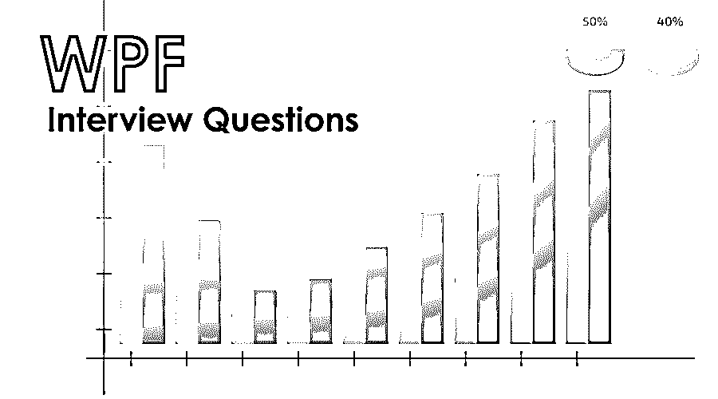

# WPF 面试问题

> 原文：<https://www.educba.com/wpf-interview-questions/>

## WPF 面试问答介绍

WPF 代表 Windows 演示基础。它是任何一种基于 windows 的系统的关键图形表示之一，用于为基于 windows 的应用程序呈现任何一种用户界面。它特别用于。net 框架和. NET 面试中很常见的问题。

如果你想找一份与 WPF 相关的工作，你需要准备 2022 年 WPF 的面试问题。根据不同的职位描述，每次面试都是不同的。在这里，我们准备了重要的 WPF 面试问题和答案，将帮助你在面试中取得成功。

<small>网页开发、编程语言、软件测试&其他</small>

在这篇 2022 年 WPF 面试问题的文章中，我们将呈现 10 个最重要和最常被问到的 WPF 面试问题。这些问题分为以下两部分:

### 第 1 部分-WPF 面试问题(基础)

这第一部分包括基本的 WPF 面试问题和答案。

#### Q1。详细解释 Windows Presentation Foundation(WPF ),以理解在。NET 框架？

**答案:**
WPF(Windows Presentation Foundation)是一个流行的框架。NET developer，用于在 Windows 平台上开发的任何桌面应用程序中设计和呈现适当的用户界面、图像、电影和文档。

#### Q2。给出了有关在中使用 WPF 时可用的实用程序的更多详细信息。NET 或任何基于 windows 的桌面应用程序，为什么 Windows 窗体不替换相同的？

**答:**
通常 WPF 遵循如下的一些关键特性，这主要使它与众不同，取代了像 windows 窗体这样的方法论。

*   WPF 设计的. net 代码可以在任何地方执行，比如 windows 或 web。
*   WPF 框架帮助开发人员编写更少的代码库，这意味着它总是保持不同代码库的良好绑定。
*   使用一些常见的样式或资源，整个应用程序的外观和感觉几乎是一样的。
*   遵循一种强大的声明式编程风格，如 XAML。
*   有助于任何种类的动画演示；在动画演示的情况下，它总是一种表达混合。
*   它有助于提高任何硬件的性能，这有助于代码的快速执行。
*   它是作为一个独立的解决方案，所以它总是避免依赖图形硬件。

让我们转到下一个 WPF 面试问题。

#### Q3。解释一下 XAML，它非常受那些使用 WPF 在 windows 中开发桌面应用程序的开发人员的欢迎。举一个 XAML 效用的恰当例子？

**答:**
WPF 框架总是通过引入一个特定的 XML 文件名 XAML 来定义，这个文件名用来表示设计合适的 WPF UI。现在，这种 XML 表示对开发人员帮助很大。如果开发人员在 [XML 文件中正确定义 UI 表示，就像 XAML、](https://www.educba.com/xml-commands/)一样，它可以在任何地方轻松重用，无论是窗口还是 web 应用程序。所以 XAML 在 WPF 总是被定义为“写一次就可以在任何地方运行”。这是利用 XAML 恰当地宣布 WPF 的关键用途之一。因此，开发人员使用它将非常有效，因为某种 XAML 用户界面可以很容易地在 windows 应用程序中呈现，无论开发人员在 web 上的任何地方都可以很容易地重用它。

#### Q4。解释一下 XMLNS，它是 XAML 文件中使用的关键标记之一。举一些定义相同的代码例子？

**答案:**
这些都是 WPF 面试中问的基本问题。Xmlns 通常用于识别适当的 XML 文件中的某个名称空间，如 XAML。它主要帮助开发人员避免一个 XML 文件的名称或定义冲突。假设我们希望在同一个 HTML 文件中定义两个平板电脑，考虑一个包含一个雇员详细信息表的 HTML 文件。另一个 HTML 文件包含关于雇员工资的信息。一些 UI 表示开发人员需要合并它们，并准备一个包含它们的 HTML 文件；在这种情况下，名称可能会发生冲突，所以开发人员可以定义 xmlns 来识别它。

`<k:table xmlns:k=”…..”>
<tr>
<td>….</td>
<td>….</td>
</tr>
</k:table>`

#### Q5。提供两个流行标记 XMLNS 和 XMLNS: X 之间的一些清晰的区别，这两个标记在定义 WPF 配置中使用。

**答案:**
两个标签的功能其实都是给定命名空间的。这里，XMLNS 使用默认的名称空间，可以用来解析所有可用的 WPF 元素。而第二个和第二个名称空间 XMLNS: X 用于解析 XAML 语言的定义。

### 第 2 部分-WPF 面试问题(高级)

现在让我们来看看高级 WPF 面试问题。

#### Q6。给出一些在配置 WPF 时使用“xmlns:x”在 XAML 文件中定义特定名称空间的流行例子和代码片段？

**回答:**
通常有两个流行的例子，一个开发者非常频繁地使用 xmlns:x 标签。这些例子如下:

*   有时，开发人员需要编写一些代码，这些代码将在普通的 UI 视图代码之后工作。在这种情况下，开发人员在使用 x: class 属性时会非常频繁地使用 xmlns:x 标记。

`<page xmlns = “….”
Xmlns = “….”
x:Class = “….”
/>`

*   其次，开发者可以在提供 UI 元素的一个特定名称的情况下使用它。

；堆叠面板 x:名称= ... '

#### Q7。提供两个流行标签“x: name”和“name”之间的明显区别，确定在哪里需要恰当地使用它们？

**答案:**
x:name 和 name 之间根本没有任何这样恰当的区别；两者完全相同，只是有一些不同的表现。但是在某些情况下，类没有定义任何类型的 name 属性，在这种情况下，开发人员可能习惯于使用 x: name 属性来代替它。

让我们转到下一个 WPF 面试问题。

#### Q8。为上的任何开发人员解释有关 WPF 定义情况下的整个定义控件的详细信息。NET 平台开发一个基于 windows 平台的桌面应用程序？

**答案:**
WPF 控件可以定义为 4 类:

*   **控件**:基本控件，通常用于设计文本框、按钮等 UI。
*   **形状**:用于保持图形显示，如日蚀、矩形、圆形等。
*   **面板**:用于特定 UI 元素的对齐和定位。
*   **动态控件**:用于在 WPF UI 中呈现一些动态控件。

#### Q9。解释在 windows 平台上开发基于桌面的应用程序时，WPF 配置的整个对象层次结构。

**答案:**
这是 WPF 面试中被问得最多的问题。对象调度程序依赖关系可视化 UI 元素框架元素

*   **对象**:Represents.Net 对象类。
*   **Dispatcher** :保证线程安全，由一个呈现 WPF UI 对象的线程使用。
*   **依赖**:维护同一个 UI 中两个 WPF 对象之间的依赖关系。
*   **视觉**:维护 WPF UI 的视觉表现。
*   **UI 的一个元素**:实现事件、布局或输入。
*   **框架的一个元素**:实现 UI 元素的样式、资源、绑定。

#### Q10。有没有可能通过正确使用 WPF 来取代 DirectX？

**答案:**

不，WPF 在取代 DirectX 方面仍然没有太大的进步。准备任何一种前沿游戏或者准备一些高清视频还是非常需要 DirectX 的。与 WPF 相比，DirectX 的高清视频性能要好得多。

### 推荐文章

这是 WPF 面试问答列表的指南。在这里，我们列出了最有用的 10 组面试问题，以便求职者可以轻松地破解面试。您也可以阅读以下文章，了解更多信息——

1.  [嵌入式系统面试问题](https://www.educba.com/embedded-system-interview-questions/)
2.  [甲骨文 SOA 面试问题](https://www.educba.com/oracle-soa-interview-questions/)
3.  [继承面试问题](https://www.educba.com/inheritance-interview-questions/)
4.  [RMAN 面试问题](https://www.educba.com/rman-interview-questions/)

