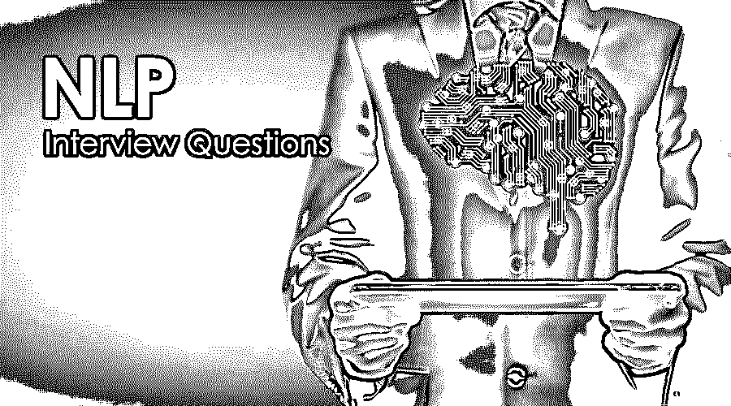

# NLP 面试问题

> 原文：<https://www.educba.com/nlp-interview-questions/>

## NLP 面试问答介绍

NLP 代表自然语言处理。利用计算机科学、工程知识，特别是信息工程知识和强大的人工智能，确保人类语言和计算机系统之间的适当交互，这是多语言处理的大计划之一。

如果是找 NLP 相关的工作，需要准备 2022 年的 NLP 面试问题。根据不同的职位描述，每次面试都是不同的。在这里，我们准备了重要的 NLP 面试问答，帮助你面试成功。

<small>网页开发、编程语言、软件测试&其他</small>

在这篇 2022 年 NLP 面试问题的文章中，我们将提出 10 个最重要和最常见的 NLP 面试问题。这些问题分为以下两部分:

### 第 1 部分 NLP 面试问题(基础)

这第一部分包括基本的面试问题和答案。

#### Q1。详细解释一下自然处理语言(NLP)，这是目前业界已经开始的关键人工语言学习过程之一？

**答:**
自然语言处理(NLP)旨在以自动的方式理解和分析自然语言，并从那些可用的数据中导出数据或可能需要的信息。NLP 定义了一种主要帮助机器学习的算法。这种[机器学习算法](https://www.educba.com/uses-of-machine-learning/)实际上有助于理解和分析一些自然语言。

#### Q2。自然语言处理有一些不同的共同要素。这些元素对于正确理解 NLP 是必不可少的。你能举例详细解释一下吗？

**答:**
那里有很多组件通常使用自然语言处理(NLP)。一些主要组件解释如下:

*   **提取实体**:从可用信息中识别并提取一些关键数据，在识别每个实体的基础上帮助对给定的句子进行切分。它可以帮助识别一个人是虚构的还是真实的，同样的现实识别适用于任何组织、事件或任何地理位置等。
*   **句法方面的分析:**主要帮助维持可用词的正确排序。
*   **程序化分析:**它是 NLP 的关键流程之一。它有助于从自然语言的特定可用文本中提取数据。

让我们转到下一个 NLP 面试问题。

#### Q3。解释智能处理自然语言中可用的各种领域的细节，我们是否知道受影响的领域非常小，因为这种处理最近才开始？

**答案:**
自然语言处理(NLP)可以在当前行业环境的各个领域有一个实现。一些关键领域解释如下:

*   进行了语义分析。
*   自动汇总自然语言信息。
*   品种分类文本是用自然语言编写的。
*   一些常见问题的现成答案

我们可以给出一些自然语言处理(NLP)在现实生活中广泛应用的关键例子。例如谷歌助手、IOS Siri 或亚马逊 echo。

#### Q4。在处理自然语言的情况下，我们通常会提到一个公共术语，NLP，并将每种语言与相同的术语恰当地绑定在一起。请举例详细解释一下这个 NLP 术语？

**回答:**
这些是面试中问的基本 NLP 面试问题。在解释自然语言处理的情况下，有几个因素可用。一些关键因素如下:

*   **向量和权重** : Google 词向量，TF-IDF 长度，varieties 文档，词向量，TF-IDF。
*   **文本结构**:命名实体，词性标注，识别句首。
*   **情感分析**:了解情感特征、情感可用的实体、情感常用词典。
*   **文本分类**:学习监督、出发训练、Dev 中的一组验证、定义测试的一组、个体文本的特征、LDA。
*   **阅读机器语言**:提取可能的实体，链接一个单独的实体，DBpedia，一些像 Pikes 或 FRED 这样的库。

#### Q5。在自然学习处理的情况下使用的另一个非常常见的术语被称为 TF-IDF。请详细解释对 TFIDF 的理解，并举例说明。

**答案:**
TF-IDF 或者 TF-IDF 基本上是代表某个术语的某个临界频率或者某个特定文档的某个逆频率。TF-IDF 基本上是用来从用自然语言编写的整个文档中识别一些关键字的。它主要涉及通过使用一些统计数字数据从关键文档中检索信息，以识别一些关键词，并提及该词在多个文档的集合中或在集合的集合中有多重要。

### 第 2 部分 NLP 面试问题(高级)

现在让我们来看看高级面试问题。

#### Q6。有几种标记用于处理自然语言。在所有这些词性标注(POS)中，标注是我们行业中最受欢迎的一种。请详细解释一下词性标注以及如何正确使用？

**答案:**
词性标注器是一个非常有趣，也是正确处理自然语言最重要的工具。这种词性(POS)标记器是一种普通的工具或软件，它有助于阅读一些独立于任何语言的重要文本，然后为每个单词或软件中定义的其他一些标记逻辑(如形容词、动词或名词等)分配整个句子的词性。

它通常包含一些特定的算法，帮助标记整个文本主体中的一些术语。它有一些种类，比上面定义的效用更复杂。上面定义的功能是 POS 标签最基本的特征之一。

#### Q7。由于分析是自然语言处理(NLP)的关键要求之一，我们可以遵循几种分析方法来正确理解 NLP。在所有这些分析中，一个关键的分析叫做语用分析。请详细解释一下语用分析？

**答:**
语用分析是自然语言处理中的批评性分析之一。它主要是处理一些属于外部世界的知识。这意味着对于一些定义的文档或已有的查询来说，某些知识总是外部的。这种分析主要集中在对某个特定词语的批评性解释上，并试图理解其实际意义。为了进行这种分析，非常需要真实世界的知识。

让我们转到下一个 NLP 面试问题。

#### Q8。同样，由于 NLP 被灵活地用于多语言处理，并基于正确的语言理解与计算机系统交互，NLP 通常使用的关键解析之一是依存解析。请用恰当的解释详细解释依存解析？

**答案:**
依存解析其实在业内被称为句法解析。它正在做 NLP 处理的一个关键任务，识别或辨认一些句子，然后将它们分配到一些定义正确理解的句法结构中。一种流行的语法结构是用某种解析算法定义的解析树。

#### Q9。自然语言处理的一个非常基本的要求是关键字规范化。NLP 通常遵循两个过程或技术来处理适当关键字规范化。请详细解释关于关键字规范化和哪些技术可以遵循同样的。

**答案:**
这是在面试中被问到最多的 NLP 面试问题。NLP 中有两个关键的规范化过程，它们有助于关键字规范化。这两个过程是词干化和词汇化。

#### Q10。在 NLP 中定义了一些分类模型。NLP 可以遵循什么样的特征来提高分类模型的准确性？

**答案:**
NLP 后面有几个分类，解释如下:

*   已定义术语的计数频率。
*   每个句子的向量符号。
*   词性标注。
*   语法依赖或一些已定义的词典或库。

### 推荐文章

这是 NLP 面试问题和答案列表的指南，以便候选人可以轻松解决这些面试问题。在本帖中，我们研究了 NLP 面试中常见的问题。您也可以阅读以下文章，了解更多信息——

1.  [线程面试问题](https://www.educba.com/threading-interview-questions/)
2.  [Oracle Apps 面试问题](https://www.educba.com/oracle-apps-interview-questions/)
3.  [OpenStack 面试问题](https://www.educba.com/openstack-interview-question/)
4.  [计算机架构面试问题](https://www.educba.com/computer-architecture-interview-questions/)

