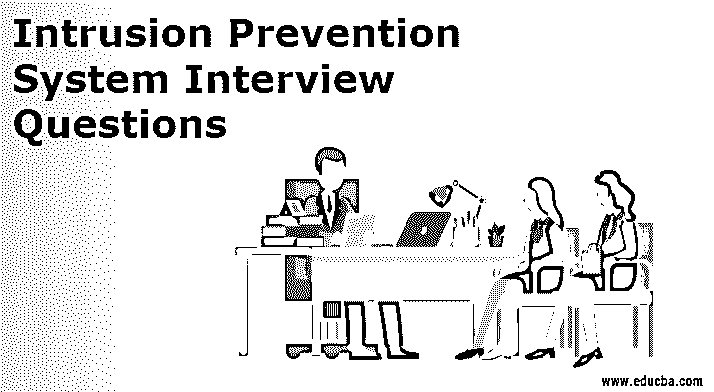

# 入侵防御系统面试问题

> 原文：<https://www.educba.com/intrusion-prevention-system-interview-questions/>

## 入侵防御系统简介面试问题

入侵防御系统可以定义为禁止恶意网络数据包对现有系统进行任何更改的工具或软件。这项技术存在的唯一目的是确保任何可能导致系统发生任何危险变化的有害流量都不会被允许执行。说到面试，为了通过 SOC 职位的任何面试，候选人必须精通防火墙、IPS、IDS、SIEM 等工具和其他技术。在本文中，我们将重点关注入侵防御系统中常见的不同类型的面试问题。以下是一些非常常见的问题，或者在面试 SOC 职位时被认为是必问的问题。

当我们谈论基于入侵检测系统的问题时，可以有两种类型的问题:直接指向 IPS 的问题和与 IPS 间接关联的问题。在下面的列表中，我们将关注这两种问题。

<small>网页开发、编程语言、软件测试&其他</small>

### 第 1 部分-入侵防御系统面试问题(基础)

第一部分介绍了基本的入侵防御系统面试问题和答案。

#### 1.简要入侵防御系统？

**答:**
IPS 只不过是一种工具，可以部署在网络或主机级别，目的是保护系统免受恶意流量的攻击。任何进入网络的有害流量都会被 IPS 归档并阻止。它与 IDS 协同工作，以便检测异常情况，并基于结果；它决定是否必须阻止网络数据包。

#### 2.IP 的类型有哪些？

**答案:**
主要有四种 IP 类型:基于网络的 IP、基于主机的 IP、无线 IP、基于网络的 IP。每种 IPS 类型都有一个独立的实体角色，主要是根据部署它的平台来划分的。每个 IP 的功能几乎相同，但略有不同。

#### 3.IPS 和 IDS 有什么区别？

**答案:**
IPS 代表入侵防御系统，IDS 代表入侵检测系统。IPS 的作用是防止恶意网络数据包被执行，而 IDS 的作用是确认任何数据包是否是恶意的。IDS 并不阻止数据包进入网络，但它只是在发现任何恶意流量时发出警报。IPS 一旦感知到警报就开始工作。它们只是确保发出警报的数据包不允许在网络中运行。

#### 4.什么是基于主机的 IP？

**答:**
基于主机的 IPS 可以定义为一种工具，它可以部署在主机中，而不是部署在整个网络中。它通过阻止主机中的恶意流量来保护主机上的恶意活动。它被称为基于主机的 IPS，因为它只能部署在主机中，无法达到保护整个网络的目的。

#### 5.说出几个最好的 IP？你认为哪一个是最好的，为什么？

**回答:**
市面上一些比较好的 IP 有 Sogan，OSSEC，Fail2ban，Zeek 等。根据我的理解，最好的 IPS 是能够部署在其预期的平台上，以阻止几乎所有恶意流量对系统造成伤害的 IPS。Sogan 是最好的一个，因为它的效率。它可以部署在系统中以阻止所有有害的数据包。使用 Sogan 最好的一点是它有恶意签名的治疗方案文件。它实际上可以非常有效地保护网络，并且部署在各种大型组织的网络中。

### 第 2 部分-入侵防御系统面试问题

现在让我们看看高级入侵防御系统面试问题和答案。

#### 6.你熟悉入侵防御系统吗？

**回答:**
我对 IPS 系统非常了解。[分享或解释您在 IPS 的工作经验以及您当前的项目]。我对使用任何 IP 都非常有信心，因为我了解它们的核心功能。在 1-10 的范围内，10 代表最好，我会给自己打 8 分。不给出 10 的原因是因为我并不了解每一个 IP，这在我的阶段不太可行。我给自己打了 8 分，对我来说，这个分数绝对是最佳的，它会激励我达到 10 分；这是我未来想要关注的。

#### 7.你对 Sogan 很熟悉，但我们在组织中使用不同的 IP。你认为你最适合这个职位吗？

**答:**
虽然制作公司可能有所不同，但所有 IP 的核心功能都是一样的。我相信我是这个职位的最佳候选人，因为我了解 IPS 的基本原理。当涉及到除 Sogan 之外的 IPS 工作时，我将需要一点 KT 来了解您的组织中正在使用的 IPS 的环境，在此之后，我将完全准备好在您的 SOC 中工作。

#### 8.入侵检测的功能有哪些？

**答:**
IPS 主要负责对用户和系统的活动进行监控和分析。[入侵防御系统还会检查](https://www.educba.com/types-of-intrusion-prevention-system/)的系统配置，并尝试识别漏洞，从而保护系统免受攻击。它还通过正确评估文件和系统来检查数据的完整性。它的核心职责之一是确定或识别攻击模式并跟踪它，以便下次遇到同样的情况时，它可以采取适当的措施。

#### 9.我们知道 IPS 依赖 IDS 来理解攻击。IDS 如何识别恶意流量？

**答:**
入侵检测系统与 IPS 协同工作，检测并防止恶意流量对系统造成伤害。为了识别流量，IDS 使用异常检测，当正常活动之外的任何活动发生时，就会发出警报。另一种方法是了解流量签名，这些签名存储在数据库中。

#### 10.IPS 保护网络免受哪几种攻击？

**答:**
IPS 可以防止恶意流量对网络做出任何有害的改变。它保护[系统免受 DDOS](https://www.educba.com/what-is-ddos-attack/) (分布式拒绝攻击)、数据泄露、服务器关闭和可能导致阻碍生产的类似问题的影响。

### 结论

在参加 IPS 专业人员面试之前，应该重点关注的一点是，您应该知道它是什么，它有哪些类型，它有哪些功能，以及它如何与其他工具集成才能高效工作。一旦你得到了这些问题的答案，你就会明白它是如何把你的面试变成一张百搭牌的。

### 推荐文章

这是入侵防御系统面试问答列表的指南。这里我们学习了常见的入侵防御系统面试问题，这些问题在面试中经常被问到。您也可以看看以下文章，了解更多信息–

1.  [网络安全面试问题](https://www.educba.com/cyber-security-interview-questions/)
2.  [网络安全面试问题](https://www.educba.com/network-security-interview-questions/)
3.  [信息安全职业道路](https://www.educba.com/information-security-career-path/)
4.  [网络安全基础知识](https://www.educba.com/cybersecurity-fundamentals/)

