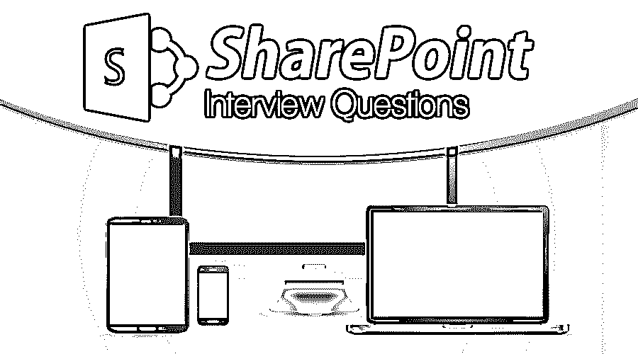

# SharePoint 面试问题

> 原文：<https://www.educba.com/sharepoint-interview-questions/>

## SharePoint 面试问答简介

SharePoint 提供了一个具有产品维度的可扩展平台，该平台根据各种需求为组织提供业务解决方案。SharePoint 对于创建网站很有用。SharePoint 有助于将来自不同数据源的重要信息集中到一个地方。SharePoint 有助于网络通信，并确保它与不同的人协作。

因此，如果你最终在 SharePoint 找到了你的梦想工作，但不知道如何通过面试，以及 2022 年 SharePoint 面试可能会有哪些问题，那么每个面试都是不同的，工作的范围也是不同的。牢记这一点，我们设计了最常见的 SharePoint 面试问题和答案，以帮助您在面试中取得成功。

<small>网页开发、编程语言、软件测试&其他</small>

以下是 2022 年 SharePoint 面试十大最常被问到的问题和答案。这些顶级面试问题分为以下两部分:

### 第 1 部分 SharePoint 面试问题和答案(基础)

这第一部分包括基本的面试问题和答案。

#### 1.SharePoint 有哪些重要的特性？

**答案:**
每当推出 SharePoint 的新版本，都会有新的功能加入其中。这些特性为内容管理、业务流程管理和 Web 发布提供了适当的基础。这些工具如下:

*   SharePoint 网站对于创建网站很有用。
*   洞察作为一种工具，将来自不同数据源的所有信息汇集在一起。
*   SharePoint Communicates 有助于与不同的人进行联网和协作。
*   搜索有助于提供高效快捷的信息和企业内容。
*   内容作为一个完美的内容管理系统。
*   最后，组合有助于一起使用不同的工具和功能。

#### 2.SharePoint 的最新版本是什么，并简要说明其主要功能？

**答案:**
SharePoint 的最新版本是 SharePoint 2013。它的主要特点是性能有所提高；它为业务连接服务(BCS)提供了新的功能；它支持跨站点发布和具有精确结果的改进和更好的搜索。此外，他们还对工作流架构进行了更改。它还提供了一个帮助发布网站的设计经理。SharePoint 2013 还提供了 office web app 服务器，并新增了社交网络功能。如今一切都在移动设备上，它们为用户提供了一个优化的移动设备用户界面。它也有粉碎的斑点来储存。旧版本中的一些问题存在性能问题，但现在已经得到了改进，如分布式缓存服务、最小下载策略和碎片存储。

#### 3.解释术语:站点模板、站点定义和 ONET.xml。

**答:**
站点模板有助于为要在 SharePoint 中创建的新站点提供基本模板和布局。设计信息包含关于场地的信息，包括:

*   将成为网站一部分的列表
*   文档库等网站内容
*   将在网站上使用的主题和边框
*   将在网站中使用的 Web 部件页

除此之外，它还允许在需要时实例化 SharePoint 的其他应用程序。

站点定义主要是包含所有必要组件的 XML 或 ASPX 文件的集合。它主要有三个文件- webTemp。XML，onet。XML，默认。aspx。网站定义还包含有关网站要包含的 web 文件、库、功能和导航栏的信息，这些信息打包在 SharePoint 中。

ONET.xml 指定了将出现在站点上的所有组件。这是站点定义中最重要的部分。该文件位于:% SharePoint Root % \ TEMPLATE \ site templates \ XML \ onet . XML

#### 4.你对 WSP 了解多少？

**答案:**
Web 解决方案包是一个文件，包含程序集、资源文件、特性、图片、应用页面、站点定义等。，合并成一个文件。每当要在 SharePoint 中进行新的升级或任何自定义时，将部署上面列出的所有项目。很难将所有这些部署到开发、试运行、QA 和生产中。这就需要我们拥有的工具 WSP。

#### 5.什么是安全控件，SharePoint web.config 文件的该元素中放置了什么类型的信息？

**答:**
当用户选择将 web 部件部署到 SharePoint 时，需要对其进行安全控制，该控制存在于 web.config 文件中。SharePoint 处理程序对象接受在安全控件元素中创建的条目，并将其正确加载到环境中。该文件通常包含程序集名称、命名空间、公钥标记数字、类型名称和安全声明。没有正确加载到环境中的项目将会抛出一个错误。

### 第 2 部分 SharePoint 面试问题和答案(高级)

现在让我们来看看高级面试问题。

#### 6.什么是 SPSite 和 SPWeb？请解释它们之间的区别。

**答案:**
SPSite 是一个站点集合，用对象模型表示。它是我们开始使用服务器对象模型的对象。它最常用于 SharePoint 应用程序开发。

另一方面，SPWeb 是 SharePoint 中的网站下集合。它在服务器对象模型中被称为 SPWeb 类。SPWeb 表示 SharePoint Web 中的一个实例，包含实际内容。SPSite 由子网站及其相关信息组成。

#### 7.什么是 CAML？

**答案:**
CAML 是协作应用标记语言的缩写。它就像 XML。一种标记语言，当网站在 SharePoint 中进行设置时，它有助于提供用于构建字段、查看和创建表定义的结构。它负责拆分数据并创建结果 HTML，作为 SharePoint 的输出。它可用于各种情况，主要用于查询、构建和自定义基于 SharePoint 的网站。通常，它用于在 web 部件中构建 CAML 查询，以从 SharePoint 列表中检索值。

#### 8.SharePoint 中的 GAC 是什么？

**答案:**
全局汇编缓存包含用于运行程序的汇编代码或机器码。它将自定义二进制文件放入完全信任的代码组中。部署二进制文件是为了在发送方和接收方之间使用。签名后，二进制文件将拥有自己的公钥标识符，以便发送方和接收方可以使用它。GAC 可以与一起使用。命令行平台的. NET 程序集缓存。

#### 9.解释 SharePoint 中内容类型的概念。

**回答:**
SharePoint 有内容设施；因此，内容类型被称为可重用的设置和元数据的集合，以表示特定的内容。例如，雇员内容类型可能有一组元数据，如雇员 id、雇员姓名、薪金等。它有助于以更有意义和更有条理的方式组织内容。它还支持所有属性和外观的继承。

#### 10.什么是主题？

**答:**
主题是根据用户需求定制网站的工具。它通过改变网站的整体布局、颜色、背景、标题等来应用轻量级品牌。最新版本有一个可扩展的主题引擎，有许多新的功能，这使得定制更加容易。它提供操作系统字体方案和调色板的创建。这些特定于用户的主题可以添加到主题库中并保存。

### 推荐文章

这是 SharePoint 面试问题和答案列表的指南，以便候选人可以轻松解决这些 SharePoint 面试问题。您也可以阅读以下文章，了解更多信息——

1.  [数据科学面试问题](https://www.educba.com/data-science-interview-questions/)
2.  [信用分析师面试问题](https://www.educba.com/credit-analyst-interview-questions/)
3.  [DBA 面试问题](https://www.educba.com/dba-interview-questions/)
4.  [Magento 面试问题](https://www.educba.com/magento-interview-questions/)

