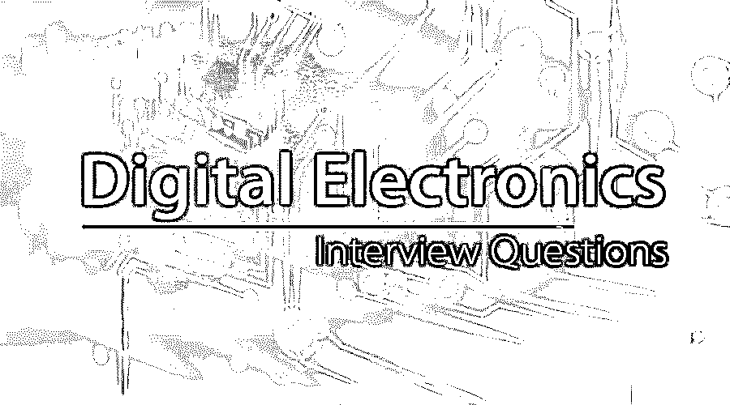

# 数字电子面试问题

> 原文：<https://www.educba.com/digital-electronics-interview-questions/>

## 数字电子概论面试问题

数字电子设备是对数字信号进行操作的电子设备，其中数字电子电路由一系列逻辑门组装而成。每个逻辑门在来自逻辑门的信号的帮助下执行基于布尔值的功能。通常，使用两种类型的数字系统来表示数字电路，例如组合系统和时序系统，其中当组合系统接收相同的输入时，组合系统表示相同的输出，而时序系统被描述为具有一些输出作为输入(即反馈)的组合系统。由于数字电路是由模拟元件构成的，我们需要确保模拟元件的行为不会主导数字行为。

现在，如果你想找一份与数字电子相关的工作，你需要准备 2022 年的数字电子面试题目。根据不同的职位描述，每次面试都是不同的。在这里，我们准备了重要的数字电子面试问题和答案，将帮助你在面试中取得成功。

<small>网页开发、编程语言、软件测试&其他</small>

本期 2022 数字电子面试问答。这些数字电子面试问题分为两部分如下:

### 第 1 部分-数字电子面试问题(基础)

这第一部分包括基本的面试问题和答案。

#### Q1。锁存器和触发器的区别是什么？

**答案:**
锁存器和触发器的区别在于锁存器是电平敏感的，而触发器是边沿敏感的。锁存器和触发器都将用于时序逻辑，并且需要时钟信号。当信号为高电平时，锁存器输出将跟踪输入，即当时钟为高电平 1 时，如果输入改变，输出也会改变。而在触发器中，仅当存在时钟的上升/下降沿时，输入才会被存储，并且在锁存器对毛刺敏感的情况下，它不受毛刺的影响。锁存器比触发器需要更少的逻辑门来实现，所以锁存器比触发器更快。

#### Q2。为什么十六进制数字系统被称为字母数字系统？

**答案:**
十六进制数字系统被称为字母数字系统，因为十六进制数字系统的基数是 16，所以它需要 16 个唯一的符号来表示十六进制数。这些是从 0-9 的数字和从 A 到 f 的字母，因为数字和字母都用来表示十六进制数字系统中的数字；它被称为字母数字系统。

#### Q3。Mealy 和 Moore 状态机有什么区别？

**答案:**

*   **Moore Machine:** 这种机器是状态机的基本模型，其输出依赖于仅使用入口动作的状态的状态机被称为 Moore 模型。
*   **Mealy Machine:** 这种机器是状态机的基本模型，其输出依赖于输入和状态的状态机称为 Mealy 模型。

这些模型之间的选择将取决于应用程序的类型、项目要求和复杂性。大多数模型只依赖于状态，而 Mealy 模型的输出依赖于输入和状态。

让我们转到下一个数字电子面试问题。

#### Q4。为什么大多数中断低电平有效？

**答:**
大多数信号为低电平有效的原因如下:以晶体管为例，低电平有效意味着晶体管输出端的电容将分别根据信号从低到高或从高到低的转换而充电或放电。当信号由高变低时，取决于下拉的电阻；它被称为下拉电阻。输出电容容易放电而不是充电。因此，大多数人会使用低电平无效信号。

#### Q5。时序电路和组合电路的区别是什么？

**答案:**

*   **时序电路:**时序电路是根据时钟周期、当前输入和过去输出来产生输出的电路，称为时序电路。
*   **组合电路:**组合电路是一种与时间无关的电路，即它们不依赖于时钟和先前的输入来产生输出，这种电路称为组合电路。

### 第 2 部分-数字电子面试问题(高级)

现在让我们来看看高级面试问题。

#### Q6。围绕这个问题的竞赛是什么，你如何解决它？

**答:**
围绕问题的竞争在数字电路方面定义如下，因为当 J 和 K 输入都等于 1 时，时钟脉冲将保持在状态 1，并且它将导致输出互补，并且这些状态集重复直到脉冲回到 0，称为围绕问题的竞争。为了避免这种情况，时钟脉冲的持续时间需要小于 F-F 的传播延迟时间，这是有限制的。因此，替代方案是主从式或边沿触发式结构。

#### Q7。你将如何实现全加器的全减器？

**答案:**
可以通过将减法器的所有位连接到异或门和其他输入到异或作为一个然后进位位作为全加器的输入来实现，全加器需要做为一个。因此，全加器将作为全减器工作。

让我们转到下一个数字电子面试问题。

#### Q8。定义最小项和最大项？

#### **答案:**

最小项被定义为布尔表达式乘积，其中所有可能的变量以补码形式出现一次，或者非补码变量被称为最小项。

最大项被定义为布尔表达式的和，其中所有可能的变量将在补码中出现一次，或者非补码变量被称为最大项。

#### Q9。什么是边沿触发触发器？

**答案:**
使用边沿触发的触发器可以解决环绕竞争条件的问题。边沿触发的触发器将在时钟脉冲的正边沿或负边沿改变其状态。边沿触发的触发器仅在触发器的这一事务中对其输入敏感。

#### Q10。移位寄存器计数器有哪些不同类型？

**答案:**
移位寄存器计数器有环形计数器和约翰逊计数器两种。

*   **环形计数器:**环形计数器被定义为一个循环移位寄存器，任何时候只有一个触发器被置位，其他位会被清零。
*   **约翰逊计数器:**约翰逊计数器定义为 k 位开关环形计数器，带有 2^K 解码门，为 2^k 定时信号提供输出。

### 结论

最后是数字电子面试主要题目的概述。希望你看完这篇 2018 数字电子面试题型文章后有很好的准备，我会建议在逻辑门上练习题型进行面试准备。

### 推荐文章

这是一个数字电子面试问题和答案列表的指南，以便候选人可以轻松地解决这些数字电子面试问题。在本帖中，我们研究了一些常见的数字电子面试问题。您也可以阅读以下文章，了解更多信息——

1.  [数字营销技巧](https://www.educba.com/digital-marketing-skills/)
2.  [面试准备技巧](https://www.educba.com/tips-for-the-interview-preparation/)
3.  [数字营销面试问题](https://www.educba.com/digital-marketing-interview-questions/)
4.  [数字学习](https://www.educba.com/digital-learning/)

