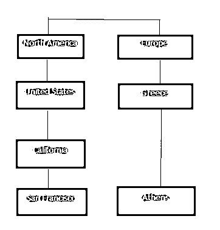

# 商业智能面试问题

> 原文：<https://www.educba.com/business-intelligence-interview-questions/>

## 商业智能面试问题和答案

商业智能只是一个术语，它帮助用户在经营业务或与业务相关的重要问题上做出决策。它帮助用户管理任何组织的业务增长。商业智能帮助用户做出决策，在任何业务的适当报告和数据的帮助下，导致他们的业务增长，这是非常重要的。

所以你终于在商业智能领域找到了你的梦想工作，但你想知道如何破解 2022 年的商业智能面试，以及可能的商业智能面试问题。每次面试都不一样，工作范围也不一样。牢记这一点，我们设计了最常见的商业智能面试问题和答案，以帮助您在面试中取得成功。你可以很容易地破解这些商业智能面试问题，这些问题是在面试中被问到的。

<small>网页开发、编程语言、软件测试&其他</small>

### 十大商业智能面试问题和答案

以下是最热门的商业智能面试问题和答案

#### 1.什么是商业智能？

**答:**
“商业智能”(BI)一词为用户提供了数据和工具来回答任何一个组织做出决策的重要问题；它可以与经营业务或业务的一部分有关。简而言之，商业智能用于报告任何业务的特定数据，这非常重要，任何组织的更高[管理层](https://www.educba.com/performance-management-tools/)将利用这些数据为其业务的增长做出决策。通常，任何组织都可以通过商业智能工具做出以下决策:

*   BI 用于确定业务是否按计划运行。
*   BI 用于识别哪些事情确实出错了。
*   BI 用于采取和监控纠正措施。
*   BI 用于确定其业务的当前趋势。

#### 2.商业智能有哪些不同的阶段和好处？

**答案:**
商业智能有以下五个阶段:

*   **数据源**:从多个数据源中提取数据。
*   **数据分析**:基于从收集数据中获得的有用知识，提供合适的[分析](https://www.educba.com/sentiment-analysis-social-media/)报告。
*   **决策支持**:即将正确使用信息。它的目标始终是提供有关重要事件的适当图表，如接管、市场变化和员工表现不佳。
*   **情境意识**:它是关于过滤掉不相关的信息，并将剩余的信息置于业务及其[环境的背景下](https://www.educba.com/inclusive-work-environment/)。
*   **风险管理**:即将发现在不同的时间可能采取什么样的纠正措施或决策。

以下是商业智能的不同优势:

*   改善决策。
*   加快决策速度。
*   优化内部[业务流程](https://www.educba.com/business-process-re-engineering-vs-continuous-improvement/)。
*   提高运营效率。
*   帮助或推动新的收入。
*   在与另一个竞争对手的市场竞争中获得优势。

#### 3.市场上有哪些不同的商业智能工具？

**答案:**
市面上有很多智能工具，在它们之间，下面是最受欢迎的:

*   Oracle 商业智能企业版(OBIEE)
*   [Cognos](https://www.educba.com/cognos-interview-questions/)
*   微观战略
*   SAS 商业智能
*   业务对象
*   活人画
*   Microsoft 商业智能工具
*   Oracle Hyperion 系统

#### 4.商业分析的宇宙是什么？

**答案:**
宇宙是数据库和用户界面之间的一种语义层。更准确地说，它是客户机(业务用户)和数据仓库之间的接口层之一。它实际上定义了一个[数据仓库](https://www.educba.com/10-popular-data-warehouse-tools/)中各个表之间的完整关系。

#### 5.定义或列出 OLAP 和 OLTP 之间的区别？

**回答:**
一般来说，我们可以假设 OLTP 实际上是帮助提供数据仓库中的源数据，而 OLAP 帮助分析这些数据。

|  | **OLTP 系统** | **OLAP 系统** |
| **数据来源** | 运营数据、OLTP 是数据的原始来源。 | 整合数据，OLAP 数据来自各种 OLTP 数据库。 |
| **数据目的** | 用于任何类型的当前或基本业务任务。 | 有助于未来的规划、解决问题或决策。 |
| **数据更新** | 最终用户发起的数据频繁地在事务数据库中插入或更新。 | 在一个定义的时间间隔后，基于批处理作业更新数据。这个时间可以少于或多于一天。 |
| **加工速度** | 像往常一样，通常非常快。 | 显然取决于数据量。刷新批处理数据后，有时复杂的查询需要花费超过几个小时。常见的习惯是添加一个索引来提高速度。 |
| **空间需求** | 考虑到存档状态下的历史数据，这也相对较小。 | 由于必须保存所有历史数据，聚合结构显然更大，因此它也比 OLTP 需要更多的索引。 |
| **数据库架构** | 规范化的数据，所以所有的表和数据都有适当的关系。 | 通常对一些表进行反规范化(如因子维度)。它通常使用星型或雪花型模式。 |
| **备份和恢复** | 备份是 OLTP 的一项基本要求，因为它是日常数据，所以任何数据丢失都可能带来巨大的经济损失和法律责任。 | 一些环境可能会考虑简单地重新加载 OLTP 数据作为恢复方法，而不是常规备份。 |

#### 6.什么是数据仓库中的仪表板？

**答:**
仪表盘就是所有报表和[图表](https://www.educba.com/visual-basic-graph-with-dynamic-input/)在一页上的排列。它只是不同格式的报告的集合，在同一页面上显示相同的功能。

#### 7.解释数据仓库和跨国系统的区别。

**答案:**

| **交易系统** | **数据仓库系统** |
| 它通常被设计为处理日常数据，因此它主要集中于高容量事务处理而不是后端报告。 | 它通常设计用于处理大量的分析报告和后续工作。它还详细阐述了报告的生成。 |
| 它通常是流程驱动的，这意味着它依赖于特定于业务的任务或执行。 | 它实际上是面向主题的，这意味着它从交易系统加载数据，然后开放用于任何类型的分析报告，这有助于组织基于特定主题做出正确的决策。 |
| 它通常处理当前的事务数据。 | 它通常处理历史数据。 |
| 事务系统中的数据可以在每个任务中插入、更新或删除。 | 数据仓库数据被称为非易失性的，这意味着可以定期添加新数据，但一旦加载，这些数据很少改变。 |
| 在性能或速度方面，我们应该总是倾向于使用事务系统来插入、更新或删除少量数据。 | 我们应该总是更喜欢数据仓库，而不是相对大量数据的快速检索。 |

#### 8.用一个例子解释事实和维度表。

**答案:**
事实表是数据仓库星型架构中的中心表。它实际上保存了用于分析的定量信息，并且在最长时间内不正常。

一个[维度表是数据仓库的星型模式中的重要表](https://www.educba.com/dimension-table/)之一，它存储属性或维度，描述事实表中的[对象。](https://www.educba.com/what-is-fact-table/)

事实表主要包含两种类型的列。外键列允许与维度表连接，主列包含正在分析的数据。

**举例:**假设一家公司向客户销售产品。因此，每笔销售都是一个事实，所以事实表包含如下信息:

| **时间 ID** | **产品 ID** | **客户 ID** | **售出单位** |
| Four | Seventeen | Two | One |
| Eight | Twenty-one | Three | Two |
| Eight | Four | One | One |

现在，在事实表中，有一个客户 id，因此我们需要为客户维护一个维度表，如下所示:

| **客户 ID** | **名称** | **性别** | **收入** | **教育** | **地区** |
| One | 圣人 | 英语字母表中第十三个字母 | Two | Three | Four |
| Two | 交流电（alternating current） | 英语字母表中第十三个字母 | Three | Five | One |
| Three | 女士 | 英语字母表中第六个字母 | One | Seven | Three |

#### 9.定义或列出雪花模式和星型模式之间的区别。

**答案:**

|  | **雪花模式** | **星形模式** |
| **维护** | 没有冗余，所以更容易维护。 | 持有冗余数据，因此不容易维护。 |
| **复杂度** | 更复杂的查询，因此不太容易理解。 | 降低一个复杂的查询，这样容易理解。 |
| **查询性能** | 外键越多，查询执行时间就越长。 | 外键数量较少，因此与雪花相比，查询执行速度更快。 |
| **利用率** | 适合用于数据仓库核心，以简化复杂的关系(多对多)。 | 适用于具有简单关系(一对一或一对多)的数据集市。 |
| **尺寸表** | 对于每个维度，雪花架构可以有多个维度表。 | 对于每个维度，星型架构只包含一个维度表。 |
| **去规格化** | 事实表采用非规范化形式，但维度表采用规范化形式。 | 事实和维度这两个表都是非规范化形式的。 |

#### 10.解释或定义不规则的层次结构。

**答:**
如果维度中至少有一个成员的父代成员不在该成员的上一级，则层次结构实际上是在维护一种关系。举个例子，如果我们考虑地理等级，把北美看作一个大陆，那么它就有国家(比如美国)，省或州(比如加州)，城市(比如旧金山)。但是如果我们考虑欧洲，希腊，或者雅典，它没有这种等级制度。因此，在这个例子中，欧洲、希腊或雅典的分支下降到不同的深度，形成了一个参差不齐的层次结构。

### 推荐文章

这是一个商业智能面试问题和答案列表的指南，以便候选人可以轻松地解决这些商业智能面试问题。您也可以阅读以下文章，了解更多信息——

