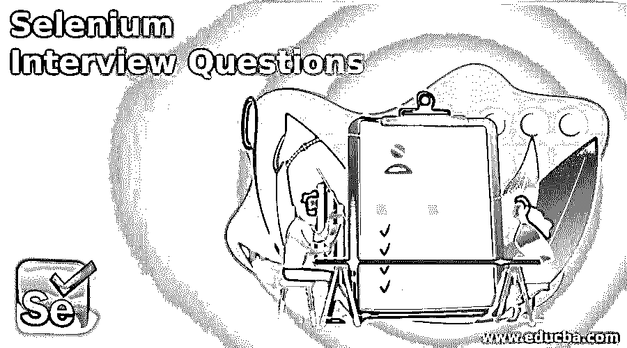

# Selenium 面试问题

> 原文：<https://www.educba.com/selenium-interview-questions/>

## Selenium 面试问题介绍

以下文章提供了 Selenium 面试问题的概要。Selenium 专注于为了研究而自动化 web 程序，但它远不止于此。基于网络的管理功能也可以自动化。它自动化了浏览器的使用。Selenium 支持最流行的浏览器供应商，拥抱它并使它成为他们浏览器不可或缺的一部分。许多其他浏览器自动化工具、API 和框架也使用这种技术。

如果是找硒相关的工作，需要准备 2022 硒面试题。根据不同的职位描述，每次面试都是不同的。在这里，我们准备了重要的硒面试问答，帮助你面试成功。

<small>网页开发、编程语言、软件测试&其他</small>

在这篇 2022 年硒面试问题的文章中，我们将提出 15 个最重要和最常见的硒面试问题。

### 第 1 部分 Selenium 面试问题(基础)

第一部分包括基本的面试问题和答案:

#### Q1。什么是软件测试或测试自动化？

**答案:**

软件测试使用自动化软件来编写和执行测试用例；运行自动化测试套件时，不需要人工干预。为了编写测试脚本和测试用例，测试人员倾向于使用自动化软件，然后将它们组织成测试套件。使用高级软件来自动执行手动构建的测试用例，而不需要人工交互，这被称为自动化测试。访问测试结果，控制测试执行，以及比较实际结果和预测结果都是自动化测试软件的功能。结果，生成了被测系统的详细测试报告。

#### Q2。自动化测试的好处是什么？

**答案:**

以下是自动化测试的一些最基本的好处:

*   在应用程序中，自动化测试促进了技术和输出测试。
*   它允许我们一遍又一遍地运行测试用例。
*   这使得并行执行更加容易。
*   这使得评估大型测试矩阵变得更加容易。
*   它通过消除人为错误的可能性来提高准确性。

#### Q3。告诉一些最广泛使用的自动化测试软件的功能自动化。

**答案:**

以下是功能自动化最常用的十大自动化研究方法。

*   telerik 测试工作室
*   硒，开源
*   托斯卡测试套件
*   HPE 统一功能测试
*   瓦特尔
*   IBM 的理性机器人
*   测试高手
*   惠普专业快速测试
*   编码用户界面，微软
*   Auto It，开源

#### Q4。讲一些最广泛使用的非功能自动化的自动化测试软件。

**答案:**

下面是非功能自动化最常用的十种自动化研究方法。

*   波特斯威格的打嗝组曲
*   负载运行器，由惠普提供
*   Acunetix
*   JMeter，由阿帕奇

#### Q5。硒是什么？

**答案:**

Selenium 是一个轻量级软件测试平台。Selenium 工具附带了一个重放工具，允许您创建功能测试，而不必掌握测试脚本语言。Selenium 是一个流行的开源 Web UI(用户界面)自动化测试框架。Selenium 是一个自动化框架，适用于各种应用程序、浏览器、平台和编程语言。

#### Q6。硒的不同成分是什么？

**答案:**

Selenium 是一个工具和一套软件，每一个都有不同的方法来支持自动化测试。

它由四个主要部分组成，包括:

*   Selenium IDE(集成开发环境)
*   硒遥控器
*   硒栅
*   web 驱动程序

#### Q7。列出 selenium 支持的所有编程语言和操作系统、浏览器和编程语言。

**答案:**

Selenium 兼容广泛的操作系统、浏览器和编程语言。

*   JavaScript、C#、Python、Java、PHP、Perl 和 Ruby 都是编程语言的例子。
*   Android、iOS、Windows、Linux、Mac 和 Solaris 是一些可用的操作系统。
*   Google Chrome、Mozilla Firefox、Internet Explorer、Edge、Opera、Safari 等都是浏览器的例子。

#### Q8。在 selenium 中，定位器的种类有哪些？

**答案:**

定位器是一种地址类型，它提供了一种在网页上定义 web 要素的独特方法。

为了对网站的各种元素进行分类，Selenium 有许多定位器，包括:

*   ClassName
*   数字正射影像图
*   CSS 选择器
*   身份证明
*   名字
*   XPath
*   TagName
*   LinkText
*   部分链接文本

### 第 2 部分 Selenium 面试问题(高级)

现在让我们来看看高级面试问题:

#### Q9。什么是硒断言？

**答案:**

作为验证点，使用断言。它确认应用程序的当前状态符合预期。“断言”、“验证”和“等待”是断言的三种形式。

#### Q10。您能描述一下 selenium 断言和验证命令之间的区别吗？

**答案:**

断言和验证命令都负责确定条件是真还是假。两者最大的区别是条件测试结束后各自做什么。在经过验证的指令的情况下，如果条件为假，则执行将停止，并且不会运行进一步的测试。然而，如果条件为真，程序控制将进行到下一个测试阶段。另一方面，verify 与条件测试输出无关。

#### Q11。selenium 使用的各种注释有哪些？

**答案:**

可以使用以下 JUnit 注释:

*   试验
*   以前
*   在...之后
*   忽视
*   上课前
*   下课后
*   RunWith

#### Q12。selenium WebDriver 有哪些异常？

**答案:**

Selenium WebDriver 有五个不同的例外。

*   超时异常
*   NoAlertPresentException
*   WebDriverException
*   nosuchwindowsexception
*   NoSuchElementException

#### Q13。Selenese 是什么？

**答案:**

Selenium IDE 中用来编写测试脚本的语言叫做 Selenese。

#### Q14。键盘快捷键和键盘命令有什么区别？

**答案:**

在大多数情况下，TypeKeys()会触发 JavaScript 事件，而. type()不会。

#### Q15。什么是 selenium IDE，它是如何工作的？

**答案:**

Selenium IDE 是一个 Firefox 插件，允许您存储和重放测试脚本。它帮助测试人员导出 HTML、Java、Ruby、RSpec、Python、C#、JUnit 和 TestNG 等语言的脚本。不幸的是，Selenium IDE 覆盖面很窄，它生成的测试脚本既不稳定也不可移植。

### 结论

我们最受欢迎的 Selenium 面试问题和答案列表到此结束。阅读这个列表无疑会帮助你加紧硒面试准备。

### 推荐文章

这是硒面试问题指南。在这里，我们讨论简介以及基本和高级 selenium 面试问题。您也可以看看以下文章，了解更多信息–

1.  [熊猫面试问题](https://www.educba.com/pandas-interview-questions/)
2.  [Xamarin 面试问题](https://www.educba.com/xamarin-interview-questions/)
3.  [手机测试面试问题](https://www.educba.com/mobile-testing-interview-questions/)
4.  [人工测试面试问题](https://www.educba.com/manual-testing-interview-question/)

