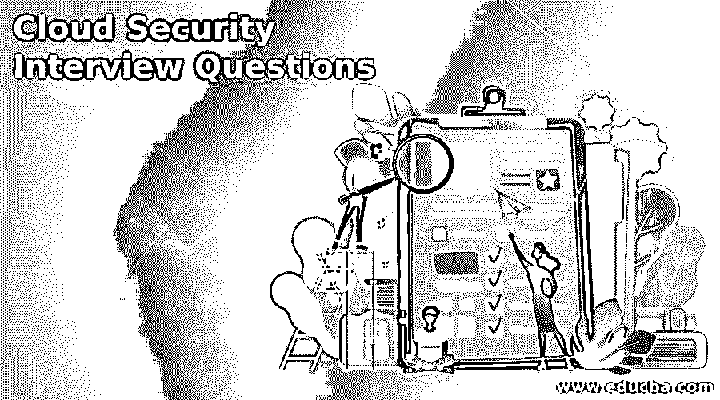

# 云安全面试问题

> 原文：<https://www.educba.com/cloud-security-interview-questions/>

## 云安全面试问题介绍

以下文章提供了云安全面试问题的概要。云安全是一系列控制措施、政策、程序和技术，它们共同保护基于云的系统、数据和基础设施。这些安全措施是为云保护、强制执行和隐私保护以及个人用户和设备的身份验证而设置的。

还配置了这些安全措施。例如，可以通过对过滤流量的访问进行身份验证来配置云安全，以满足公司的确切需求。由于这些法规都是在一个地方配置和管理的，因此降低了管理开销，IT 团队可以专注于其他业务领域。

<small>网页开发、编程语言、软件测试&其他</small>

在这篇 2022 年人工测试面试问题的文章中，我们将介绍 10 个最重要和最常见的人工测试面试问题。这些面试问题分为以下两部分:

### 第 1 部分—云安全面试问题(基础)

第一部分包括基本的面试问题和答案:

#### Q1。解释云计算和移动计算的区别？

**答案:**

与云计算相同的概念也适用于移动设备。互联网而不是个人设备使用云计算来激活数据。它向用户提供他们需要根据请求收集的数据。在 mobile 中，应用程序运行在远程服务器上，为用户提供存储和管理访问。

#### Q2。解释云计算的应用？

**答案:**

一个非常快速的应用过程就是云计算。因为你不必出售或购买任何东西，你可以很容易地使用该软件。应用程序的速度提高了 5 倍，并且可以随时随地进行部署。申请流程现在。这也使得应用程序在本质上可以立即移动。

#### Q3。SaaS 有哪些不同的模式？

**答案:**

SaaS 有细粮和多租户两种模式。有两种模式。在前一种情况下，许多人共享具有相同功能的资源。但是，在后一种情况下，每个用户都有独立的资源，因此与其他用户不同。这就是为什么最有效的模式是简单的多租户。

#### Q4。云计算有哪些不同的层次，并解释每一层？

**答案:**

云计算中基本上有三种类型的层，即 PaaS、IaaS 和 SaaS。

*   **PaaS:** PaaS 层为开发者提供云应用。
*   **IaaS:** 这是基础设施即服务；我们能做的这一层提供了处理器、速度和内存等方面的基础设施。
*   **SAAS:** 允许用户直接访问云应用，无需任何系统安装。

#### Q5。什么是混合云和社区云？

**答案:**

*   **混合云:**它由几个服务提供商组成。它是私有云和公共云功能的混合。当同时需要私有云和公共云时，使用该公司。
*   **社区云:**这种模式非常昂贵，当组织致力于并准备分享云服务的好处时使用。

### 第 2 部分—云安全面试问题(高级)

现在让我们来看看高级面试问题:

#### Q6。你了解 windows azure 操作系统吗？

**答案:**

具体来说，Windows Azure 操作系统用于运行 Windows Azure 平台应用程序。操作系统包含在云上运行和托管应用程序所需的所有先决条件。在云中部署在 Windows Azure 上之前，操作系统已知为开发提供服务。

#### Q7。什么是云服务？

**答案:**

基本上，云服务创建云应用。简单地说，即使没有安装计算机，你也可以使用这些应用程序。与那些必须安装在计算机上才能使用的应用程序相比，对应用程序的维护和支持是不必要的。

#### Q8。你说的云计算用外行的语言是什么意思？

**答案:**

这是一台基于互联网的电脑。这里使用互联网来处理和向用户提供必要的服务。许多公司现在使用云计算来满足客户、商业领袖或供应商的需求。因此，这些资源被视为一个池，而不是独立的资源。

#### Q9。哪些是大规模云计算平台？

**答案:**

有两个 Map-Reduce 和 Apache Hadoop。

*   **Map Reduce:** 是 Google 内置的支持计算分发的软件。它使用广泛的数据和不同的云资源，并将数据分发到称为集群的几台计算机上。Map Reduce 可以处理结构化和非结构化数据。
*   Apache Hadoop: 这是一个 Java 编写的开源平台。它为每个文件系统创建一个计算机池。然后用类似的散列算法将数据元素聚集在一起。然后复制现有文件。

#### Q10。“桉树”在云计算中有什么用？

**答案:**

Eucalyptus”是一个开源的云软件基础设施，在云计算平台上使用集群。它用于创建私有、公共和混合云。它可以将您自己的数据中心变成私有云，并允许许多其他组织使用它的功能。

### 结论

我们最受欢迎的云安全访谈问题和答案列表到此结束。阅读此列表无疑将有助于您加紧云安全面试准备。

### 推荐文章

这是云安全面试问题指南。在这里，我们将讨论简介以及基本和高级云安全面试问题。您也可以看看以下文章，了解更多信息–

1.  [熊猫面试问题](https://www.educba.com/pandas-interview-questions/)
2.  [Xamarin 面试问题](https://www.educba.com/xamarin-interview-questions/)
3.  [手机测试面试问题](https://www.educba.com/mobile-testing-interview-questions/)
4.  [人工测试面试问题](https://www.educba.com/manual-testing-interview-question/)

