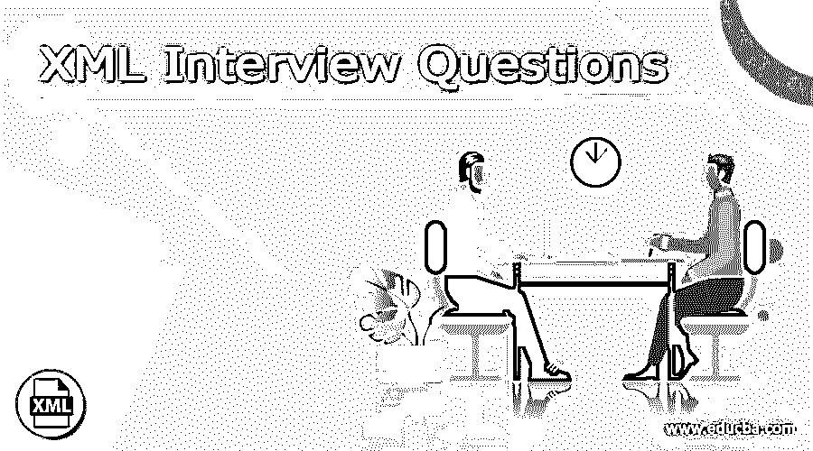

# XML 面试问题

> 原文：<https://www.educba.com/xml-interview-questions/>

## XML 面试问题介绍

XML 或可扩展标记语言是一种基于文本的标记语言，它允许我们以结构格式存储数据。XML 不是一种编程语言，它用于格式化数据或内容，通常用于存储、传输和程序处理。它主要由开发人员用于设计、开发和维护界面。XML 中没有预定义标签，因此我们可以简单地定义自己的标签。

### 面试问题

面试是面试者和被面试者之间正式的一对一的谈话，面试者会问被面试者一些问题，以寻找适合他们所提供工作的人，面试者会给出一些信息作为回应。

<small>网页开发、编程语言、软件测试&其他</small>

XML 面试问题及答案:

#### 1)解释 XML 是怎样的可扩展标记语言？

首先，正如我们所知，XML 不是一种编程语言，它用于格式化数据或内容，这些数据或内容通常由程序存储、传输或处理，它不像编程语言那样对数据做任何说明。它是一种标记语言，因为它有一套规则、标签，在呈现文本时定义了文本的结构和格式，并且一些标记语言，尤其是那些在文字处理器中使用的标记语言，仅描述外观，如粗体、斜体，仅用于显示，不容易重复使用。
XML 是可扩展的，这意味着它是一种元语言，因此我们可以扩展其规范来定义新的标记语言，并且在 web 上的各种数据交换中也发挥着重要作用。

#### XML 中的 HttpRequest 是什么？

XML 中的 HttpRequest 可用于从 web 服务器请求数据，这意味着假设我们作为开发人员可以检索数据并更新网页而无需重新加载，在页面加载后，我们可以从服务器请求数据，同样可以从服务器接收数据并在后台发送数据。它是 XML 中的只读属性，返回 XML 或 Html 文档，并由请求检索。例如，如果我们有一个网页，并且有一个输入字段，当我们在输入字段中键入字符时，XMLHttpRequest 从网页发送到服务器，并且它建议一些名字。

#### 3)什么是 getResponseHeader()方法？

XMLHttpRequest 具有 getResponseHeader()方法，该方法用于返回包含特定头值的文本的字符串，它从响应服务器返回特定的头信息，通常响应被解析为文本，如果我们想要完整的头信息，那么我们可以使用 getAllResponseHeader()方法。响应报头包含关于长度、服务器类型、内容类型、修改日期等的信息。

#### HTML 是不是可以用 XML 代替？

这两种语言都不能互相替代，但是 XML 确实是 HTML 的一个很好的替代品，因为它有很好的特性，比如可以在 HTML 中定义新元素，并且可以为存储和处理数据创建标记。

#### 5)说出 XML 和 HTML 之间的任意五个区别？

**XML:**

*   XML 只描述内容。
*   在 XML 中，我们可以制作自己的标签。
*   这是一种面向内容的语言。
*   XML 有多个输出。
*   它有一个标准的数据验证结构。

**HTML:**

*   它描述了数据的结构和外观。
*   它有一组不能改变固定标签。
*   它是面向演示的。
*   它只有一种输出形式。
*   它没有数据验证。

#### 6)为什么要使用 DTD？

DTD 代表文档类型定义，XML 文档的元素就是由它定义的，我们可以说，具有元素和属性列表的文档结构是由 DTD 定义的。我们必须使用 DTD 来验证我们自己的数据，因为它可以在 XML 中进行验证。这是一个独立共享数据的内置应用程序。如果我们使用任何可以使用标准 DTD 集的应用程序来验证我们从外部接收的数据，我们希望这些数据是有效的。这就是在 XML 中使用 DTD 的原因。

#### XML 中的<element>标签是什么？</element>

这个标签用于在输出文档中创建一个元素节点。这个标签用于根据 Xpath 表达式放置所选节点的值。XSLT 是 XSL 最重要的部分，换句话说，我们可以说 XSLT 将 XML 源树转换为 XML 树，XML 树是结果树，我们可以看到它的语法如下:

`<xsl:value-of
select = Expression
disable-output-escaping = “yes” | “no”>
</xsl:value-of>`

在哪里，

select:用于指定 Xpath

禁用-输出-转义:默认为“否”，如果为“是”，则 XML 字符不会从文本中转义。
XSLT 是可扩展样式表语言转换，用于将 XML 文档转换成另一种格式，这种格式使用 Xpath 来执行我们用于转换的节点的匹配，并且在对其应用 XSLT 之后我们得到另一个文档，该文档可以是 XML 文档、Html 文档和文本文档。

#### XML 中的嵌套元素是什么意思？

嵌套元素意味着根元素可以嵌套一个或两个元素，元素的嵌套将使 XML 文档更容易理解。

#### 9)为什么我们应该使用 XML 编辑器而不是 Html？

因为 XML 编辑器允许构建防错文档，并且它由模式或 DTD 进行验证，而且 XML 编辑器可以检查带验证的开始标记和结束标记。它还检查 XML 语法上的颜色代码。

### 结论

在上面的文章中，我们解释了一些与 XML 相关的问题，面试官可能会在面试中问这些问题，如果你开始学习 XML 这样的可扩展语言，那么这将有助于衡量你的技能，对于一个良好的面试实践来说，这些问题有更多的细节。

### 推荐文章

这是 XML 面试问题指南。这里我们讨论一下引言，XML 面试问题列表。您也可以看看以下文章，了解更多信息–

1.  [硒面试问题](https://www.educba.com/selenium-interview-questions/)
2.  [DynamoDB 面试问题](https://www.educba.com/dynamodb-interview-questions/)
3.  [Struts 面试问题](https://www.educba.com/struts-interview-questions/)
4.  [ESL 面试问题](https://www.educba.com/esl-interview-questions/)

